---
lab:
    title: 'サーバーレス SQL プールを使用してインタラクティブなクエリを実行する'
    module: 'モジュール 2'
---

# ラボ 2 - サーバーレス SQL プールを使用してインタラクティブなクエリを実行する

このラボでは、Azure Synapse Analytics のサーバーレス SQL プールで T-SQL ステートメントを実行し、データ レイクと外部ファイル ソースに格納されているファイルを使用する方法を学びます。データ レイクに格納されている Parquet ファイルと、外部データ ストアに格納されている CSV ファイルのクエリを実行します。次に、Azure Active Directory セキュリティ グループを作成し、ロールベースのアクセス制御 (RBAC) とアクセス制御リスト (ACL) を使用してデータ レイクのファイルにアクセスします。

このラボを完了すると、次のことができるようになります。

- サーバーレス SQL プール を使用して Parquet データのクエリを実行する
- Parquet ファイルと CSV ファイルの外部テーブルを作成する
- サーバーレス SQL プールでビューを作成する
- サーバーレス SQL プール を使用する際にデータ レイクでデータへのアクセスを保護する
- ロールベースのアクセス制御 (RBAC) とアクセス制御リスト (ACL) を使用してデータ レイクのセキュリティを構成する

## ラボの構成と前提条件

このラボを開始する前に、ラボ環境を作成するためのセットアップ手順が正常に完了していることを確認してください。

## 演習 1: Azure Synapse Analytics でサーバーレス SQL プールを使用してデータ レイク ストアのクエリを実行する

データ探索を行ってデータを理解することは、データ エンジニアやデータ サイエンティストが現在直面している中核的な問題のひとつです。データの基本的な構造、および探索プロセスに固有の要件に応じて、さまざまなデータ処理エンジンが多様なレベルのパフォーマンス、複雑度、柔軟性を提供しています。

Azure Synapse Analytics では、SQL、Apache Spark for Synapse、またはその両方を使用できます。どのサービスを使用するかは、たいてい個人的な好みと専門知識に左右されます。データ エンジニアリング作業を行う際は、多くの場合、どちらのオプションも同等に有効です。ただし、Apache Spark の機能を利用すれば、ソース データの問題を克服できる場合もあります。Synapse Notebook では、データを使用する際に多数の無料ライブラリからインポートして機能を追加できるためです。また、サーバーレス SQL プールを使用した方が、はるかに容易かつ迅速にデータを探索したり、Power BI のような外部ツールからアクセスできる SQL によってデータ レイク内のデータに表示できることもあります。

この演習では、両方のオプションを使用してデータ レイクを探索します。

### タスク 1: サーバーレス SQL プール を使用して売上 Parquet データのクエリを実行する

サーバーレス SQL プールを使用して Parquet ファイルのクエリを行うと、T-SQL 構文を使用してデータを探索できます。

1. Synapse Studio (<https://web.azuresynapse.net/>) を開き、「**データ**」ハブに移動します。

    

2. 左側のウィンドウの「**リンク**」タブで、**Azure Data Lake Storage Gen2** と **asaworkspace*xxxxxx*** プライマリ ADLS Gen2 アカウントを展開し、**wwi-02** コンテナーを選択します。
3. **sale-small/Year=2019/Quarter=Q4/Month=12/Day=20191231** フォルダーで、**sale-small-20191231-snappy.parquet** ファイルを右クリックし、「**新しい SQL スクリプト**」を選択して、「**上位 100 行の選択**」を選択します。

    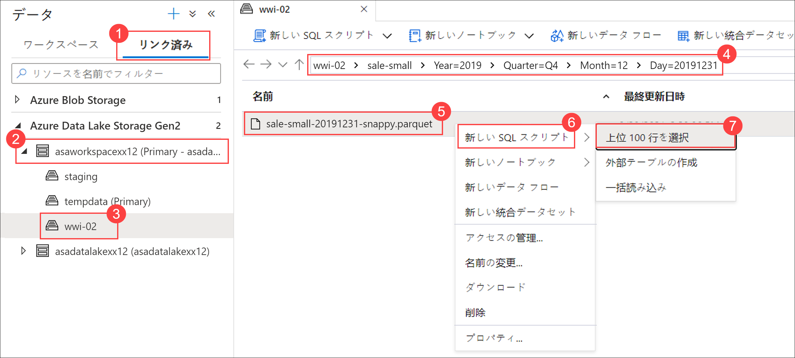

3. クエリ ウィンドウの上にある「**接続先**」ドロップダウン リストで、「**組み込み**」が選択されていることを確認し、クエリを実行します。サーバーレス SQL エンドポイントによってデータが読み込まれ、通常のリレーショナル データベースからのデータと同様に処理されます。

    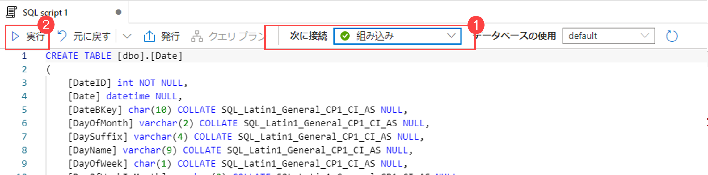

    セル出力には、Parquet ファイルの出力結果が表示されます。

    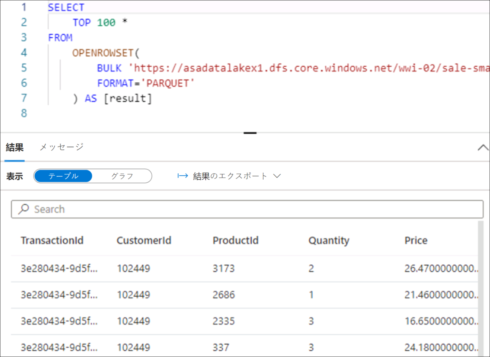

4. データをよりよく理解できるように SQL クエリを修正して集計およびグループ化操作を行います。クエリを次のように置き換え、*SUFFIX* を Azure Data Lake ストアの一意のサフィックスに置き換え、OPENROWSET 関数のファイル パスが現在のファイル パスと一致することを確認します。

    ```sql
    SELECT
        TransactionDate, ProductId,
            CAST(SUM(ProfitAmount) AS decimal(18,2)) AS [(sum) Profit],
            CAST(AVG(ProfitAmount) AS decimal(18,2)) AS [(avg) Profit],
            SUM(Quantity) AS [(sum) Quantity]
    FROM
        OPENROWSET(
            BULK 'https://asadatalakeSUFFIX.dfs.core.windows.net/wwi-02/sale-small/Year=2019/Quarter=Q4/Month=12/Day=20191231/sale-small-20191231-snappy.parquet',
            FORMAT='PARQUET'
        ) AS [r] GROUP BY r.TransactionDate, r.ProductId;
    ```

    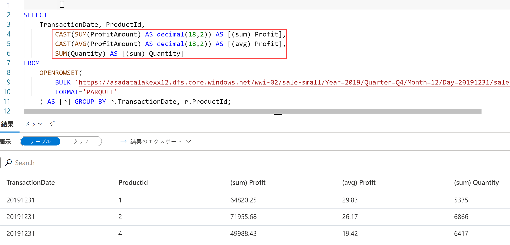

5. この 2019 年の単一ファイルから、より新しいデータ セットに移行しましょう。2019 年のあらゆるデータで Parquet ファイルに記録がいくつ含まれているのか調べます。この情報は、データを Azure Synapse Analytics にインポートするための最適化を計画する上で重要です。このために、クエリを以下に置き換えます (BULK ステートメントのデータ レイクのサフィックスを必ず更新してください):

    ```sql
    SELECT
        COUNT(*)
    FROM
        OPENROWSET(
            BULK 'https://asadatalakeSUFFIX.dfs.core.windows.net/wwi-02/sale-small/Year=2019/*/*/*/*',
            FORMAT='PARQUET'
        ) AS [r];
    ```

    > *sale-small/Year=2019* のすべてのサブフォルダーにあらゆる Parquet ファイルが含まれるようパスが更新されました。

    出力は **4124857** 件の記録になるはずです。

### タスク 2: 2019 年売上データの外部テーブルを作成する

Parquet ファイルのクエリを行うたびに OPENROWSET のスクリプトとルート 2019 フォルダーを作成する代わりに、外部テーブルを作成することができます。

1. Synapse Studio で、**wwi-02** タブに戻ります。このタブには、*sale-small/Year=2019/Quarter=Q4/Month=12/Day=20191231* フォルダーの内容が引き続き表示されます。
2. **sale-small-20191231-snappy.parquet** ファイルを右クリックし、「**新しい SQL スクリプト**」を選択してから「**外部テーブルの作成**」を選択します。「新規外部テーブル」ダイアログ ボックスで、「**続行**」をクリックします。
3. 「**SQL プール**」で、「**Built-in**」が選択されていることを確認します。次に、「**データベースの選択**」で、「**+ 新規**」を選択して、`demo` という名前のデータベースを作成して、「**作成**」をクリックします。**外部テーブル名**として `All2019Sales` と入力します。最後に、「**外部テーブルの作成**」で、「**SQL スクリプトの使用**」が選択されていることを確認してから、「**スクリプトを開く**」を選択して、SQL スクリプトを生成します。

    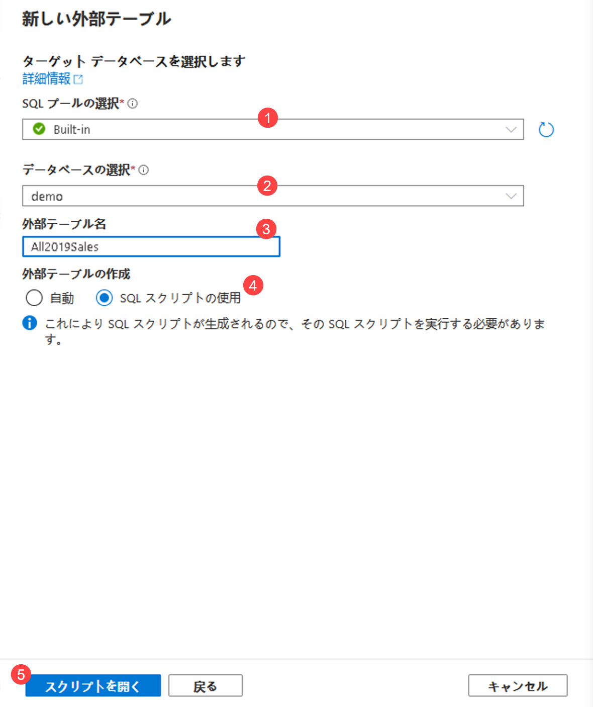

    > **注**: スクリプトの「**プロパティ**」ウィンドウが自動的に開きます。スクリプトの操作を簡単にするために、右側の上部にある「**プロパティ**」ボタンを使用して閉じることができます。

    生成されたスクリプトには、次のコンポーネントが含まれます。

    - **1)** スクリプトではまず、*PARQUET* の *FORMAT_TYPE* を使用して *SynapseParquetFormat* 外部ファイル形式を作成します。
    - **2)** 次に、外部データ ソースを作成し、データ レイク ストレージ アカウントの *wwi-02* コンテナーを指定します。
    - **3)** CREATE EXTERNAL TABLE WITH ステートメントでファイルの場所を指定し、上記で作成した新しい外部ファイル形式とデータ ソースを参照します。
    - **4)** 最後に、`2019Sales` 外部テーブルの上位 100 の結果を選択します。
    
4 CREATE EXTERNAL TABLE ステートメントの **[TransactionId] varchar(8000)** 行で、8000 を 4000 に変更して、`COLLATE Latin1_General_100_BIN2_UTF8` を追加し、*LOCATION* の値を `sale-small/Year=2019/*/*/*/*.parquet` に置き換え、ステートメントが次のようになるようにします (一意のリソースのサフィックスを除きます)。

```sql
CREATE EXTERNAL TABLE All2019Sales (
    [TransactionId] varchar(8000) COLLATE Latin1_General_100_BIN2_UTF8,
    [CustomerId] int,
    [ProductId] smallint,
    [Quantity] smallint,
    [Price] numeric(38,18),
    [TotalAmount] numeric(38,18),  
    [TransactionDate] int,
    [ProfitAmount] numeric(38,18),
    [Hour] smallint,
    [Minute] smallint,
    [StoreId] smallint
    )
    WITH (
    LOCATION = 'sale-small/Year=2019/*/*/*/*.parquet',
    DATA_SOURCE = [wwi-02_asadatalakeSUFFIX_dfs_core_windows_net],
    FILE_FORMAT = [SynapseParquetFormat]
    )
GO
```

5. スクリプトがサーバーレス SQL プール (**組み込み**) に接続されていること、「**データベースの使用**」リストで **demo** データベースが選択されていることを確認してください (ウィンドウ小さすぎて表示できない場合は、**[...]** ボタンを使用してリストを表示し、必要に応じて &#8635; ボタンを使用してリストを更新します)。

    

6. 変更したスクリプトを実行します。

    スクリプトの実行後、**All2019Sales** 外部テーブルに対する SELECT クエリの出力が表示されます。これにより、*YEAR=2019* フォルダーにある Parquet ファイルからの最初の 100 件の記録が表示されます。

    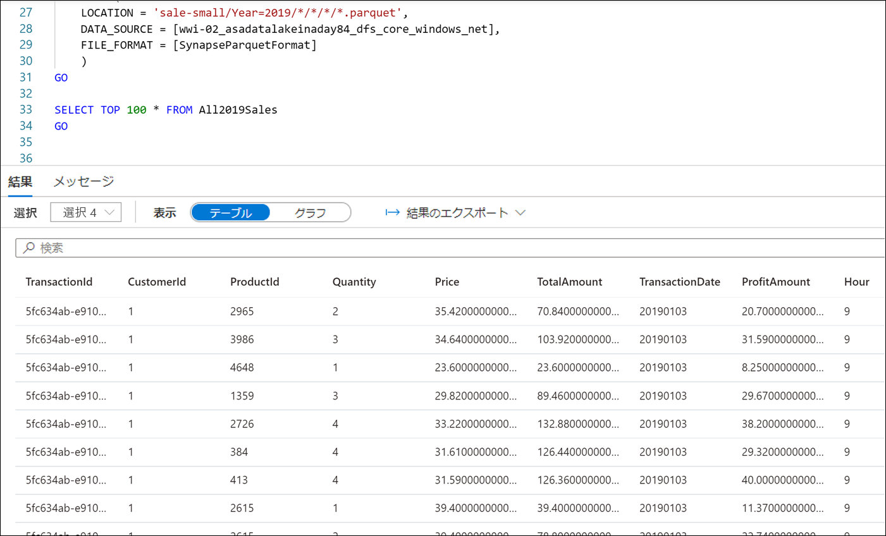

    > **ヒント**: コードの誤りが原因でエラーが発生した場合は、正常に作成されたリソースを削除してから再試行する必要があります。これを行うには、適切な DROP ステートメントを実行するか、「**ワークスペース**」タブに切り替えて**データベース**の一覧を更新し、**demo** データベース内のオブジェクトを削除します。

### タスク 3: CSV ファイルの外部テーブルを作成する

Tailwind Traders 社は、使用したい国の人口データのオープン データ ソースを見つけました。これは今後予測される人口で定期的に更新されているため、単にデータをコピーすることは望んでいません。

あなたは、外部データ ソースに接続する外部テーブルを作成することに決めます。

1. 前のタスクで実行した SQL スクリプトを次のコードに置き換えます。

    ```sql
    IF NOT EXISTS (SELECT * FROM sys.symmetric_keys) BEGIN
        declare @pasword nvarchar(400) = CAST(newid() as VARCHAR(400));
        EXEC('CREATE MASTER KEY ENCRYPTION BY PASSWORD = ''' + @pasword + '''')
    END

    CREATE DATABASE SCOPED CREDENTIAL [sqlondemand]
    WITH IDENTITY='SHARED ACCESS SIGNATURE',  
    SECRET = 'sv=2018-03-28&ss=bf&srt=sco&sp=rl&st=2019-10-14T12%3A10%3A25Z&se=2061-12-31T12%3A10%3A00Z&sig=KlSU2ullCscyTS0An0nozEpo4tO5JAgGBvw%2FJX2lguw%3D'
    GO

    -- Create external data source secured using credential
    CREATE EXTERNAL DATA SOURCE SqlOnDemandDemo WITH (
        LOCATION = 'https://sqlondemandstorage.blob.core.windows.net',
        CREDENTIAL = sqlondemand
    );
    GO

    CREATE EXTERNAL FILE FORMAT QuotedCsvWithHeader
    WITH (  
        FORMAT_TYPE = DELIMITEDTEXT,
        FORMAT_OPTIONS (
            FIELD_TERMINATOR = ',',
            STRING_DELIMITER = '"',
            FIRST_ROW = 2
        )
    );
    GO

    CREATE EXTERNAL TABLE [population]
    (
        [country_code] VARCHAR (5) COLLATE Latin1_General_BIN2,
        [country_name] VARCHAR (100) COLLATE Latin1_General_BIN2,
        [year] smallint,
        [population] bigint
    )
    WITH (
        LOCATION = 'csv/population/population.csv',
        DATA_SOURCE = SqlOnDemandDemo,
        FILE_FORMAT = QuotedCsvWithHeader
    );
    GO
    ```

    スクリプトの最上部では、ランダムなパスワードを使用して MASTER KEY を作成します。次に、代理アクセスで共有アクセス署名 (SAS) を使用し、外部ストレージ アカウントのコンテナー向けデータベーススコープ資格情報を作成します。この資格情報は、人口データを含む外部ストレージ アカウントの場所を示す **SqlOnDemandDemo** 外部データ ソースを作成する際に使用します。

    

    > データベーススコープ資格情報は、プリンシパルが DATA_SOURCE を使用して OPENROWSET 関数を呼び出すか、パブリック ファイルにアクセスできない外部テーブルからデータを選択する際に使用されます。データベーススコープ資格情報は、ストレージ アカウントの名前と一致する必要はありません。ストレージの場所を定義する DATA SOURCE で明示的に使用されるためです。

    スクリプトの次の部分では、**QuotedCsvWithHeader** と呼ばれる外部ファイル形式を作成します。外部ファイル形式の作成は、外部テーブルを作成するための前提条件です。外部ファイル形式を作成することで、外部テーブルによって参照されるデータの実際のレイアウトを指定します。ここでは、CSV フィールド終端記号、文字列区切り記号を指定し、FIRST_ROW 値を 2 に設定します (ファイルにはヘッダー行が含まれているためです)。

    

    最後に、スクリプトの最下部で **population** という名前の外部テーブルを作成します。WITH 句は、CSV ファイルの相対的な場所を指定し、上記で作成されたデータ ソースと *QuotedCsvWithHeader* ファイル形式を指します。

    

2. スクリプトを実行します。

    このクエリにデータ結果はない点に留意してください。

3. SQL スクリプトを以下に置き換えて、2019 年のデータでフィルタリングした人口の外部テーブルから選択します。ここでの人口は 1 億人以上です。

    ```sql
    SELECT [country_code]
        ,[country_name]
        ,[year]
        ,[population]
    FROM [dbo].[population]
    WHERE [year] = 2019 and population > 100000000
    ```

4. スクリプトを実行します。
5. クエリ結果で「**グラフ**」ビューを選択し、以下のように設定します。

    - **グラフの種類**: 棒
    - **カテゴリ列**: country_name
    - **凡例 (シリーズ) 列**: population
    - **凡例の位置**: bottom - center

    

### タスク 4: サーバーレス SQL プールでビューを作成する

SQL クエリをラップするビューを作成してみましょう。ビューでは、クエリを再使用することが可能で、Power BI などのツールをサーバーレス SQL プールと組み合わせて使う場合に必要になります。

1. 「**データ**」ハブの「**リンク**」タブで、**Azure Data Lake Storage Gen2/asaworkspace*xxxxxx*/ wwi-02** コンテナーで、**customer-info** フォルダーに移動します。**customerinfo.csv**ファイルを右クリックし、「**新しい SQL スクリプト**」を選択してから、「**上位 100 行を選択**」を選びます。

    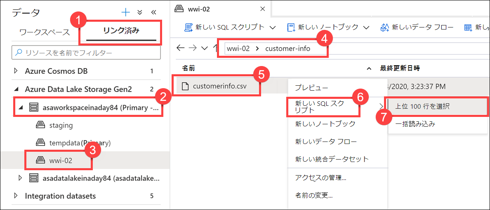

3. 「**実行**」を選択してスクリプトを実行します。CSV ファイルの最初の行が列ヘッダー行であることに注意してください。結果セットの列には、**C1**、**C2** などの名前が付けられます。

    

4. 次のコードでスクリプトを更新し、OPENROWSET BULK パスの **SUFFIX を一意のリソース サフィックスに置き換えてください**。

    ```sql
    CREATE VIEW CustomerInfo AS
        SELECT * 
    FROM OPENROWSET(
            BULK 'https://asadatalakeSUFFIX.dfs.core.windows.net/wwi-02/customer-info/customerinfo.csv',
            FORMAT = 'CSV',
            PARSER_VERSION='2.0',
            FIRSTROW=2
        )
        WITH (
        [UserName] NVARCHAR (50),
        [Gender] NVARCHAR (10),
        [Phone] NVARCHAR (50),
        [Email] NVARCHAR (100),
        [CreditCard] NVARCHAR (50)
        ) AS [r];
        GO

    SELECT * FROM CustomerInfo;
    GO
    ```

    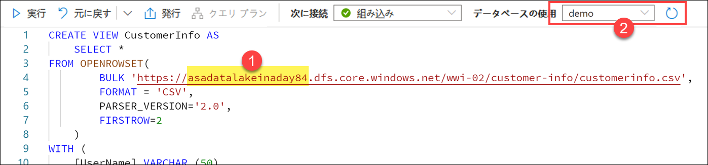

5. 「**データベースの使用**」リストで、**demo** がまだ選択されていることを確認してから、スクリプトを実行します。

    CSV ファイルからデータを選択する SQL クエリをラップするビューを作成し、ビューから行を選択しました。

    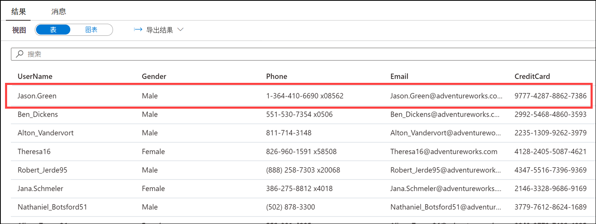

    最初の行には列のヘッダーが含まれていません。これは、ビューの作成時に OPENROWSET ステートメントで FIRSTROW=2 設定を使用したためです。

6. 「**データ**」ハブで、「**ワークスペース**」タブを選択します。データベース グループの右にあるアクションの省略記号 **(...)** を選択してから、「**&#8635; Refresh**」を選択します。

    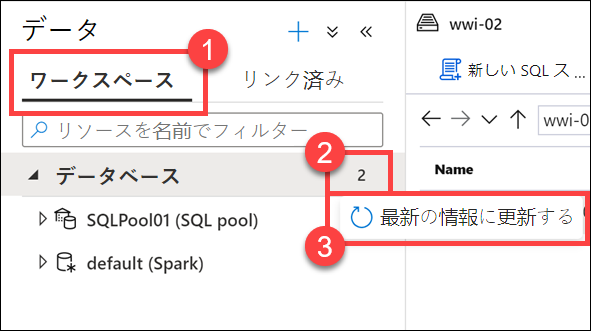

7. **demo** SQL データベースを展開します。

    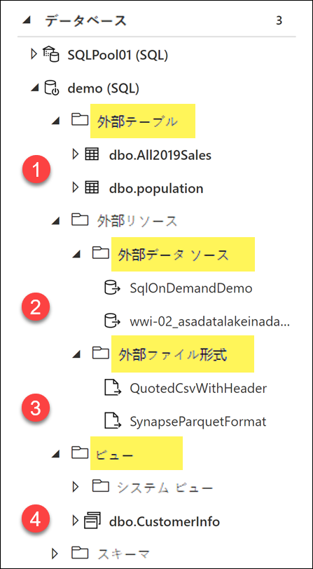

    このデータベースには、前の手順で作成した以下のオブジェクトが含まれています。

    - **1) 外部テーブル**: *All2019Sales* と *population*。
    - **2) 外部データソース**: *SqlOnDemandDemo* と *wwi-02_asadatalakeinadayXXX_dfs_core_windows_net*。
    - **3) 外部ファイル形式**: *QuotedCsvWithHeader* と *SynapseParquetFormat*。
    - **4) ビュー**: *CustomerInfo*

## 演習 2 - Azure Synapse Analytics のサーバーレス SQL プールを使用してデータへのアクセスを保護する

Tailwind Traders 社は、売上データへのどのような変更も当年度のみで行い、許可のあるユーザー全員がデータ全体でクエリを実行できるようにしたいと考えています。必要であれば履歴データを修正できる少人数の管理者がいます。

- Tailwind Traders は、AAD でセキュリティ グループ (たとえば **tailwind-history-owners**) を作成する必要があります。このグループに属するユーザー全員が、前年度のデータを修正する許可を得られるようにするためです。
- **tailwind-history-owners** セキュリティ グループは、データ レイクが含まれ、Azure Storage に組み込まれている RBAC の役割「**Storage Blob Data Owner** for the Azure Storage」アカウントに割り当てる必要があります。これにより、この役割に追加された AAD ユーザーとサービス プリンシパルは、前年度のあらゆるデータを修正できるようになります。
- すべての履歴データを修正する許可のあるユーザー セキュリティ プリンシパルを **tailwind-history-owners** セキュリティ グループに追加しなくてはなりません。
- Tailwind Traders は AAD で別のセキュリティ グループ (たとえば、**tailwind-readers**) を作成する必要があります。このグループに属するユーザー全員が、あらゆる履歴データを含むファイル システム (この場合は **prod**) のコンテンツすべてを読み取る許可を得られるようにするためです。
- **tailwind-readers** セキュリティ グループは、データ レイクが含まれ、Azure Storage に組み込まれている RBAC の役割「**Storage Blob Data Reader** for the Azure Storage」アカウントに割り当てる必要があります。このセキュリティ グループに追加された AAD ユーザーとサービス プリンシパルは、ファイル システムのあらゆるデータを読み取れますが、修正はできません。
- Tailwind Traders は AAD で別のグループ (たとえば、**tailwind-2020-writers**) を作成する必要があります。このグループに属するユーザー全員が、2020 年度のデータのみを修正する許可を得られるようにするためです。
- 別のセキュリティ グループ (たとえば、**tailwind-current-writers**) を作成します。セキュリティ グループのみがこのグループに追加されるようにするためです。このグループは、ACL を使用して設定された現在の年度からのデータのみを修正する許可を得られます。
- **tailwind-readers** セキュリティ グループを **tailwind-current-writers** セキュリティ グループに追加する必要があります。
- 2020 年度の始めに、Tailwind Traders は **tailwind-current-writers** を **tailwind-2020-writers** セキュリティ グループに追加します。
- 2020 年度の始めに、**2020** フォルダーで Tailwind Traders は **tailwind-2020-writers** セキュリティ グループの読み取り、書き込み、ACL 実行許可を設定します。
- 2021 年度の始めに、2020 年度のデータへの書き込みアクセスを無効にするため、**tailwind-current-writers** セキュリティ グループを **tailwind-2020-writers** グループから削除します。**tailwind-readers** のメンバーは引き続きファイル システムのコンテンツを読み取れます。ACL ではなく、ファイル システム レベルで RBAC 組み込みロールによって読み取り・実行 (リスト) 許可を与えられているためです。
- このアプローチでは ACL への現在の変更によって許可が継承されないため、書き込み許可を削除するには、あらゆる内容をスキャンして各フォルダーとファイル オブジェクトで許可を削除する書き込みコードが必要です。
- このアプローチは比較的すばやく実行できます。RBAC の役割の割り当ては、保護されるデータの量に関わらず、伝達に最高 5 分間かかる可能性があります。

### タスク 1: Azure Active Directory セキュリティ グループを作成する

このセグメントでは、上記に説明されているセキュリティ グループを作成します。ただし、データ セットは 2019 年で終了しているため、2021 年ではなく **tailwind-2019-writers** グループを作成します。

1. 別のブラウザー タブで Azure portal (<https://portal.azure.com>) に戻り、Synapse Studio は開いたままにしておきます。

2. 「**ホーム**」ページで、ポータル メニューがまだ展開されていない場合は展開し、「**Azure Active Directory**」を選択します。

    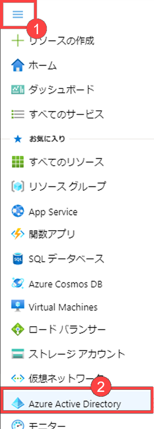

3. 左側のメニューで「**グループ**」を選択します。

    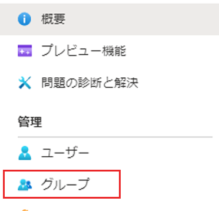

4. 「**+ 新しいグループ**」を選択します。

5. **セキュリティ** グループの種類が選択されていることを確認し、**グループ名**に `tailwind-history-owners-SUFFIX` (*サフィックス*は一意のリソース サフィックス) と入力して、「**作成**」を選択します。

    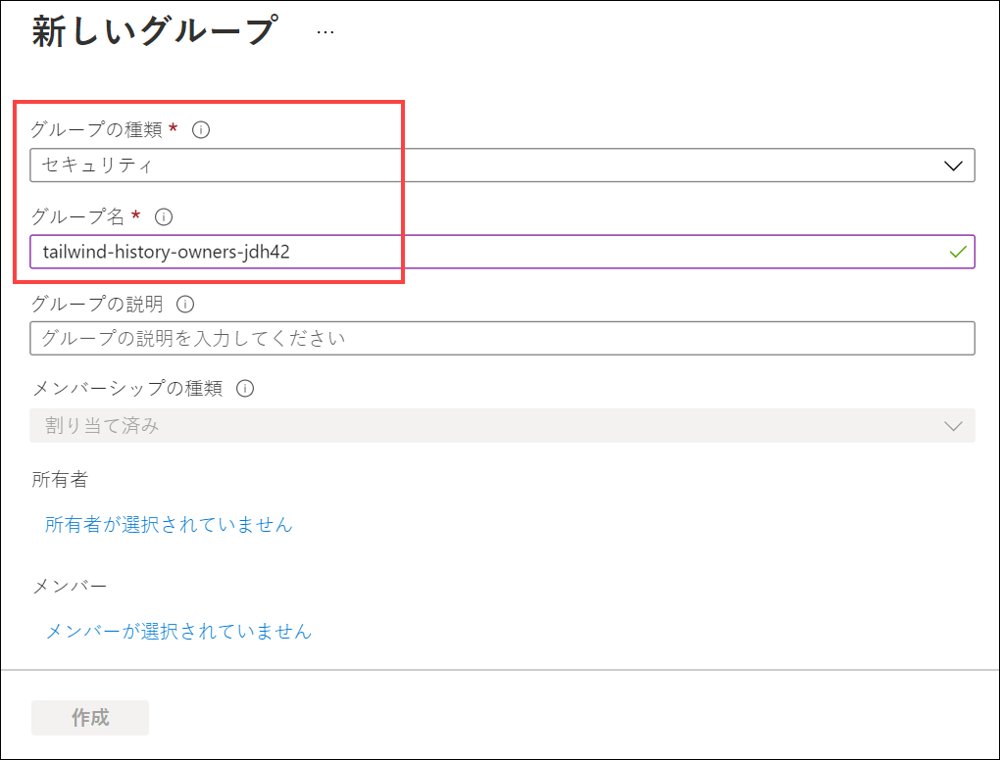

6. `tailwind-readers-SUFFIX` という名前の 2 番目の新しいセキュリティ グループを追加します (*SUFFIX* は一意のリソース サフィックスです)。
7. `tailwind-current-writers-SUFFIX` という名前の 3 番目のセキュリティ グループを追加します (*SUFFIX* は一意のリソース サフィックスです)。
8. `tailwind-2019-writers-SUFFIX` という名前の 4 番目のセキュリティ グループを追加します (*SUFFIX* は一意のリソース サフィックスです)。

> **注**: この演習の残りの手順では、わかりやすくするために、ロール名の *-SUFFIX* 部分を省略します。特定のリソース サフィックスに基づいて、一意に識別されたロール名を使用する必要があります。

### タスク 2: グループ メンバーを追加する

許可をテストするため、グループに独自のアカウントを追加します。

1. 新しく作成された **tailwind-readers** グループを開きます。

2. 左側で「**メンバー**」を選択してから「**+ メンバーの追加**」を選択します。

    

3. ラボにサインインした際に使用したユーザー アカウントを検索し、「**選択**」を選びます。

4. **tailwind-2019-writers** グループを開きます。

5. 左側で「**メンバー**」を選択してから「**+ メンバーの追加**」を選択します。

6. `tailwind` を検索し、**tailwind-current-writers** グループを選択してから「**選択**」を選びます。

    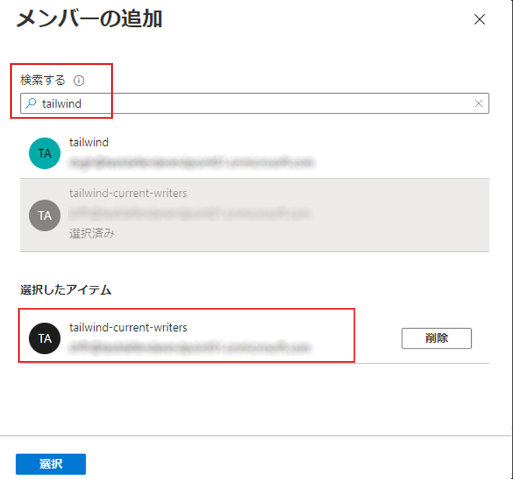

7. 左側のメニューで「**概要**」を選択し、**オブジェクト ID** を**コピー**します。

    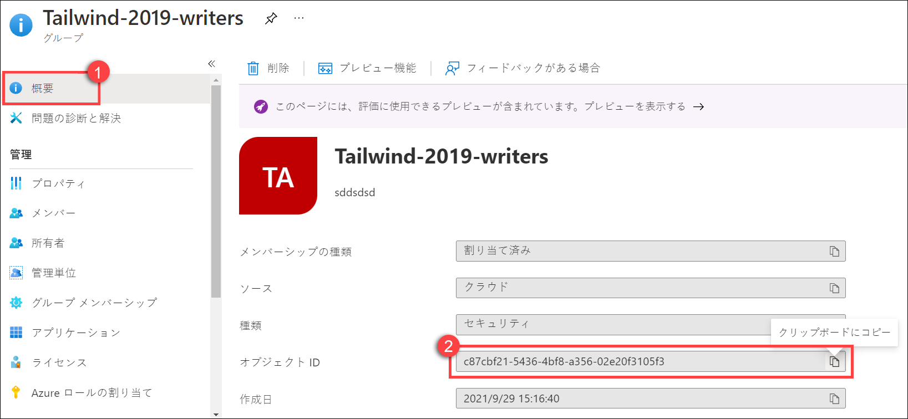

    > **注**: **オブジェクト ID** の値をメモ帳などのテキスト エディターに保存します。これは後ほど、ストレージ アカウントでアクセス制御を割り当てる際に使用されます。

### タスク 3: データ レイクのセキュリティを構成する - ロールベースのアクセス制御 (RBAC)

1. Azure portal で、**data-engineering-synapse-*xxxxxxx*** リソース グループを開きます。

2. **asadatalake*xxxxxxx*** ストレージ アカウントが開きます。

    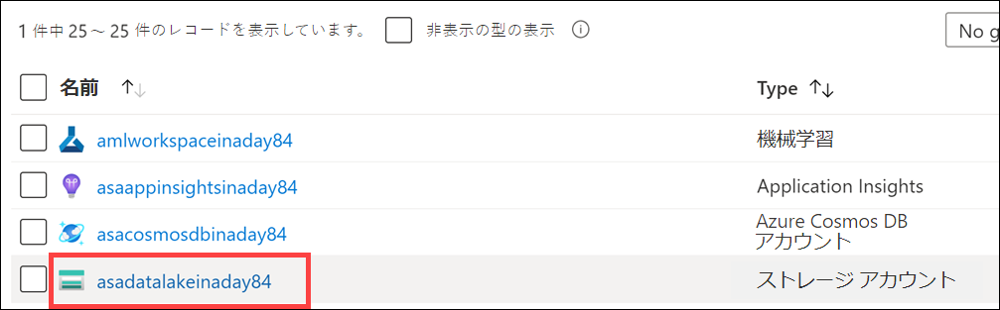

3. 左側のメニューで「**アクセス制御 (IAM)**」を選択します。

    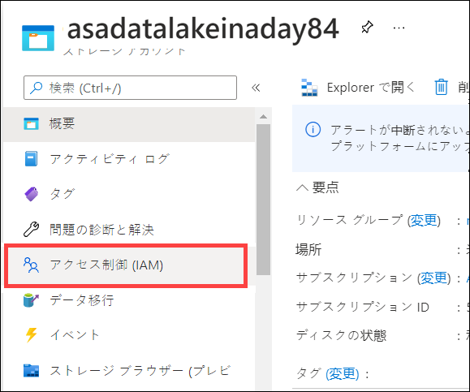

4. 「**ロールの割り当て**」タブを選択します。

    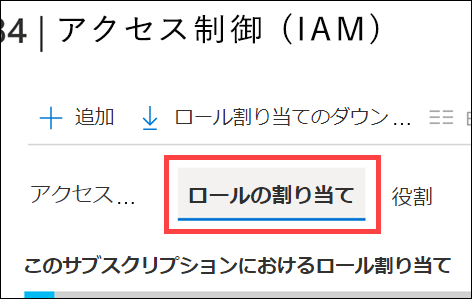

5. 「**+ 追加**」を選択した後、「**ロールの割り当ての追加**」を選択します。

    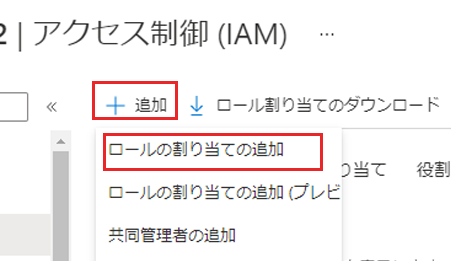

6. 「**ロール**」画面で、「**Storage Blob Data Reader**」を検索し、選択してから、「**次へ**」をクリックします。「**メンバー**」画面で、「**+ メンバ－の選択**」をクリックしてから、`tailwind-readers` を検索して、結果から **tailwind-readers** グループを選択します。次に **「選択」** をクリックします。次に、「**確認 + 割り当て**」をクリックして、「**確認 + 割り当て**」をもう一度クリックします。

    ユーザー アカウントがこのグループに追加されたので、このアカウントの BLOB コンテナーであらゆるファイルの読み取りアクセスを取得できます。Tailwind Traders はユーザー全員を **tailwind-readers** セキュリティ グループに追加する必要があります。

7. 「**+ 追加**」を選択した後、「**ロールの割り当ての追加**」を選択します。

    

8. 「**ロール**」の場合は、「**Storage Blob Data Owner**」を検索してから、「**次へ**」を選択します。

9. 「**メンバー**」画面で、「**+ メンバーの選択**」をクリックして、`tailwind` を検索して、結果から **tailwind-history-owners** グループを選択します。次に、「**確認 + 割り当て**」をクリックして、「**確認 + 割り当て**」をもう一度クリックします。

    **tailwind-history-owners** セキュリティ グループは、データ レイクが含まれ、Azure Storage に組み込まれている RBAC の役割「**Storage Blob Data Owner** for the Azure Storage」アカウントにに割り当てられます。この役割に追加された Azure AD ユーザーとサービス プリンシパルは、あらゆるデータを修正できるようになります。

    Tailwind Traders は、すべての履歴データを修正する許可のあるユーザー セキュリティ プリンシパルを **tailwind-history-owners** セキュリティ グループに追加しなくてはなりません。

10. ストレージ アカウントの「**アクセス制御 (IAM)**」リストの「**Storage Blob Data Owner**」のロールで Azure ユーザー アカウントを選択してから、「**削除**」を選択します。

    **tailwind-history-owners** グループが **Storage Blob Data Owner** グループに割り当てられ、**tailwind-readers** は **Storage Blob Data Reader** グループに割り当てられていることがわかります。

    > **注**: 新しいロールの割り当てをすべて表示するには、リソース グループに戻ってからこの画面に戻る必要があるかもしれません。

### タスク 4: データ レイクのセキュリティを構成する - アクセス制御リスト (ACL)

1. 左側のメニューで「**ストレージ ブラウザー (プレビュー)**」を選択します。**BLOB コンテナー**を展開し、**wwi-02** コンテナーを選択します。**Sale-small** フォルダーを開き、**Year=2019** フォルダーを右クリックしてから、「**ACL 管理**」を選択します。

    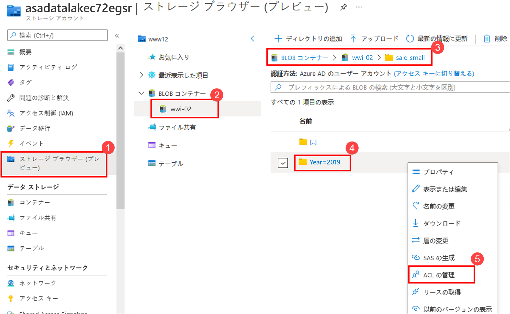

2. 「ACL の管理」画面の「**アクセス許可**」画面で、「**+ プリンシパルの追加**」をクリックして、**tailwind-2019-writers** セキュリティ グループでコピーした**オブジェクト Id** 値を「**プリンシパルの追加**」検索ボックスに貼り付けて、「**tailwind-2019-writers-suffix**」をクリックしてから、「**選択**」を選びます。

3. **tailwind-2019-writers** グループが「ACL の管理」ダイアログで選択されていることを確認できるはずです。「**読み取り**」、「**書き込み**」、「**実行**」チェックボックスにチェックを入れてから、「**保存**」を選択します。

4. 「ACL の管理」画面の「**既定のアクセス許可**」画面で、「**+ プリンシパルの追加**」をクリックして、**tailwind-2019-writers** セキュリティ グループでコピーした**オブジェクト Id** 値を「**プリンシパルの追加**」検索ボックスに貼り付けて、「**tailwind-2019-writers-suffix**」をクリックしてから、「**選択**」を選びます。

    これで、**tailwind-2019-writers** グループを使用して、**tailwind-current** セキュリティ グループに追加されたユーザーが **Year=2019** フォルダーに書き込めるようにセキュリティ ACL が設定されました。これらのユーザーは現在 (この場合は 2019 年) の売上ファイルのみを管理できます。

    翌年の始めに、2019 年度のデータへの書き込みアクセスを無効にするため、**tailwind-current-writers** セキュリティ グループを **tailwind-2019-writers** グループから削除します。**tailwind-readers** のメンバーは引き続きファイル システムのコンテンツを読み取れます。ACL ではなく、ファイル システム レベルで RBAC 組み込みロールによって読み取り・実行 (リスト) 許可を与えられているためです。

    この構成では、_アクセス_ ACL と_既定_ ACL を両方とも設定しました。

    *アクセス* ACL はオブジェクトへのアクセスを制御します。ファイルとディレクトリの両方にアクセス ACL があります。

    *既定* ACL は、ディレクトリに関連付けられた ACL のテンプレートです。この ACL によって、そのディレクトリの下に作成されるすべての子項目のアクセス ACL が決まります。ファイルには既定の ACL がありません。

    アクセス ACL と既定の ACL はどちらも同じ構造です。

### タスク 5: 許可をテストする

1. Synapse Studio の「**データ**」ハブの「**リンク**」タブで、**Azure Data Lake Storage Gen2/asaworkspace*xxxxxxx*/wwi02** コンテナーを選択します。*sale-small/Year=2019/Quarter=Q4/Month=12/Day=20191231* フォルダ－で、**sale-small-20191231-snappy.parquet ファイル**を右クリックし、「**新しい SQL スクリプト**」を選択し、「**上位 100 行を選択**」を選びます。

    

2. クエリ ウィンドウの上にある「**接続先**」ドロップダウン リストで、「**組み込み**」が選択されていることを確認し、クエリを実行します。サーバーレス SQL プール エンドポイントによってデータが読み込まれ、通常のリレーショナル データベースからのデータと同様に処理されます。

    

    セル出力には、Parquet ファイルの出力結果が表示されます。

    

    **tailwind-readers** セキュリティ グループによって割り当てられ、その後、**Storage Blob Data Reader** のロールによってストレージ アカウントで RBAC 許可を授与された Parquet ファイルの読み取り許可を使用することで、ファイルの内容を表示できます。

    ただし、アカウントは **Storage Blob Data Owner** のロールから削除され、**tailwind-history-owners** セキュリティ グループには追加されていないため、このディレクトリに書き込もうとするとどうなるのでしょう?

    試しにやってみましょう。

3. **wwi-02** ウィンドウで、**sale-small-20191231-snappy.parquet** ファイルを右クリックし、「**新しいノートブック**」を選択してから、「**データフレームに読む込む**」を選択します。

    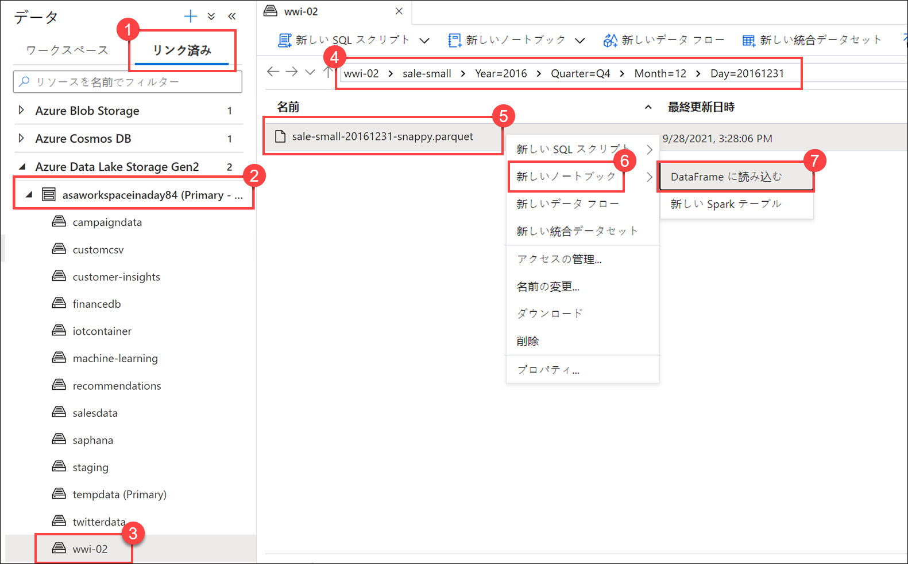

4. **SparkPool01** Spark プールをノートブックに添付します。

    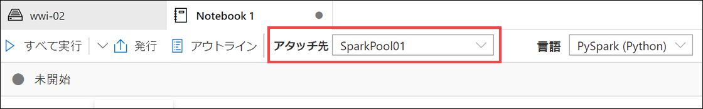

5. ノートブックのセルを実行して、データをデータフレームに読み込みます。Spark プールが開始されるまでしばらく時間がかかる場合がありますが、最終的にはデータの最初の 10 行が表示されます。この場所でデータを読み取る権限があることをもう一度確認します。

6. 結果の下で、「**+ コード**」を選択して、既存のセルの下にコード セルを追加します。

7. 次のコードを入力し、*SUFFIX* をデータ レイク リソースの一意のサフィックスに置き換えます (これは上記のセル 1 からコピーできます)。

    ```python
    df.write.parquet('abfss://wwi-02@asadatalakeSUFFIX.dfs.core.windows.net/sale-small/Year=2019/Quarter=Q4/Month=12/Day=20191231/sale-small-20191231-snappy-test.parquet')
    ```

8. 追加した新しいセルを実行します。出力には「**403 エラー**」と表示されるはずです。

    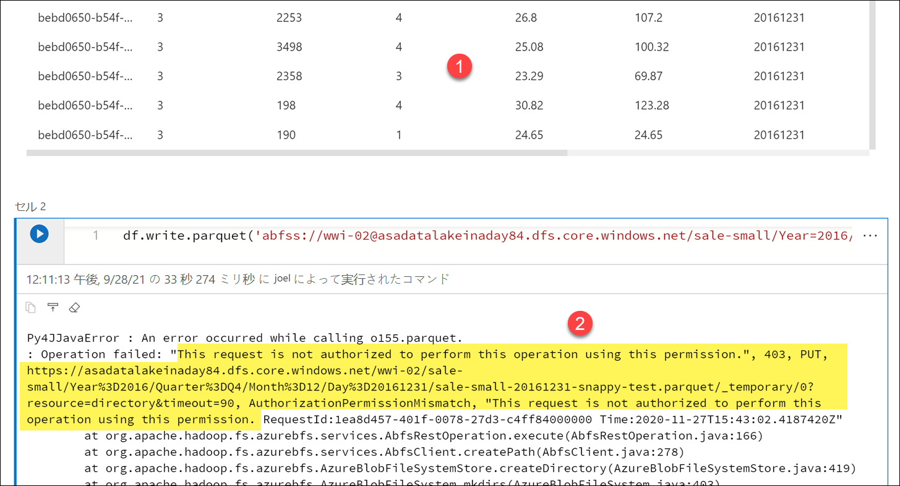

    予想していたとおり、書き込み許可はありません。セル 2 で返されるエラーは、「*このリクエストでは、この許可を使用してこの操作を行うことができません*」というメッセージで、ステータス コードは 403 です。

9. ノートブックを公開して、セッションを終了します。次に、Azure Synapse Studio からサインアウトし、ブラウザー タブを閉じて、Azure portal タブ (<https://portal.azure.com>) に戻ります。

10. 「**ホーム**」ページの「ポータル」メニューで、「**Azure Active Directory**」を選択します。

11. 左側のメニューで「**グループ**」を選択します。

12. 検索ボックスに `tailwind` と入力し、結果で **tailwind-history-owners** グループを選択します。

13. 左側で「**メンバー**」を選択してから「**+ メンバーの追加**」を選択します。

14. ラボにサインインした際に使用したユーザー アカウントを追加し、「**選択**」を選びます。

15. 新しいタブで、Azure Synapse Studio (<https://web.azuresynapse.net/>) を参照します。次に、「**開発**」タブで、「**ノートブック**」を展開し、以前に公開したノートブックを再度開きます。

16. ノートブックのすべてのセルを再実行するには、「**すべて実行**」をクリックします。しばらくすると、Spark セッションが開始され、コードが実行されます。セル 2 は「**成功**」のステータスを返し、新しいファイルがデータ レイク ストアに書き込まれたことを示します。

    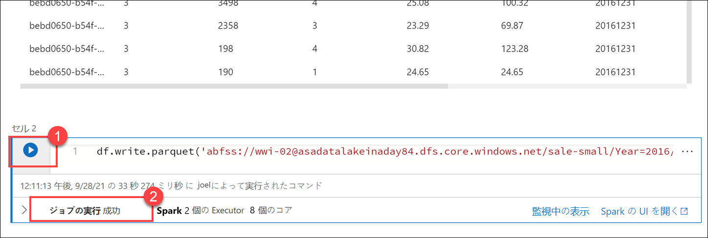

    今回、セルが成功したのは、**Storage Blob Data Owner** のロールを割り当てられているアカウントを **tailwind-history-owners** グループに追加したためです。

    > **注**: 今回も同じエラーが発生した場合は、ノートブックで**Spark セッションを中止**してから「**すべて公開**」を選択し、公開してください。変更の公開後、ページの右上コーナーでユーザー プロファイルを選択して**ログアウト**します。ログアウト後に**ブラウザー タブを閉じ**、 Synapse Studio (<https://web.azuresynapse.net/>) を再起動してノートブックを再び開き、セルを再実行します。許可を変更するためにセキュリティ トークンを更新しなくてはならない場合に、この操作が必要になります。

17. ノートブックの右上にある「**セッションの停止**」ボタンを使用して、ノートブックセッションを停止します。

18. 変更を保存する場合は、ノートブックを公開します。次に、それを閉じます。

    ファイルがデータ レイクに書き込まれているか確認してみましょう。

19. Synapse Studio の「**データ**」ハブの「**リンク**」タブで、**Azure Data Lake Storage Gen2/asaworkspace*xxxxxxx*/wwi02** コンテナーを選択します。そして、*sale-small/Year=2019/Quarter=Q4/Month=12/Day=20191231* フォルダーを参照して、このフォルダーに新しいファイルが追加されたことを確認します。

    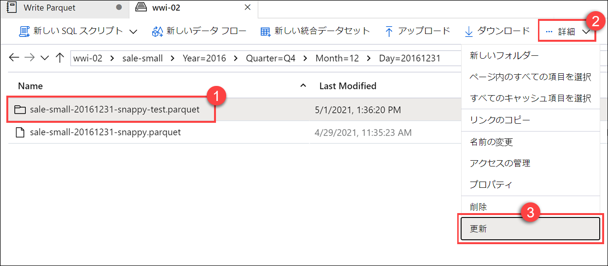
