---
lab:
    title: 'Azure Data Factory または Azure Synapse パイプラインでデータを変換する'
    module: 'モジュール 6'
---

# ラボ 6 - Azure Data Factory または Azure Synapse パイプラインでデータを変換する

このラボでは、データ統合パイプラインを構築して、複数のデータ ソースから取り込み、マッピング データ フローとノートブックを使用してデータを変換し、ひとつ以上のデータシンクにデータを移動する方法を説明します。

このラボを完了すると、次のことができるようになります。

- コードを書かずに Azure Synapse パイプラインを使用して大規模な変換を実行する
- データ パイプラインを作成して、形式が不良な CSV ファイルをインポートする
- マッピング データ フローを作成する

## ラボの構成と前提条件

このラボを開始する前に、**ラボ 5: *データ ウェアハウスにデータを取り込んで読み込む***を完了してください。

このラボでは、前のラボで作成した専用 SQL プールを使用します。前のラボの最後で SQL プールを一時停止しているはずなので、次の手順に従って再開します。

1. Synapse Studio (<https://web.azuresynapse.net/>) を開きます。
2. 「**管理**」ハブを選択します。
3. 左側のメニューで「**SQL プール**」を選択します。**SQLPool01** 専用 SQL プールが一時停止状態の場合は、名前の上にマウスを動かして、「**&#9655;**」を選択します。

    

4. プロンプトが表示されたら、「**再開**」を選択します。プールが再開するまでに、1 ～ 2 分かかります。
5. 専用 SQL プールが再開する間、続行して次の演習に進みます。

> **重要:** 開始されると、専用 SQL プールは、一時停止されるまで Azure サブスクリプションのクレジットを消費します。このラボを休憩する場合、またはラボを完了しないことにした場合は、ラボの最後にある指示に従って、SQL プールを一時停止してください。

## 演習 1 - コードを書かずに Azure Synapse パイプラインを使用した大規模な変換を実行する

Tailwind Traders 社は、データ エンジニアリング タスクでコードを書かないオプションを希望しています。データを理解しているものの開発経験の少ないジュニアレベルのデータ エンジニアがデータ変換操作を構築して維持できるようにしたいというのがその動機です。また、特定のバージョンに固定されたライブラリに依存した複雑なコードによる脆弱性を減らし、コードのテスト要件を排除して、長期的なメンテナンスをさらに容易にするという目的もあります。

もうひとつの要件は、専用 SQL プールに加えて、データ レイクで変換データを維持することです。それにより、ファクト テーブルとディメンション テーブルで格納するよりも多くのフィールドをデータ セットに保持できる柔軟性を得られます。これを行うと、コスト最適化のために専用 SQL プールを一時停止した際でもデータにアクセスできるようになります。

このような要件を考慮して、あなたはマッピング データ フローの構築を推奨します。

マッピング データ フローはパイプライン アクティビティで、コードを書かないデータ変換方法を指定する視覚的な方法を提供します。この機能により、データ クレンジング、変換、集計、コンバージョン、結合、データ コピー操作などが可能になります。

その他の利点

- Spark の実行によるクラウドのスケーリング
- レジリエントなデータ フローを容易に構築できるガイド付きエクスペリエンス
- ユーザーが慣れているレベルでデータを変換できる柔軟性
- 単一のグラスからデータを監視して管理

### タスク 1: SQL テーブルを作成する

これから構築するマッピング データ フローは、ユーザーの購入データを専用 SQL プールに書き込みます。Tailwind Traders には、まだ、このデータを格納するためのテーブルがありません。SQL スクリプトを実行し、前提条件として、このテーブルを作成します。

1. Synapse Studio で「**開発**」ハブに移動します。

    

2. 「**+**」メニューで、「**SQL スクリプト**」を選択します。

    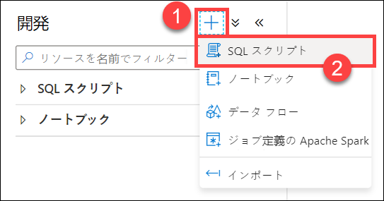

3. ツールバー メニューで、**SQLPool01** データベースに接続します。

    

4. クエリ ウィンドウでスクリプトを以下のコードに置き換え、Azure Cosmos DB に格納されているユーザーの好みの製品と、データ レイク内で JSON ファイルに格納されている e コマース サイトからのユーザー当たりの上位製品購入を結合する新しいテーブルを作成します。

    ```sql
    CREATE TABLE [wwi].[UserTopProductPurchases]
    (
        [UserId] [int]  NOT NULL,
        [ProductId] [int]  NOT NULL,
        [ItemsPurchasedLast12Months] [int]  NULL,
        [IsTopProduct] [bit]  NOT NULL,
        [IsPreferredProduct] [bit]  NOT NULL
    )
    WITH
    (
        DISTRIBUTION = HASH ( [UserId] ),
        CLUSTERED COLUMNSTORE INDEX
    )
    ```

5. ツールバー メニューの「**実行**」を選択してスクリプトを実行します (SQL プールが再開するまで待つ必要がある場合があります)。

    

6. クエリ ウィンドウでスクリプトを以下に置き換え、キャンペーン分析 CSV ファイル用に新しいテーブルを作成します。

    ```sql
    CREATE TABLE [wwi].[CampaignAnalytics]
    (
        [Region] [nvarchar](50)  NOT NULL,
        [Country] [nvarchar](30)  NOT NULL,
        [ProductCategory] [nvarchar](50)  NOT NULL,
        [CampaignName] [nvarchar](500)  NOT NULL,
        [Revenue] [decimal](10,2)  NULL,
        [RevenueTarget] [decimal](10,2)  NULL,
        [City] [nvarchar](50)  NULL,
        [State] [nvarchar](25)  NULL
    )
    WITH
    (
        DISTRIBUTION = HASH ( [Region] ),
        CLUSTERED COLUMNSTORE INDEX
    )
    ```

7. スクリプトを実行して、テーブルを作成します。

### タスク 2: リンク サービスを作成する

Azure Cosmos DB は、マッピング フロー データで使用するデータ ソースの 1 つです。Tailwind Traders はまだリンク サービスを作成していません。このセクションの手順に従って作成してください。

> **注**: すでに Cosmos DB リンク サービスを作成している場合は、このセクションをスキップしてください。

1. 「**管理**」ハブに移動します。

    

2. 「**リンク サービス**」を開き、「**+ 新規**」を選択して新しいリンク サービスを作成します。オプションのリストで「**Azure Cosmos DB (SQL API)**」を選択し、「**続行**」を選択します。

    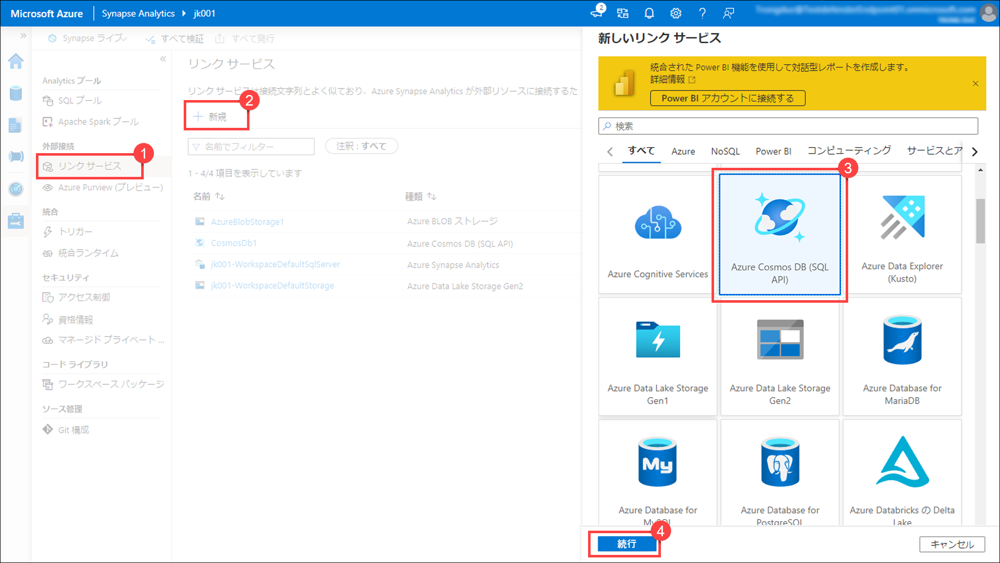

3. リンク サービスに `asacosmosdb01` という名前を付けてから、**asacosmosdb*xxxxxxx*** Cosmos DBア カウント名と **CustomerProfile** データベースを選択します。次に、「**作成**」をクリックする前に、「**接続のテスト**」を選択して成功を確認します。

    

### タスク 3: データ セットを作成する

ユーザー プロファイル データは 2 つの異なるデータ ソースに由来しており、それを今から作成します。e コマース システムの顧客プロファイル データは、過去 12 か月間のサイトの訪問者 (顧客) ごとに上位の商品購入数を提供するもので、データ レイクの JSON ファイル内に格納されます。ユーザー プロファイル データには製品の好みや製品のレビューなどが含まれており、Cosmos DB に JSON ドキュメントとして格納されています。

このセクションでは、このラボで後ほど作成するデータ パイプライン向けのデータ シンクとして機能する SQL テーブルのデータセットを作成します。

1. 「**データ**」ハブに移動します。

    

2. 「**+**」メニューで、「**統合データセット**」を選択して、新しいデータセットを作成します。

    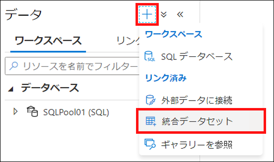

3. 「**Azure Cosmos DB (SQL API)**」を選択してから、「**続行**」を選択します。

    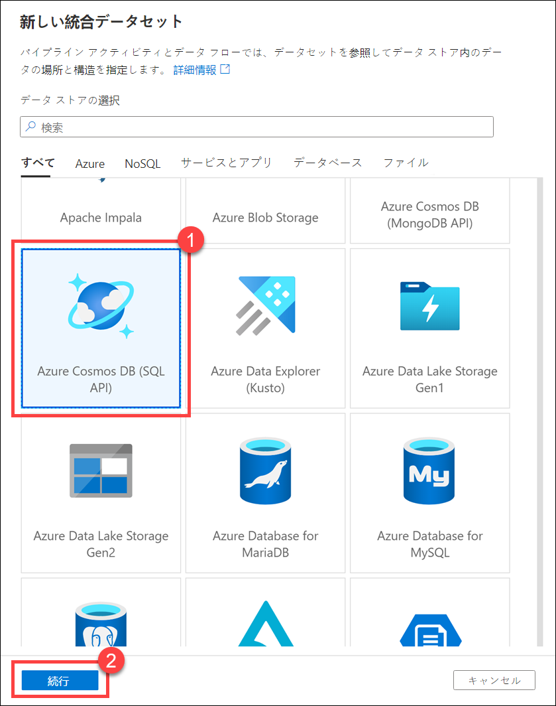

4. データセットを次のように構成して、「**OK**」を選択します。

    - **名前**: `asal400_customerprofile_cosmosdb` と入力します。
    - **リンク サービス**: 「**asacosmosdb01**」を選択します。
    - **コレクション**: 「**OnlineUserProfile01**」を選択します。

        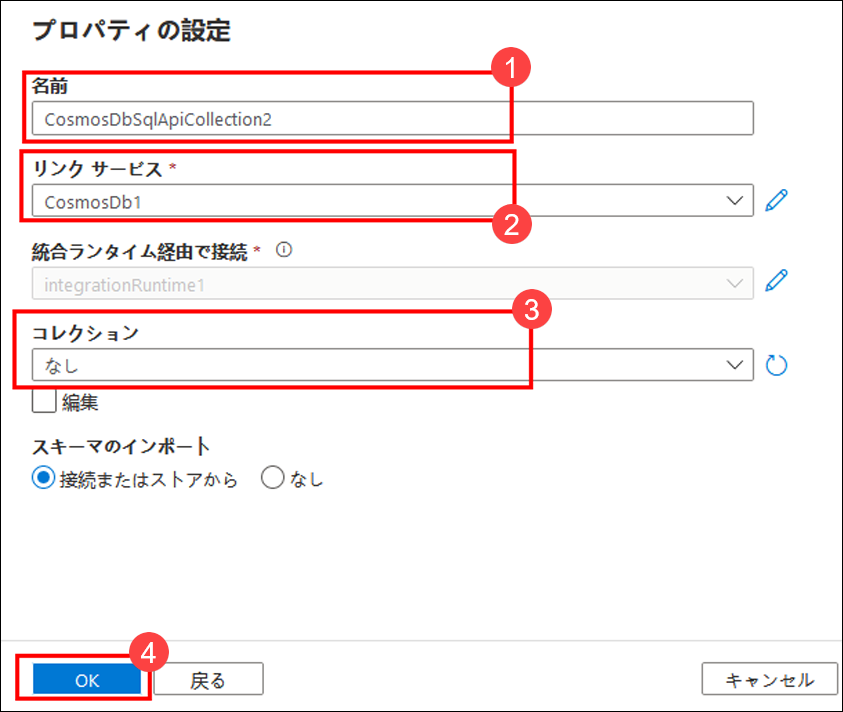

5. データセットの作成後、「**接続**」タブで「**データのプレビュー**」を選択します。

    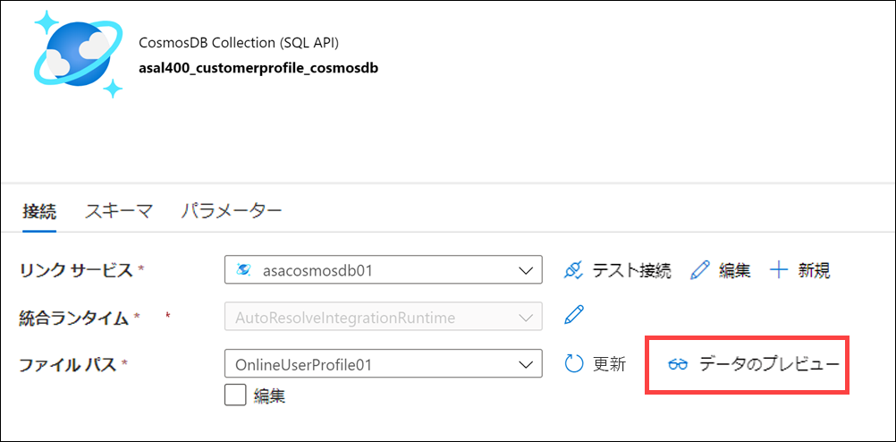

6. データのプレビューで、選択された Azure Cosmos DB コレクションのクエリを実行し、その内部でドキュメントのサンプルを返します。ドキュメントは JSON 形式で格納され、**userId**、**cartId**、**preferredProducts** (空の可能性がある製品 ID の配列) のフィールド、**productReviews** (空の可能性がある書き込み済みの製品レビューの配列) が含まれています。

    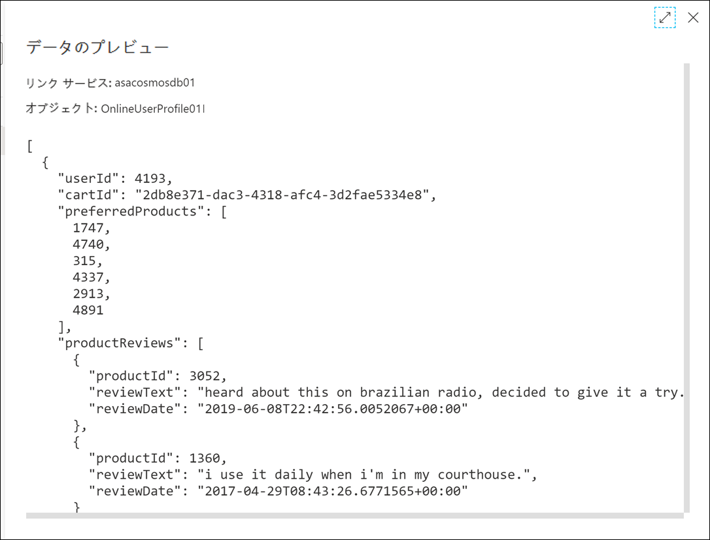

7. プレビューを閉じます。次に、「**データ**」ハブの「**+**」メニューで、「**統合データセット**」を選択して、必要な 2 番目のソース データデータセットを作成します。

    

8. 「**Azure Data Lake Storage Gen2**」を選択し、「**続行**」をクリックします。

    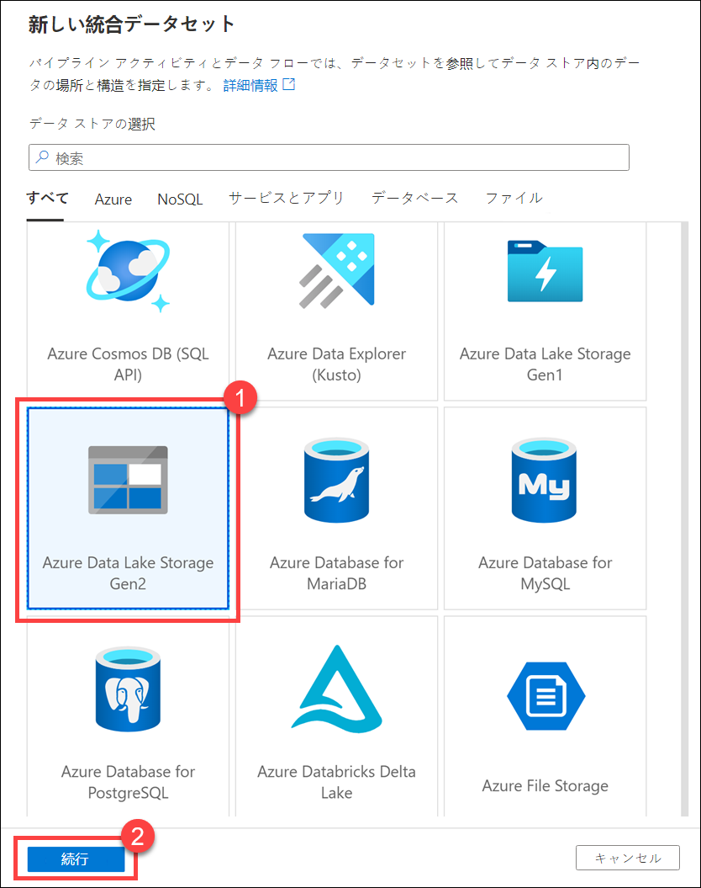

9. 「**JSON**」形式を選び、「**続行**」を選択します。

    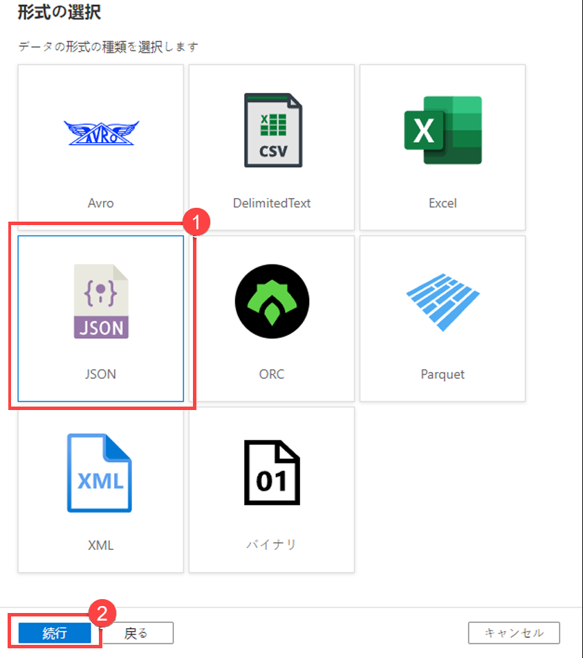

10. データセットを次のように構成して、「**OK**」を選択します。

    - **名前**: `asal400_ecommerce_userprofiles_source` と入力します。
    - **リンク サービス**: **asadatalake*xxxxxxx*** リンク サービスを選択します。
    - **ファイル パス**: **wwi-02/online-user-profiles-02** パスを参照します。
    - **スキーマのインポート**: 「**接続/ストアから**」を選択します。

    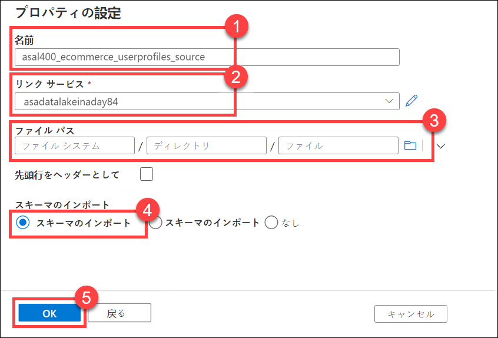

11. 「**データ**」ハブの「**+**」メニューで、「**統合データセット**」を選択して、キャンペーン分析の宛先テーブルを参照する 3 番目のデータセットを作成します。

    

12. 「**Azure Synapse Analytics**」を選択してから「**続行**」を選択します。

    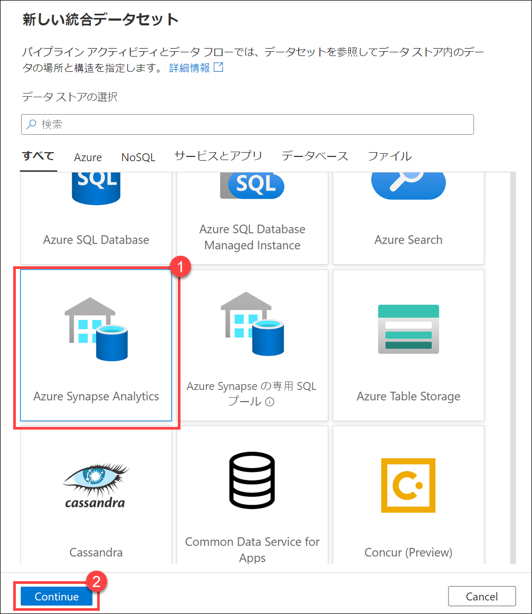

13. データセットを次のように構成して、「**OK**」を選択します。

    - **名前**: `asal400_wwi_campaign_analytics_asa` と入力します。
    - **リンク サービス**: **SqlPool01** を選択します。
    - **テーブル名**: **wwi.CampaignAnalytics** を選択します。
    - **スキーマのインポート**: 「**接続/ストアから**」を選択します。

    

14. 「**データ**」ハブの「**+**」メニューで、「**統合データセット**」を選択して、上位の製品購入の宛先テーブルを参照する 4 番目のデータセットを作成します。

    

15. 「**Azure Synapse Analytics**」を選択してから「**続行**」を選択します。

    

16. データセットを次のように構成して、「**OK**」を選択します。

    - **名前**: `asal400_wwi_usertopproductpurchases_asa` と入力します。
    - **リンク サービス**: **SqlPool01** を選択します。
    - **テーブル名**: **wwi.UserTopProductPurchases** を選択します。
    - **スキーマのインポート**: 「**接続/ストアから**」を選択します。

    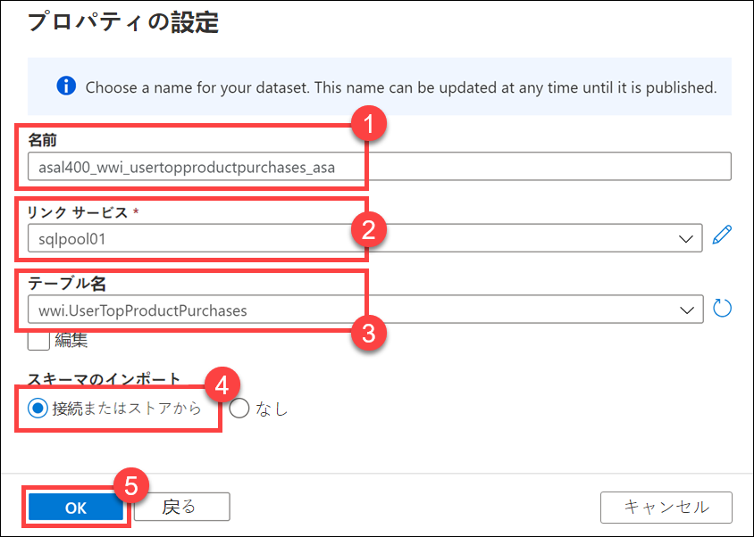

### タスク 4: キャンペーン分析データセットを作成する

あなたの組織は、マーケティング キャンペーン データが含まれている、形式が不良な CSV ファイルを提供されました。ファイルはデータ レイクにアップロードされていますが、データ ウェアハウスにインポートする必要があります。


収益通貨データの無効な文字、一致しない列といった問題があります。

1. 「**データ**」ハブの「**+**」メニューで、「**統合データセット**」を選択して、新しいデータセットを作成します。

    

2. 「**Azure Data Lake Storage Gen2**」を選択し、「**続行**」を選択します。

    

3. 「**DelimitedText**」形式を選び、「**続行**」を選択します。

    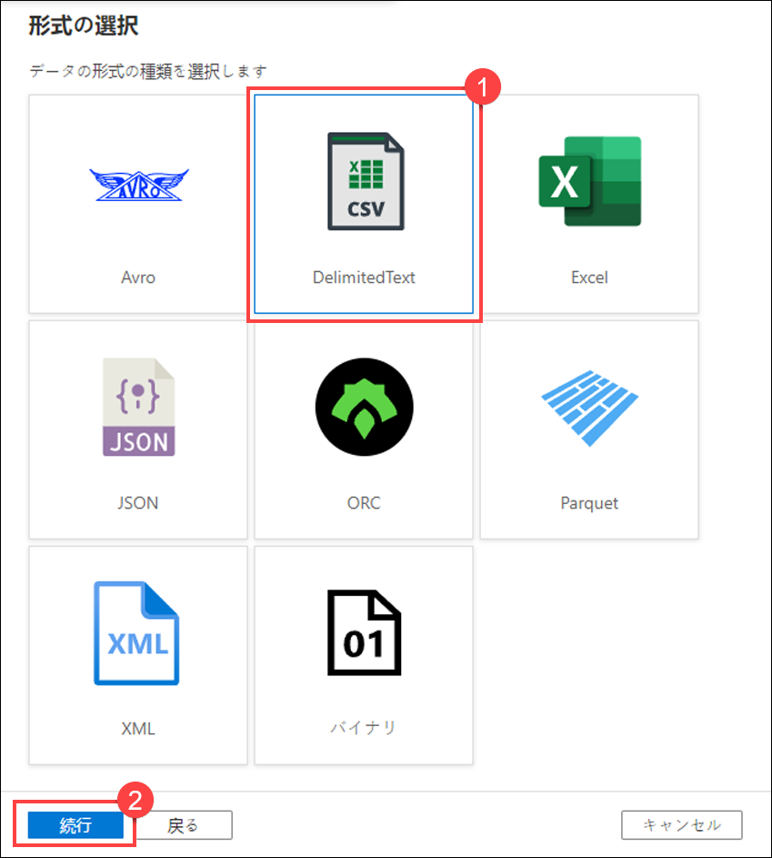

4. データセットを次のように構成して、「**OK**」を選択します。

    - **名前**: `asal400_campaign_analytics_source` と入力します。
    - **リンク サービス**: **asadatalake*xxxxxxx*** リンク サービスを選択します。
    - **ファイル パス**: **wwi-02/campaign-analytics/campaignanalytics.csv** を参照します。
    - **先頭の行を見出しとして使用**: チェックを外したままにします (見出しの列数とデータ行の列数が一致しないため、見出しはスキップします)。
    - **スキーマのインポート**: 「**接続/ストアから**」を選択します。

    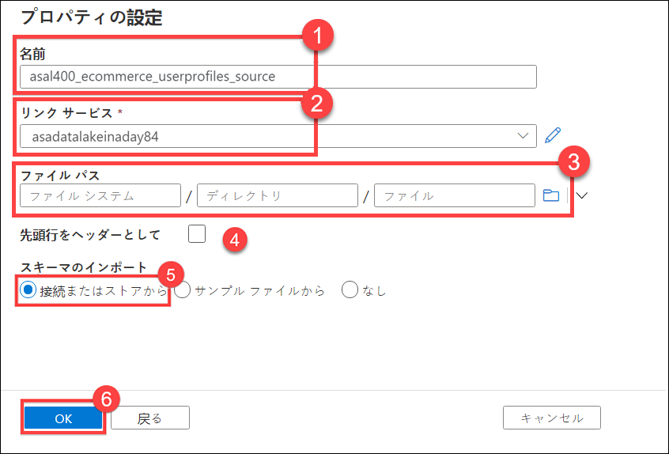

5. データセットを作成した後、「**接続**」タブで、既定の設定を確認します。以下の構成に一致しなくてはなりません。

    - **圧縮の種類**: なし。
    - **列区切り記号**: コンマ (,)
    - **行区切り記号**: 既定 (\r、\n、\r\n)
    - **エンコード**: 既定値 (UTF-8)
    - **エスケープ文字**: 円記号 (\\)
    - **引用符文字**: 二重引用符 (")
    - **先頭の行を見出しとして使用**: *オフ*
    - **Null 値**: *空白*

    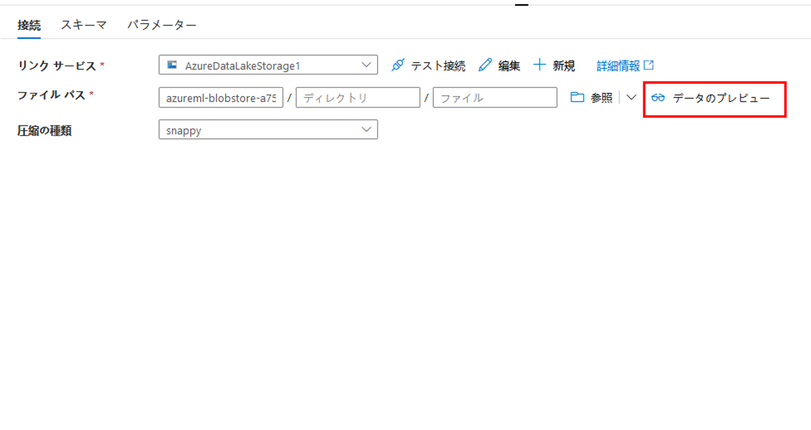

6. 「**データのプレビュー**」を選択します (邪魔になる場合は「**プロパティ**」ウィンドウを閉じます)。

    プレビューには、CSV ファイルのサンプルが表示されます。このタスクの最初に、いくつかの問題を確認できます。最初の行は見出しとして設定しないので、見出し列が最初の行として表示されます。また、市区町村と県・州の値が表示されない点に留意してください。これは、見出し行の列数がファイルの残りの部分と一致しないためです。次の演習でデータ フローを作成する際、最初の行を除外します。

    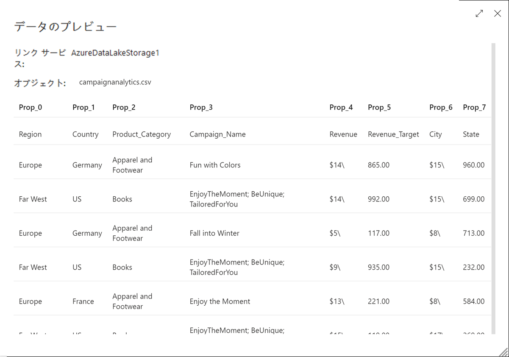

7. プレビューを閉じて、「**すべて公開**」を選択し、「**公開**」をクリックして新しいリソースを保存します。

    

### タスク 5: キャンペーン分析データ フローを作成する

1. 「**開発**」ハブに移動します。

    

2. 「**+**」メニューで、「**データ フロー**」を選択して新しいデータ フローを作成します (ヒントが表示されている場合は閉じます)。

    

3. 新しいデータ フローの「**プロパティ**」ブレードの「**全般**」設定で、「**名前**」を `asal400_lab2_writecampaignanalyticstoasa` に変更します。

    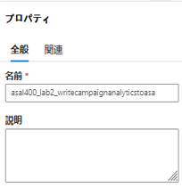

4. データ フロー キャンバスで「**ソースの追加**」を選択します (ここでも、ヒントが表示されている場合は閉じます)。

    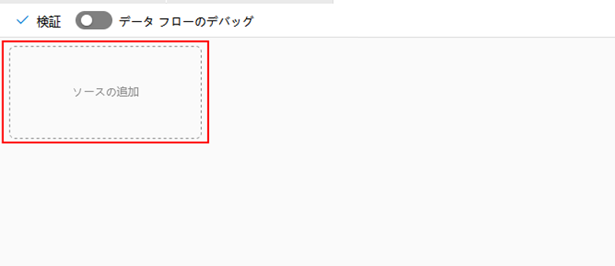

5. 「**ソース設定**」で次のように構成します。

    - **出力ストリーム名**: `CampaignAnalytics` と入力します。
    - **ソースの種類**: 「**統合データセット**」を選択します。
    - **データセット**: 「**asal400_campaign_analytics_source**」を選択します。
    - **オプション**: 「**スキーマの誤差を許可する**」を選択し、他のオプションはオフのままにします。
    - **スキップ ライン カウント**: `1` と入力します。これにより、CSV ファイルの残りの行よりも 2 列少ない見出し行をスキップし、最後の 2 つのデータ列を切り詰めます。
    - **サンプリング**: 「**無効**」を選択します。

    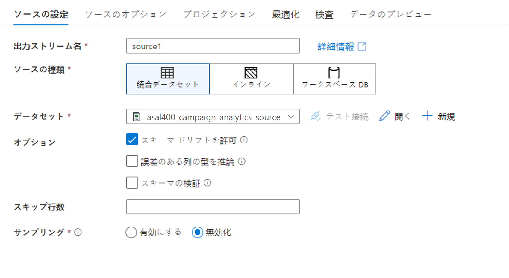

    データ フローを作成すると、デバッグをオンにして特定の機能が有効になります。データのプレビューやスキーマ (プロジェクション) のインポートなどです。このオプションを有効にするのに時間がかかり、ラボ環境でのリソース消費を最小限に抑えるために、これらの機能をバイパスします。
    
6. データ ソースには、設定する必要のあるスキーマが含まれています。設定するには、設計キャンバスの上で「**スクリプト**」を選択します。

    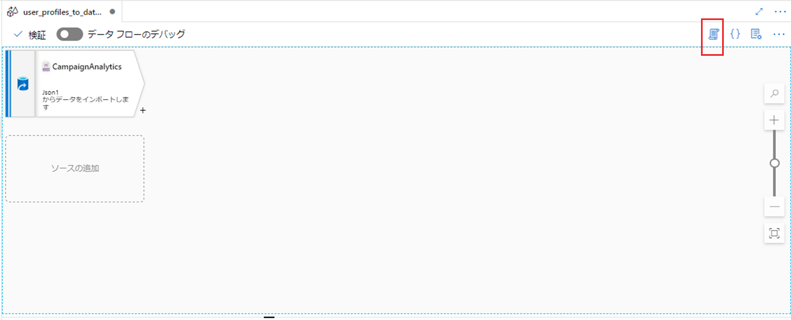

7. スクリプトを以下に置き換え、列のマッピングを提供して、「**OK**」を選択します。

    ```json
    source(output(
            {_col0_} as string,
            {_col1_} as string,
            {_col2_} as string,
            {_col3_} as string,
            {_col4_} as string,
            {_col5_} as double,
            {_col6_} as string,
            {_col7_} as double,
            {_col8_} as string,
            {_col9_} as string
        ),
        allowSchemaDrift: true,
        validateSchema: false,
        ignoreNoFilesFound: false,
        skipLines: 1) ~> CampaignAnalytics
    ```

8. 「**CampaignAnalytics**」データ ソースを選択してから「**プロジェクション**」を選択します。プロジェクションには以下のスキーマが表示されるはずです。

    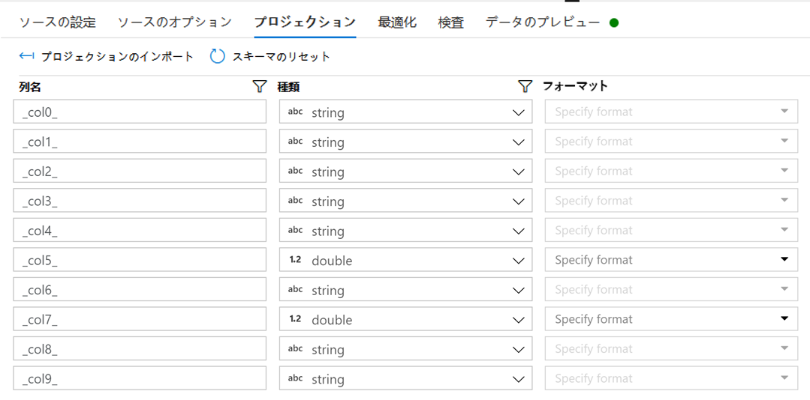

9. **CampaignAnalytics** ステップの右側で「**+**」を選択し、「**選択**」スキーマ修飾子を選択します。

    

10. 「**設定の選択**」で以下のように構成します。

    - **出力ストリーム名**: `MapCampaignAnalytics` を入力します。
    - **着信ストリーム**: **CampaignAnalytics** を選択します。
    - **オプション**: 両方のオプションをオンにします。
    - **入力列**: 「**自動マッピング**」がオフになていることを確認し、「**名前を付ける**」フィールドで以下の値を入力します。
      - `Region`
      - `Country`
      - `ProductCategory`
      - `CampaignName`
      - `RevenuePart1`
      - `Revenue`
      - `RevenueTargetPart1`
      - `RevenueTarget`
      - `City`
      - `State`

    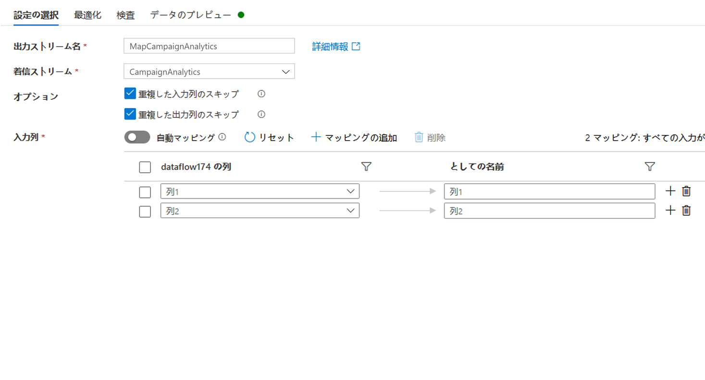

11. **MapCampaignAnalytics** ステップの右側で「**+**」を選択し、「**派生列**」スキーマ修飾子を選択します。

    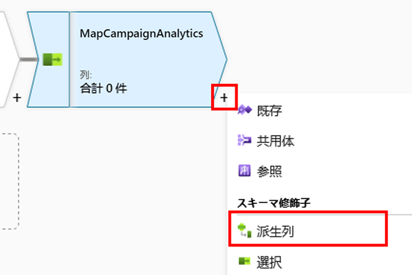

12. 「**派生列の設定**」で以下を構成します。

    - **出力ストリーム名**: `ConvertColumnTypesAndValues` と入力します。
    - **着信ストリーム**: **MapCampaignAnalytics** を選択します。
    - **列**: 次の情報を指定します。

        | 列 | 式 |
        | --- | --- |
        | Revenue | `toDecimal(replace(concat(toString(RevenuePart1), toString(Revenue)), '\\', ''), 10, 2, '$###,###.##')` |
        | RevenueTarget | `toDecimal(replace(concat(toString(RevenueTargetPart1), toString(RevenueTarget)), '\\', ''), 10, 2, '$###,###.##')` |

    > **注**: 2 番目の列を挿入するには、列リストの上で「**+ 追加**」を選択してから「**列の追加**」を選択します。

    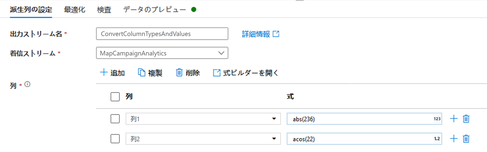

    定義した式は、**RevenuePart1** と **Revenue** の値、および **RevenueTargetPart1** と **RevenueTarget** の値を連結してクリーンアップします。

13. **ConvertColumnTypesAndValues** ステップの右側で「**+**」を選択し、コンテキスト メニューで「**選択**」スキーマ修飾子を選択します。

    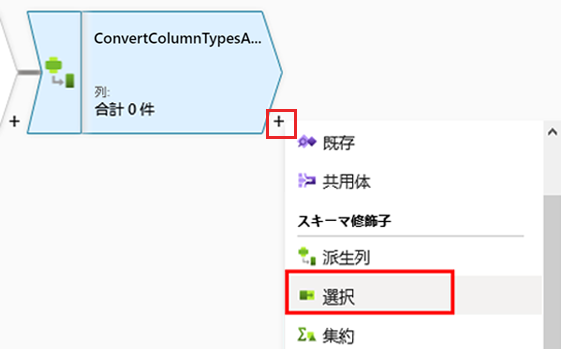

14. 「**設定の選択**」で以下のように構成します。

    - **出力ストリーム名**: `SelectCampaignAnalyticsColumns` と入力します。
    - **着信ストリーム**: **ConvertColumnTypesAndValues** を選択します。
    - **オプション**: 両方のオプションをオンにします。
    - **入力列**: 「**自動マッピング**」がオフになっていることを確認し、**RevenuePart1** と **RevenueTargetPart1** を**削除**します。これらのフィールドはもう必要ありません。

    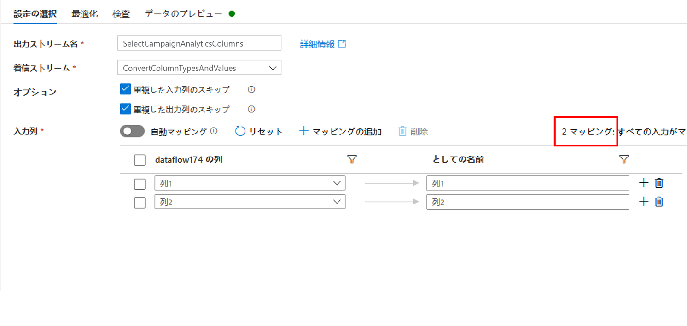

15. **SelectCampaignAnalyticsColumns** ステップの右側で「**+**」を選択し、「**シンク**」の宛先を選択します。

    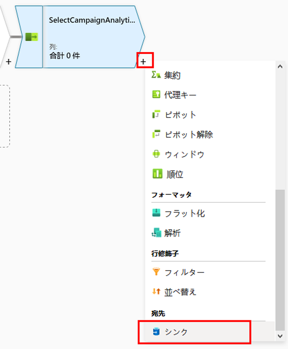

16. 「**シンク**」で以下を構成します。

    - **出力ストリーム名**: `CampaignAnalyticsASA` と入力します。
    - **着信ストリーム**: **SelectCampaignAnalyticsColumns** を選択します。
    - **シンクの種類**: 「**統合データセット**」を選択します。
    - **データセット**: 「**asal400_wwi_campaign_analytics_asa**」を選択します。
    - **オプション**: 「**スキーマの誤差を許可する**」をチェックし、「**スキーマの検証**」はオフにします。

    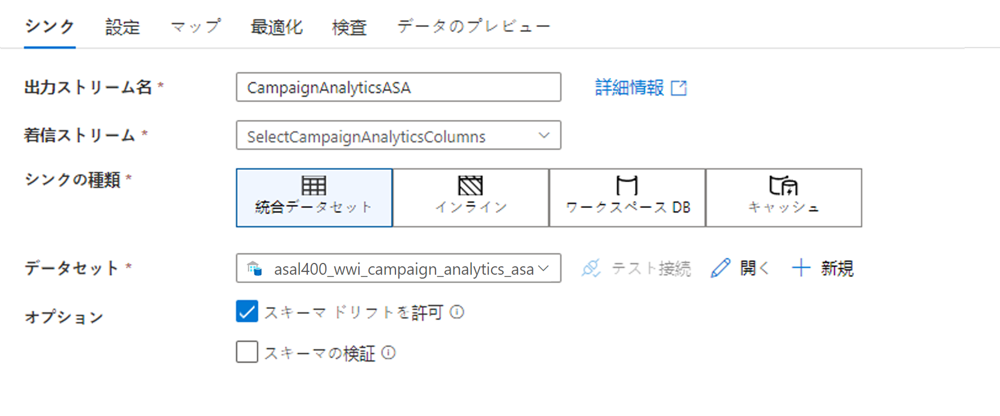

17. 「**設定**」タブで、次のオプションを構成します。

    - **更新方法**: **Allow insert** をチェックして、残りはオフのままにします。
    - **テーブル アクション**: 「**テーブルの切り詰め**」を選択します。
    - **ステージングの有効化**: このオプションはオフにします。サンプル CSV ファイルは小さいので、ステージング オプションは不要です。

    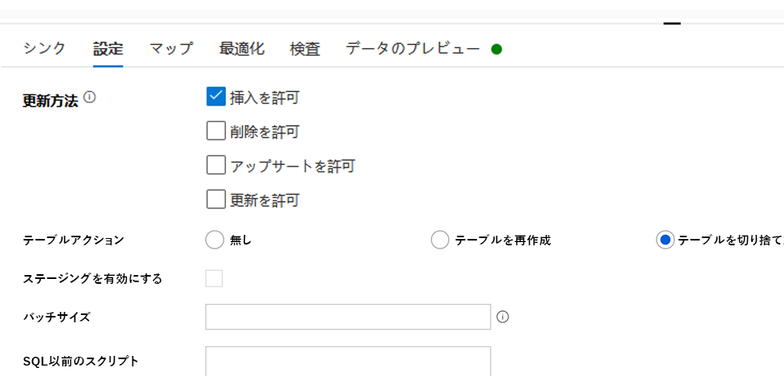

18. 完成したデータ フローは次のようになるはずです。

    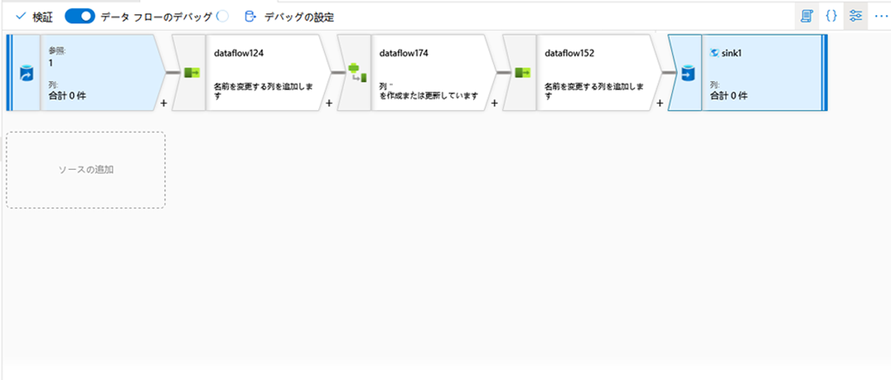

19. 「**すべて公開**」を選択した後、「**公開**」を選択して新しいデータ フローを保存します。

    

### タスク 6: キャンペーン分析データ パイプラインを作成する

新しいデータ フローを実行するには、新しいパイプラインを作成してデータ フロー アクティビティを追加する必要があります。

1. 「**統合**」ハブに移動します。

    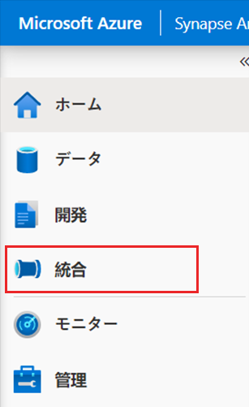

2. 「**+**」メニューで、「**パイプライン**」を選択して新しいパイプラインを作成します。

    

3. 新しいパイプラインの「**プロパティ**」ブレードの「**全般**」セクションに以下の**名前**を入力します: `Write Campaign Analytics to ASA`。

4. アクティビティ リスト内で「**移動と変換**」を展開し、「**データ フロー**」アクティビティをパイプライン キャンバスにドラッグします。

    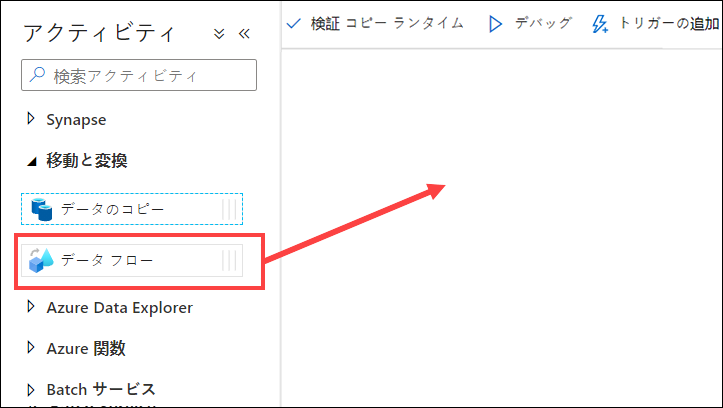

5. データ フローの「**全般**」タブ (パイプライン キャンバスの下) で、「**名前**」を `asal400_lab2_writecampaignanalyticstoasa` に設定します。

    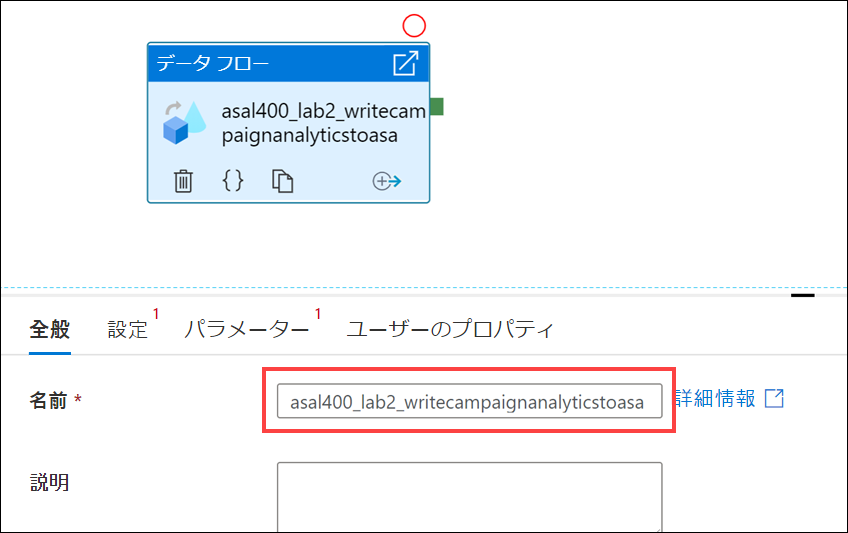

6. 「**設定**」タブを選択します。 次に、「**データ フロー**」リストで、**asal400_lab2_writecampaignanalyticstoasa** を選択します。

    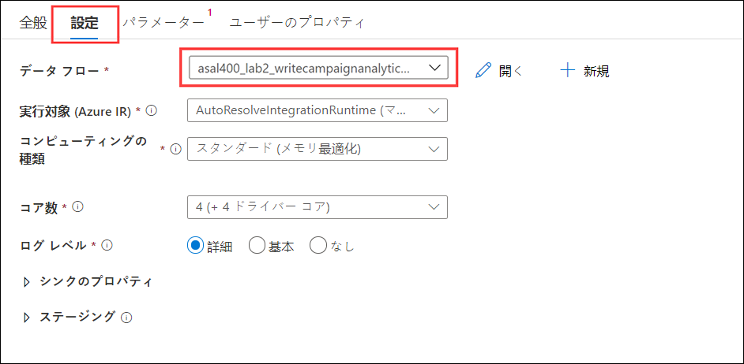

8. 「**すべて公開**」を選択して、新しいパイプラインを保存してから、「**公開**」を選択します。

    

### タスク 7: キャンペーン分析データ パイプラインを実行する

1. 「**トリガーの追加**」を選択し、パイプライン キャンバスの最上部にあるツールバーで「**今すぐトリガー**」を選択します。

    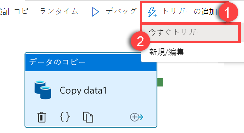

2. 「**パイプライン実行**」ウィンドウで「**OK**」を選択してパイプライン実行を開始します。

    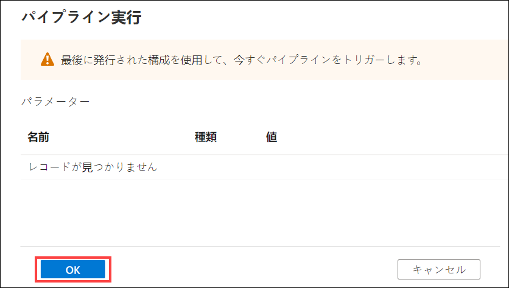

3. 「**監視**」ハブに移動します。

    

4. パイプライン実行が正常に完了するまで待ちます。これにはしばらく時間がかかります。場合によっては、ビューを更新する必要があります。

    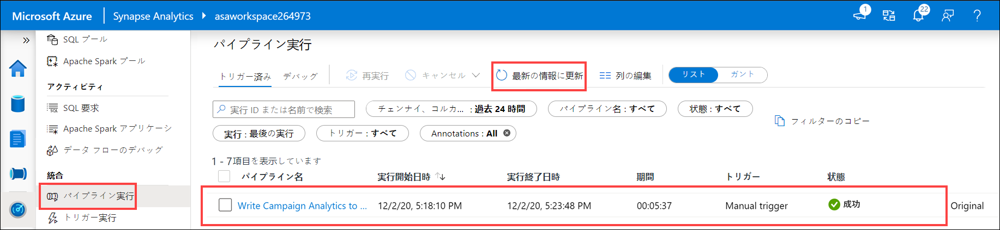

### タスク 8: キャンペーン分析テーブルの内容を表示する

パイプライン実行が完了したので、SQL テーブルを見て、データがコピーされていることを確認しましょう。

1. 「**データ**」ハブに移動します。

    

2. 「**ワークスペース**」セクションの下にある **SqlPool01** データベースを展開し、「**テーブル**」を展開します (新しいテーブルを表示するには更新が必要な場合があります)。

3. **wwi.CampaignAnalytics** テーブルを右クリックし、「**新しい SQL スクリプト**」を選択してから、「**上位 100 行を選択**」を選びます。 

    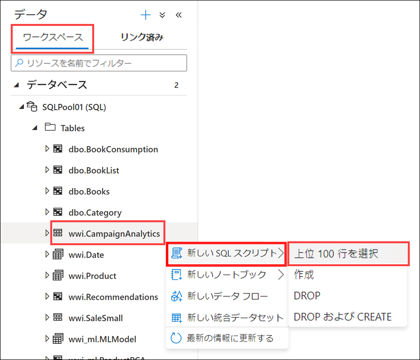

4. 適切に変換されたデータがクエリ結果に表示されるはずです。

    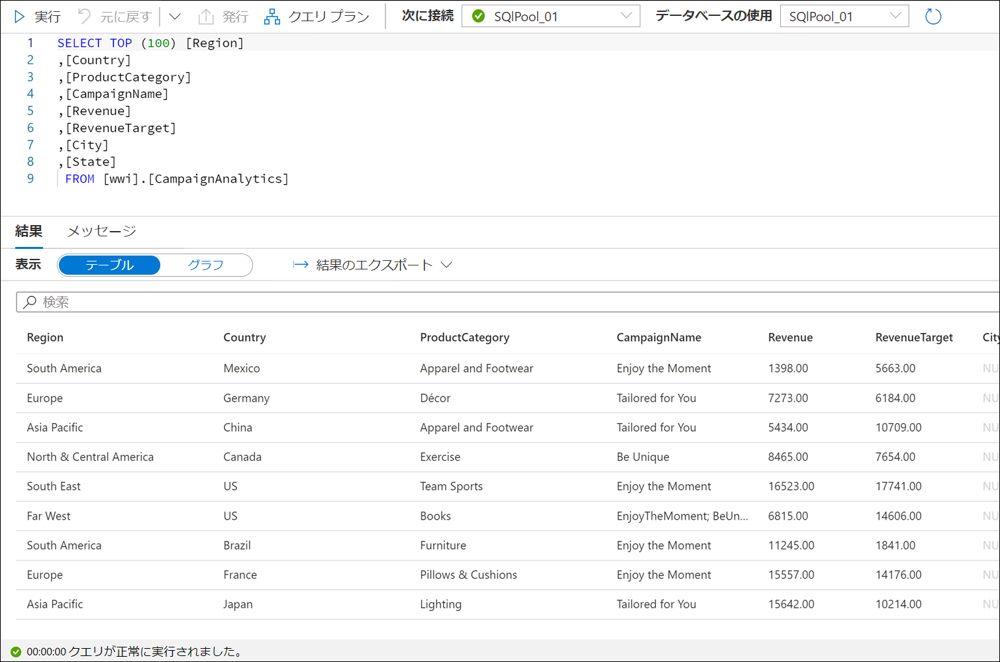

5. 次のようにクエリを変更し、スクリプトを実行します。

    ```sql
    SELECT ProductCategory
    ,SUM(Revenue) AS TotalRevenue
    ,SUM(RevenueTarget) AS TotalRevenueTarget
    ,(SUM(RevenueTarget) - SUM(Revenue)) AS Delta
    FROM [wwi].[CampaignAnalytics]
    GROUP BY ProductCategory
    ```

6. クエリ結果で「**グラフ**」ビューを選択します。定義されているように列を構成します。

    - **グラフの種類**: Column。
    - **カテゴリ列**: ProductCategory。
    - **凡例 (シリーズ) 列**: TotalRevenue、TotalRevenueTarget、Delta。

    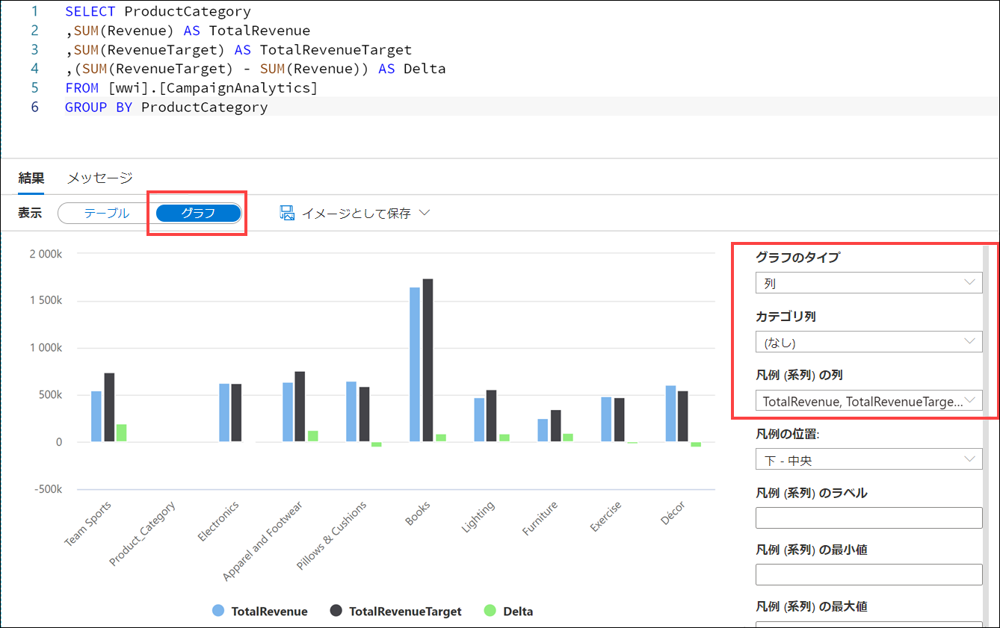

## 演習 2 - 上位製品購入向けのマッピング データ フローを作成する

Tailwind Traders は、JSON ファイルとして e コマースシステムからインポートされた上位製品購入を、JSON ドキュメントとして Azure Cosmos DB で格納されていたプロファイル データのユーザーの好みの製品に組み合わせる必要があります。組み合わせたデータは専用 SQL プールおよびデータ レイクに格納して、さらなる分析と報告に使いたいと考えています。

これを行うため、以下のタスクを実行するマッピング データ フローを構築する必要があります。

- 2 つの ADLS Gen2 データ ソースを JSON データ向けに追加する
- 両方のファイル セットの階層構造をフラット化する
- データ変換と種類の変換を行う
- 両方のデータ ソースを結合する
- 条件ロジックに基づき、結合したデータで新しいフィールドを作成する
- 必要なフィールドで null 記録をフィルタリングする
- 専用 SQL プールに書き込む
- 同時にデータ レイクに書き込む

### タスク 1: マッピング データ フローを作成する

1. Synapse Studio で「**開発**」ハブに移動します。

    

2. 「**+**」メニューで、「**データ フロー**」を選択して新しいデータ フローを作成します。

    

3. 新しいデータ フローの「**プロパティ**」ペインの「**全般**」セクションで、「**名前**」を以下に更新します: `write_user_profile_to_asa`。

    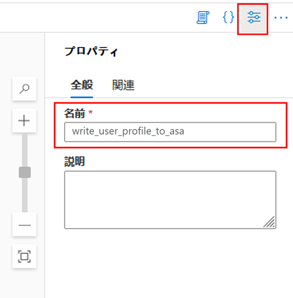

4. 「**プロパティ**」ボタンを選択してペインを非表示にします。

    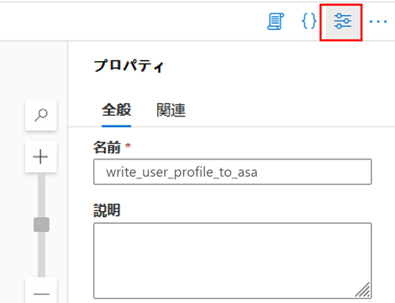

5. データ フロー キャンバスで「**ソースの追加**」を選択します。

    

6. 「**ソース設定**」で次のように構成します。

    - **出力ストリーム名**: `EcommerceUserProfiles` と入力します。
    - **ソースの種類**: 「**統合データセット**」を選択します。
    - **データセット**: 「**asal400_ecommerce_userprofiles_source**」を選択します。

        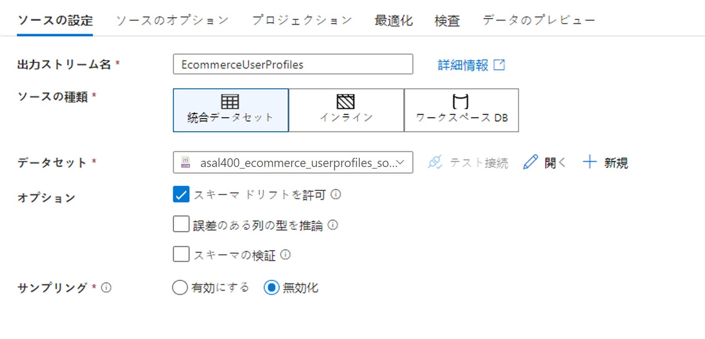

7. 「**ソースのオプション**」タブを選択し、以下のように構成します。

    - **ワイルドカード パス**: `online-user-profiles-02/*.json` と入力します
    - **JSON 設定**: このセクションを展開し、「**ドキュメントの配列**」設定を選択します。これにより、各ファイルに JSON ドキュメントの配列が含まれていることがわかります。

        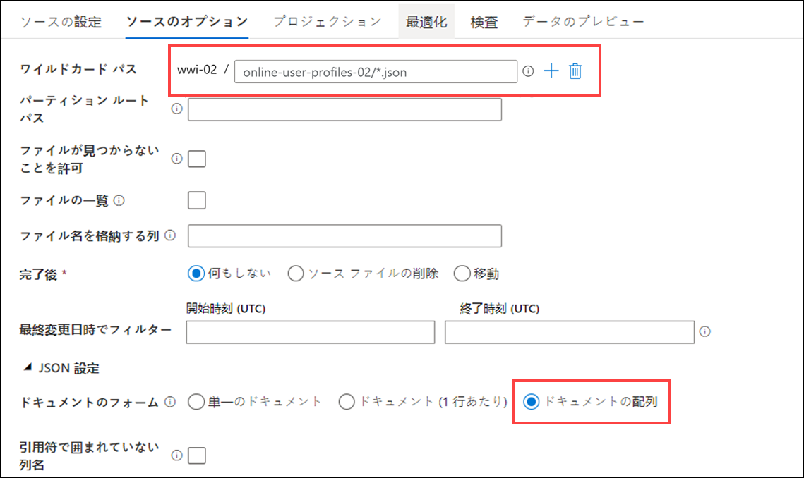

8. **EcommerceUserProfiles** ソースの右側で「**+**」を選択し、「**派生列**」スキーマ修飾子を選択します。

    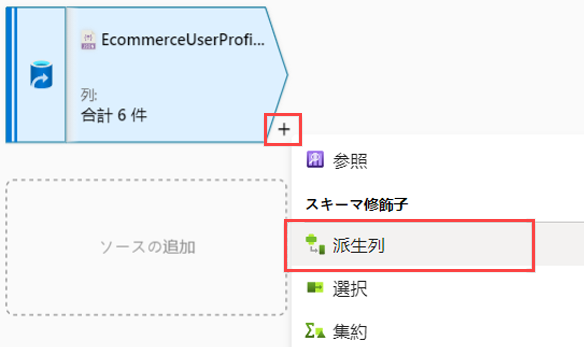

9. 「**派生列の設定**」で以下を構成します。

    - **出力ストリーム名**: `userId` と入力します。
    - **着信ストリーム**: **EcommerceUserProfiles** を選択します。
    - **列**: 次の情報を指定します。

        | 列 | 式 |
        | --- | --- |
        | visitorId | `toInteger(visitorId)` |

        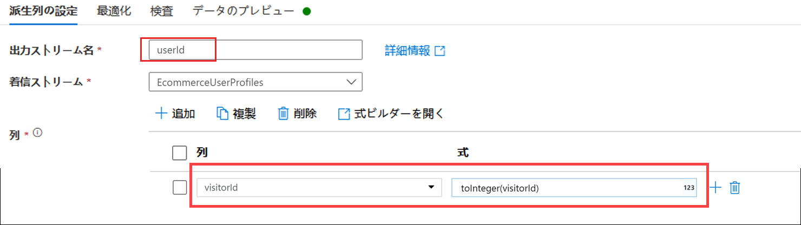

        この式は、**visitorId** 列の値を整数データ型に変換します。

10. **userId** ステップの右側で「**+**」を選択し、「**フラット化**」フォーマッタを選択します。

    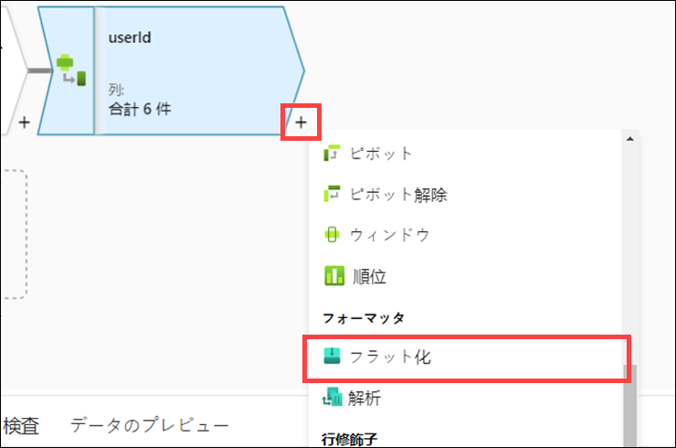

11. 「**設定のフラット化**」で以下のように構成します。

    - **出力ストリーム名**: `UserTopProducts` を入力します。
    - **着信ストリーム**: **userId** を選択します。
    - **アンロール**: **[] topProductPurchases** を選択します。
    - **入力列**: 次の情報を指定します。

        | userId の列 | 名前を付ける |
        | --- | --- |
        | visitorId | `visitorId` |
        | topProductPurchases.productId | `productId` |
        | topProductPurchases.itemsPurchasedLast12Months | `itemsPurchasedLast12Months` |

        > 「**+ マッピングの追加**」を選択し、「**固定マッピング**」を選択して新しい列マッピングをそれぞれ追加します。

        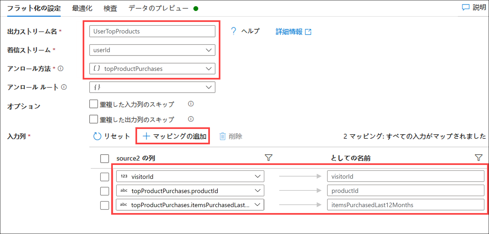

    これらの設定は、データのフラット化された表現を提供します。

12. ユーザー インターフェイスは、スクリプトを生成することによってマッピングを定義します。スクリプトを表示するには、ツールバーの「**スクリプト**」ボタンを選択します。

    

    スクリプトが次のようになっていることを確認してから、「**キャンセル**」をクリックしてグラフィカル UI に戻ります (そうでない場合は、スクリプトを変更します)。

    ```
    source(output(
            visitorId as string,
            topProductPurchases as (productId as string, itemsPurchasedLast12Months as string)[]
        ),
        allowSchemaDrift: true,
        validateSchema: false,
        ignoreNoFilesFound: false,
        documentForm: 'arrayOfDocuments',
        wildcardPaths:['online-user-profiles-02/*.json']) ~> EcommerceUserProfiles
    EcommerceUserProfiles derive(visitorId = toInteger(visitorId)) ~> userId
    userId foldDown(unroll(topProductPurchases),
        mapColumn(
            visitorId,
            productId = topProductPurchases.productId,
            itemsPurchasedLast12Months = topProductPurchases.itemsPurchasedLast12Months
        ),
        skipDuplicateMapInputs: false,
        skipDuplicateMapOutputs: false) ~> UserTopProducts
    ```

13. **UserTopProducts** ステップの右側で「**+**」を選択し、コンテキスト メニューで「**派生列**」スキーマ修飾子を選択します。

    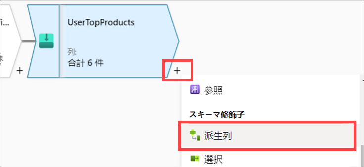

14. 「**派生列の設定**」で以下を構成します。

    - **出力ストリーム名**: `DeriveProductColumns` と入力します。
    - **着信ストリーム**: **UserTopProducts** を選択します。
    - **列**: 次の情報を指定します。

        | 列 | 式 |
        | --- | --- |
        | productId | `toInteger(productId)` |
        | itemsPurchasedLast12Months | `toInteger(itemsPurchasedLast12Months)`|

        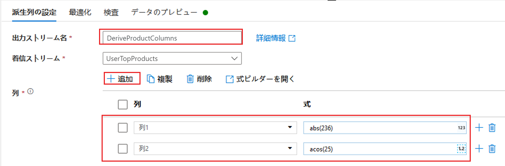

        >**注**: 列を派生列の設定に追加するには、最初の列の右にある「**+**」を選択し、「**列の追加**」を選択します。

        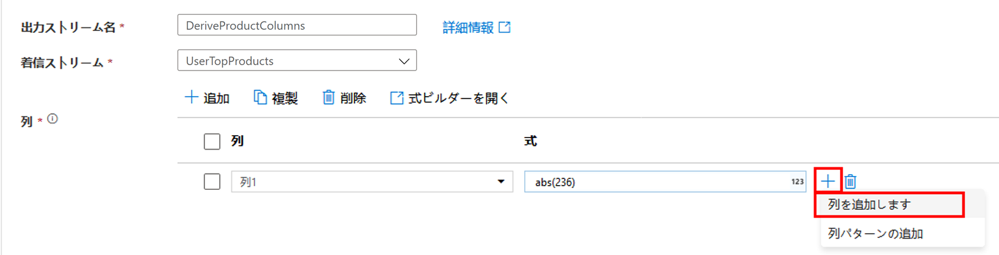

        これらの式は、**productid** および **itemsPurchasedLast12Months** 列の値を整数に変換します。

15. **EcommerceUserProfiles** ソースの下のデータ フロー キャンバスで「**ソースの追加**」を選択します。

    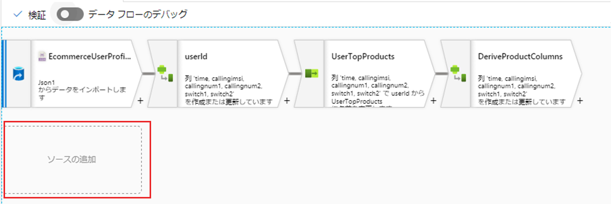

16. 「**ソース設定**」で次のように構成します。

    - **出力ストリーム名**: `UserProfiles` と入力します。
    - **ソースの種類**: 「**統合データセット**」を選択します。
    - **データセット**: 「**asal400_customerprofile_cosmosdb**」を選択します。

        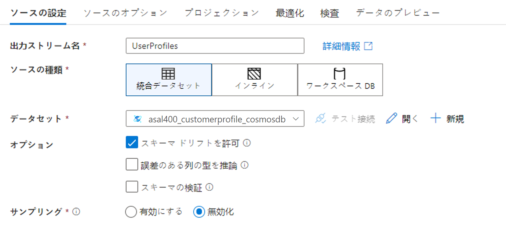

17. ここではデータ フロー デバッガーを使用しないので、データ フローのスクリプト ビューに入り、ソース プロジェクションを更新する必要があります。キャンバスの上のツールバーで「**スクリプト**」を選択します。

    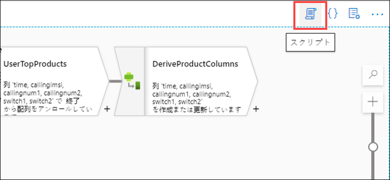

18. スクリプトで **UserProfiles** ソースを見つけます。これは次のようになります。

    ```
    source(output(
        userId as string,
        cartId as string,
        preferredProducts as string[],
        productReviews as (productId as string, reviewText as string, reviewDate as string)[]
    ),
    allowSchemaDrift: true,
    validateSchema: false,
    format: 'document') ~> UserProfiles
    ```

19. 次のようにスクリプト ブロックを変更して、**preferredProducts** を **integer[]** 配列として設定し、**productReviews** 配列内のデータ型が正しく定義されていることを確認します。次に、「**OK**」を選択して、スクリプトの変更を適用します。

    ```
    source(output(
            cartId as string,
            preferredProducts as integer[],
            productReviews as (productId as integer, reviewDate as string, reviewText as string)[],
            userId as integer
        ),
        allowSchemaDrift: true,
        validateSchema: false,
        ignoreNoFilesFound: false,
        format: 'document') ~> UserProfiles
    ```

20. **UserProfiles** ソースの右側で「**+**」を選択し、「**フラット化**」フォーマッタを選択します。

    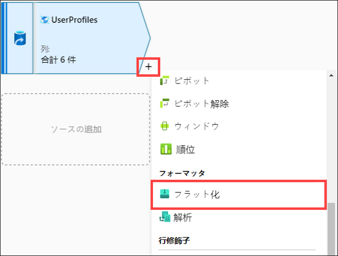

21. 「**設定のフラット化**」で以下のように構成します。

    - **出力ストリーム名**: `UserPreferredProducts` と入力します。
    - **着信ストリーム**: **UserProfiles** を選択します。
    - **アンロール**: **[] preferredProducts** を選択します。
    - **入力列**: 次の情報を指定します。必ず **cartId** と **[] productReviews** を**削除**してください。

        | UserProfiles の列 | 名前を付ける |
        | --- | --- |
        | [] preferredProducts | `preferredProductId` |
        | userId | `userId` |


        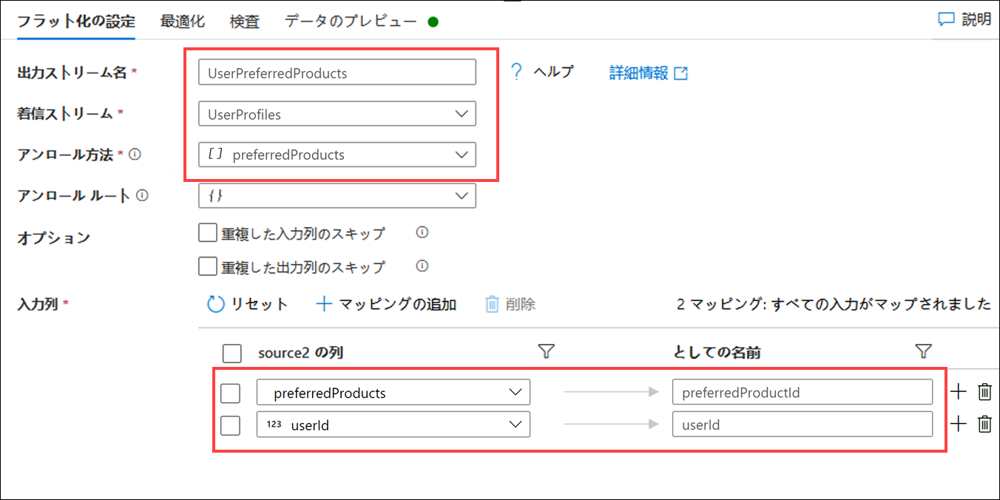

22. これで 2 つのデータ ソースを結合できます。**DeriveProductColumns** ステップの右側で「**+**」を選択し、「**結合**」オプションを選択します。

    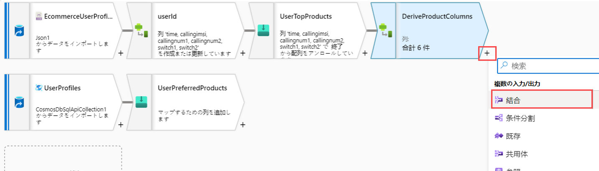

23. 「**結合設定**」で以下を構成します。

    - **出力ストリーム名**: `JoinTopProductsWithPreferredProducts` と入力します。
    - **左側のストリーム**: **DeriveProductColumns** を選択します。
    - **右側のストリーム**: **UserPreferredProducts** を選択します。
    - **結合の種類**: **Full outer** を選択します。
    - **結合条件**: 次の情報を指定します。

        | 左: DeriveProductColumns's column | 右: UserPreferredProducts's column |
        | --- | --- |
        | visitorId | userId |

        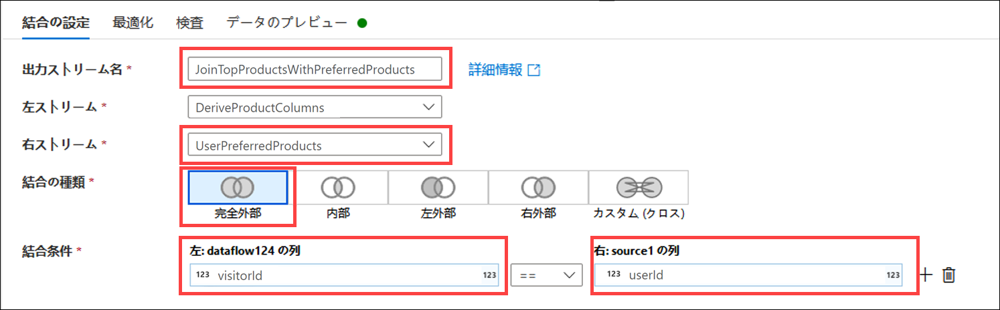

24. 「**最適化**」を選択して以下のように構成します。

    - **ブロードキャスト**: 「**固定**」を選択します。
    - **ブロードキャスト オプション**: 「**左: 'DeriveProductColumns'**」を選択します。
    - **パーティション オプション**: 「**パーティション分割の設定**」を選択します。
    - **パーティションの種類**: 「**ハッシュ**」を選択します。
    - **パーティションの数**: `30` と入力します。
    - **列**: **productId** を選択します。

        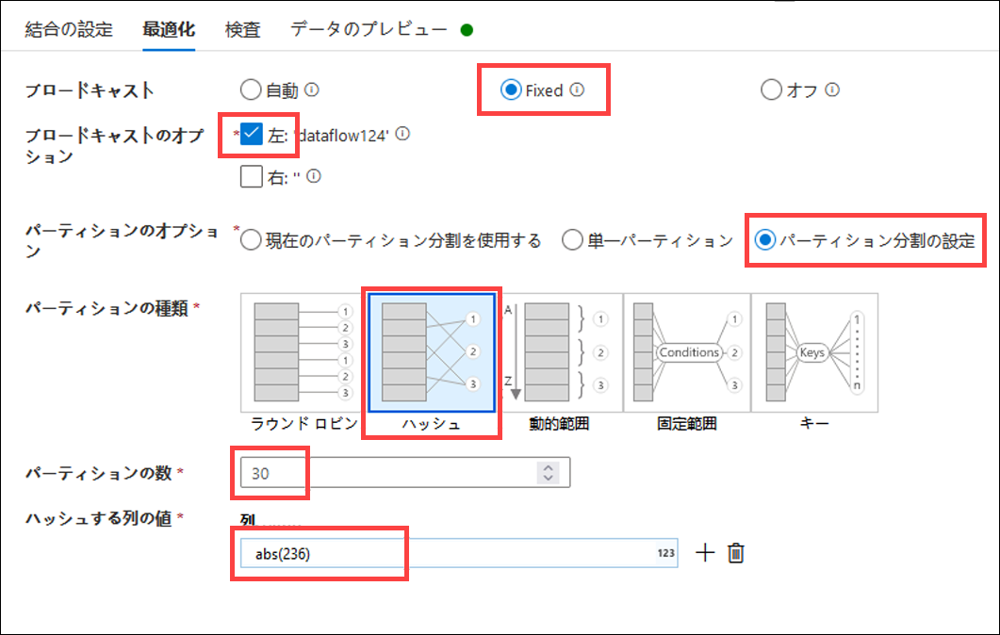

25. 「**検査**」タブを選択して結合のマッピングを表示します。列フィード ソースのほか、列を結合で使用するかどうかが含まれています。

    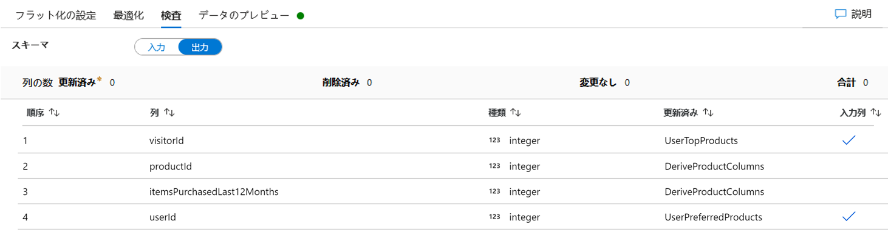

26. **JoinTopProductsWithPreferredProducts** ステップの右側で「**+**」を選択し、「**派生列**」スキーマ修飾子を選択します。

    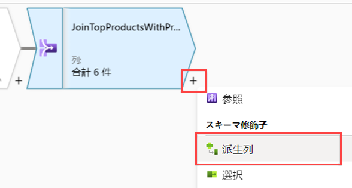

27. 「**派生列の設定**」で以下を構成します。

    - **出力ストリーム名**: `DerivedColumnsForMerge` と入力します。
    - **着信ストリーム**: **JoinTopProductsWithPreferredProducts** を選択します。
    - **列**: 次の情報を指定します (**__最初の 2 つ_の列の名前で入力**)。

        | 列 | 式 |
        | --- | --- |
        | `isTopProduct` | `toBoolean(iif(isNull(productId), 'false', 'true'))` |
        | `isPreferredProduct` | `toBoolean(iif(isNull(preferredProductId), 'false', 'true'))` |
        | productId | `iif(isNull(productId), preferredProductId, productId)` | 
        | userId | `iif(isNull(userId), visitorId, userId)` | 

        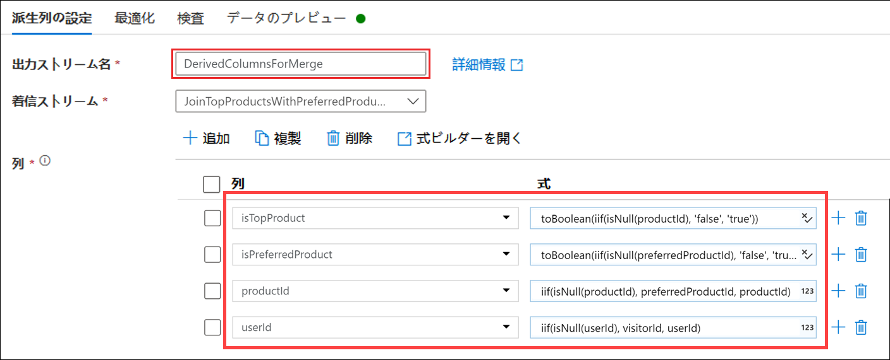

        派生列の設定は、パイプラインの実行時に次の結果を提供します。

        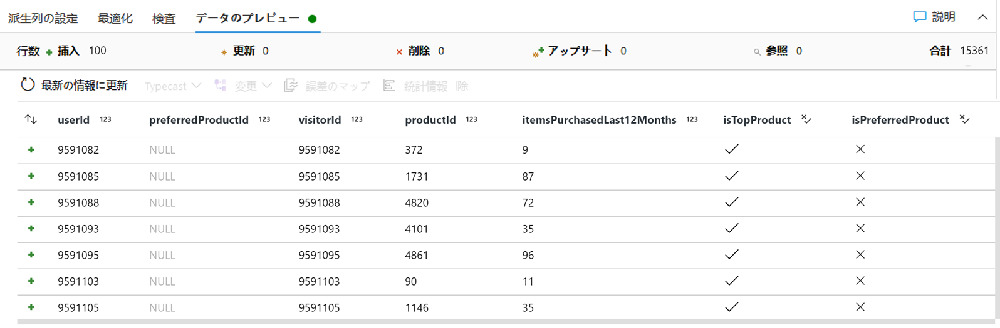

28. **DerivedColumnsForMerge** ステップの右側で「**+**」を選択し、「**フィルター**」行修飾子を選択します。

    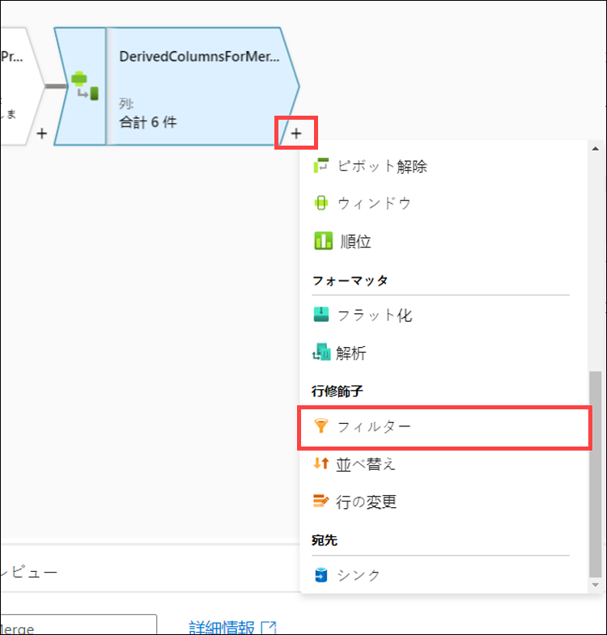

    **ProductId** が null の記録を削除するためにフィルターのステップを追加しています。データ セットには、わずかながら無効の記録が含まれており、null **ProductId** 値により、**UserTopProductPurchases** 専用 SQL プール テーブルに読み込む際にエラーが発生します。

29. 「**フィルター適用**」式を `!isNull(productId)` に設定します。

    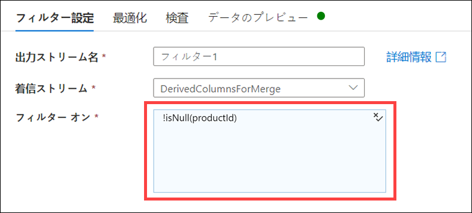

30. **Filter1** ステップの右側で「**+**」を選択し、コンテキスト メニューで「**シンク**」の宛先を選択します。

    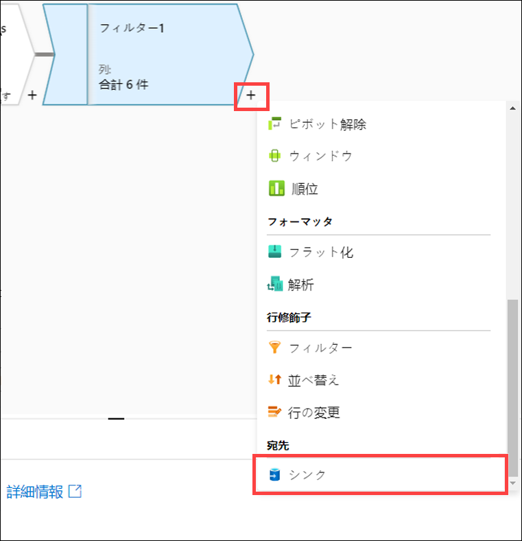

31. 「**シンク**」で以下を構成します。

    - **出力ストリーム名**: `UserTopProductPurchasesASA` と入力します。
    - **着信ストリーム**: 「**Filter1**」を選択します。
    - **シンクの種類**: 「**統合データセット**」を選択します。
    - **データセット**: 「**asal400_wwi_usertopproductpurchases_asa**」を選択します。
    - **オプション**: 「**スキーマの誤差を許可する**」をチェックし、「**スキーマの検証**」はオフにします。

    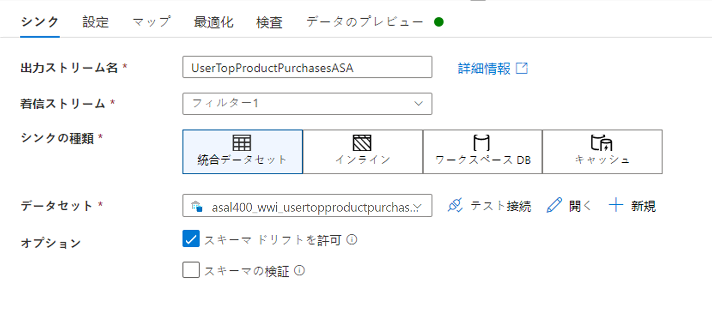

32. 「**設定**」を選択して以下を構成します。

    - **更新方法**: **Allow insert** をチェックして、残りはオフのままにします。
    - **テーブル アクション**: 「**テーブルの切り詰め**」を選択します。
    - **ステージングの有効化**: このオプションをオンにします。大量のデータをインポートするため、ステージングを有効にしてパフォーマンスを向上させることをめざします。

        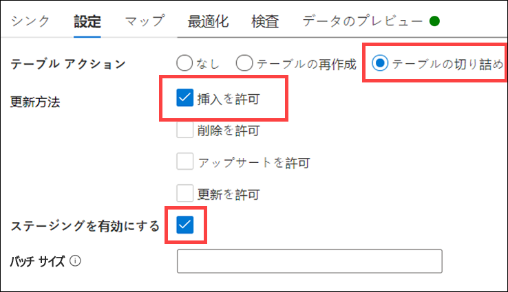

33. 「**マッピング**」を選択して以下を構成します。

    - **自動マッピング**: このオプションを選択解除します。
    - **列**: 次の情報を指定します。

        | 入力列 | 出力列 |
        | --- | --- |
        | userId | UserId |
        | productId | ProductId |
        | itemsPurchasedLast12Months | ItemsPurchasedLast12Months |
        | isTopProduct | IsTopProduct |
        | isPreferredProduct | IsPreferredProduct |

        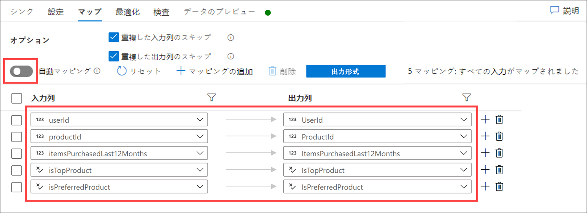

34. **Filter1** ステップの右側で「**+**」を選択し、コンテキスト メニューで「**シンク**」 の宛先を選択して 2 番目のシンクを追加します。

    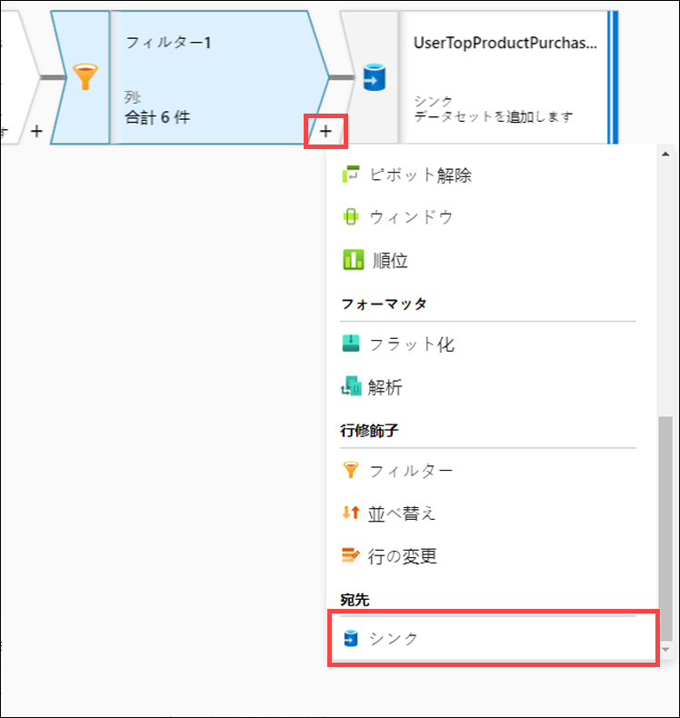

35. 「**シンク**」で以下を構成します。

    - **出力ストリーム名**: `DataLake` と入力します。
    - **着信ストリーム**: 「**Filter1**」を選択します。
    - **シンクの種類**: **Inline** を選択します。
    - **インライン データセットの種類**: **Delta** を選択します。
    - **リンク サービス**: **asaworkspace*xxxxxxx*-WorkspaceDefaultStorage** を選択します。
    - **オプション**: 「**スキーマの誤差を許可する**」をチェックし、「**スキーマの検証**」はオフにします。

        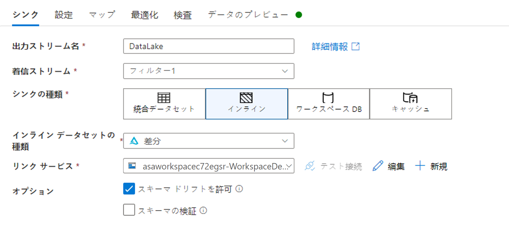

36. 「**設定**」を選択して以下を構成します。

    - **フォルダー パス**: `wwi-02` / `top-products` と入力します (**top-products** フォルダーはまだ存在しないため、これらの 2 つの値をフィールドに入力します)。
    - **圧縮の種類**: **snappy** を選択します。
    - **圧縮レベル**: 「**最速**」を選択します。
    - **データ削除**: `0` を入力します。
    - **テーブル アクション**: 「**切り詰め**」を選択します。
    - **更新方法**: **Allow insert** をチェックして、残りはオフのままにします。
    - **スキーマの統合 (Delta オプション)**: オフ。

        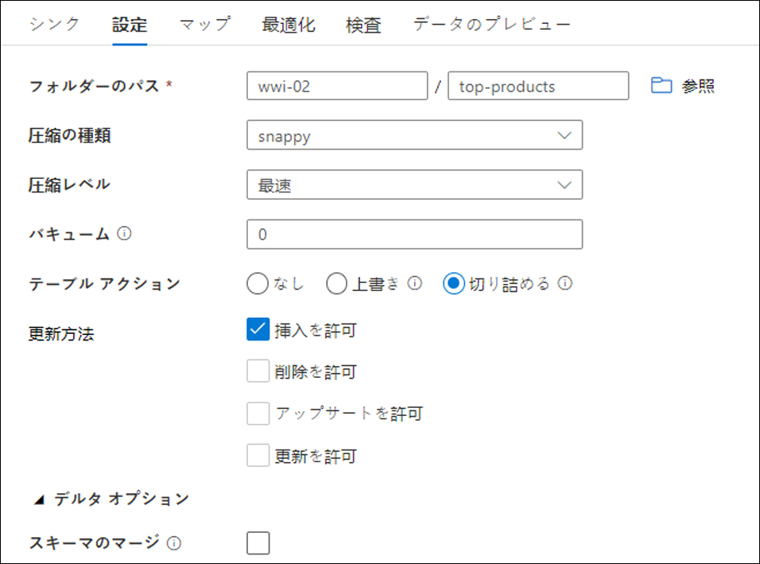

37. 「**マッピング**」を選択して以下を構成します。

    - **自動マッピング**: このオプションはオフにします。
    - **列**: 次の列マッピングを定義します。

        | 入力列 | 出力列 |
        | --- | --- |
        | visitorId | visitorId |
        | productId | productId |
        | itemsPurchasedLast12Months | itemsPurchasedLast12Months |
        | preferredProductId | preferredProductId |
        | userId | userId |
        | isTopProduct | isTopProduct |
        | isPreferredProduct | isPreferredProduct |

        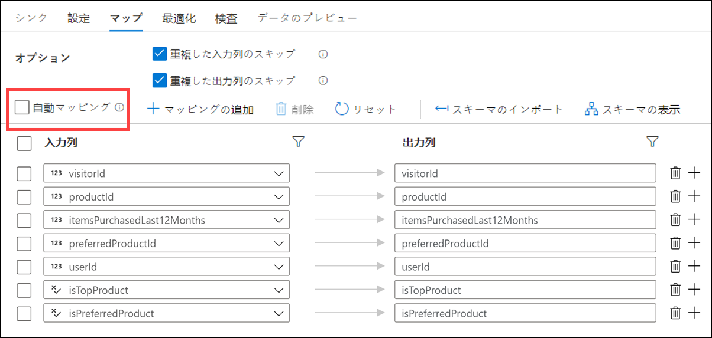

        > SQL プール シンクよりもデータ レイク シンクで 2 つの追加フィールドを維持することにした点に留意してください (**visitorId** と **preferredProductId**)。これは、固定宛先スキーマ (SQL テーブルなど) にとらわれず、データ レイクでオリジナル データをなるべく多く保持しようとしているためです。

38. 完成したデータ フローが次のようになっていることを確認します。

    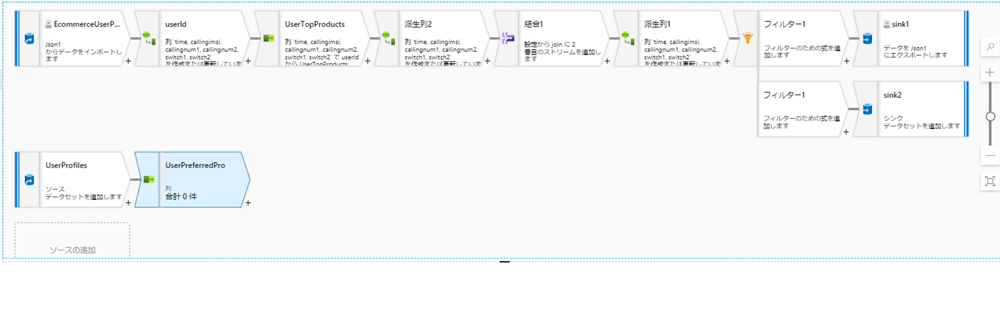

39. 「**すべて公開**」を選択した後、**公開**して新しいデータ フローを保存します。

    

## 演習 3 - Azure Synapse パイプラインでデータの移動と変換を調整する

Tailwind Traders は Azure Data Factory (ADF) パイプラインの使用に慣れており、Azure Synapse Analytics を ADF に統合できるのか、またはそれに類似した機能があるのか知りたがっています。データ ウェアハウスの内外でデータ インジェスト、変換、読み込みアクティビティをデータ カタログ全体で調整したいと考えています。

あなたは、90 以上の組み込みコネクタが含まれている Synapse パイプラインを使用すると、パイプラインの手動実行または調整によってデータを読み込めるほか、一般的な読み込みパターンをサポートし、データ レイクまたは SQL テーブルへの完全な並列読み込みが可能で、ADF とコード ベースを共有できると推奨します。

Synapse パイプラインを使用すれば、Tailwind Traders は馴染みの深いインターフェイスを ADF として利用でき、Azure Synapse Analytics 以外の調整サービスを使用する必要がありません。

### タスク 1: パイプラインを作成する

まず、新しいマッピング データ フローを実行しましょう。新しいデータ フローを実行するには、新しいパイプラインを作成してデータ フロー アクティビティを追加する必要があります。

1. 「**統合**」ハブに移動します。

    

2. 「**+**」メニューで、「**パイプライン**」を選択します。

    

3. 新しいデータ フローの「**プロパティ**」ペインの「**全般**」セクションで、「**名前**」を `Write User Profile Data to ASA` に更新します。

    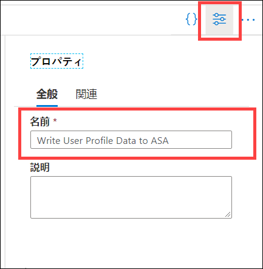

4. 「**プロパティ**」ボタンを選択してペインを非表示にします。

    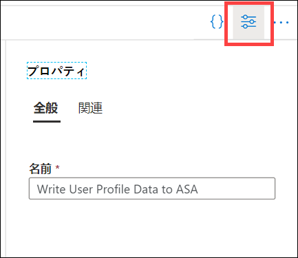

5. アクティビティ リスト内で「**移動と変換**」を展開し、「**データ フロー**」アクティビティをパイプライン キャンバスにドラッグします。

    

6. パイプライン キャンバスの下の「**全般**」タブで「**名前**」を `write_user_profile_to_asa` に設定します。

    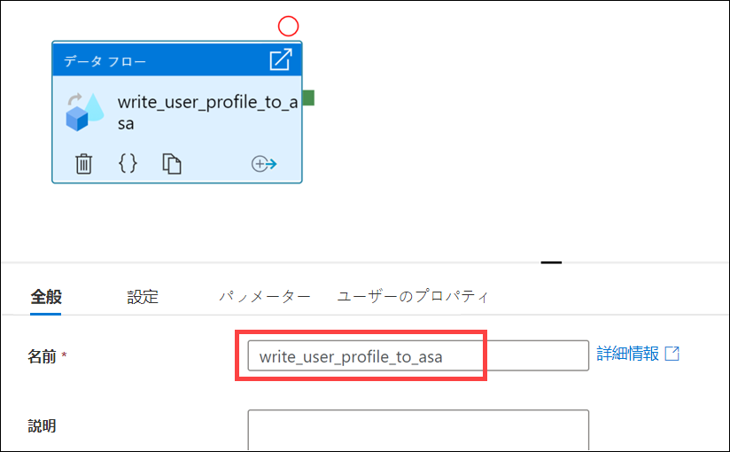

7. 「**設定**」タブで、**write_user_profile_to_asa** データ フローを選択し、**AutoResolveIntegrationRuntime** が選択されていることを確認します。**基本 (汎用)** のコンピューティングの種類を選択し、コア数を **4 (+ 4 ドライバー コア)** に設定します。

8. 「**ステージング**」を選択して以下のように構成します。

    - **ステージング リンク サービス**: **asadatalake*xxxxxxx*** リンク サービスを選択します。
    - **ステージング ストレージ フォルダー**: `staging` / `userprofiles` を入力します (**userprofiles** フォルダーは最初のパイプライン実行時に自動的に作成されます)。

        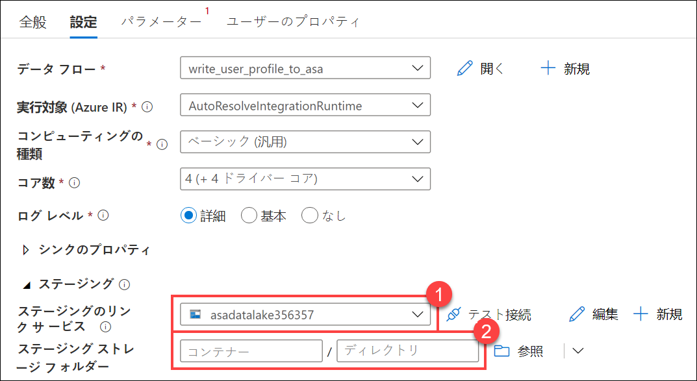

        PolyBase のステージング オプションは、大量のデータを Azure Synapse Analytics との間で移動する際に推奨されます。運用環境でデータ フローのステージングを有効にしたり無効にしたりして、パフォーマンスの差を評価するようお勧めします。

9. 「**すべて公開**」を選択した後、「**公開**」を選択して、パイプラインを保存します。

    

### タスク 2: ユーザー プロファイル データ パイプラインをトリガー、監視、分析する

Tailwind Traders は、あらゆるパイプライン実行を監視し、パフォーマンスの調整とトラブすシューティングのために統計情報を表示することを希望しています。

あなたは、手動でパイプライン実行をトリガー、監視、分析する方法を Tailwind Traders に説明することにしました。

1. パイプラインの最上部で「**トリガーの追加**」を選択した後、「**今すぐトリガー**」を選択します。

    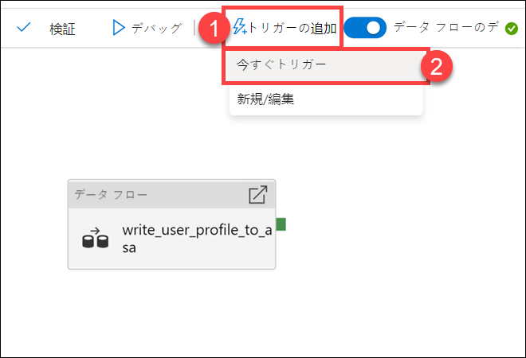

2. このパイプラインにはパラメーターがないため、「**OK**」を選択してトリガーを実行します。

    

3. 「**監視**」ハブに移動します。

    

4. 「**パイプライン実行**」を選択し、パイプラインの実行が正常に完了するのを待ちます。これには時間がかかる場合があります。場合によっては、ビューを更新する必要があります。

    

5. パイプラインの名前を選択し、パイプラインのアクティビティ実行を表示します。

    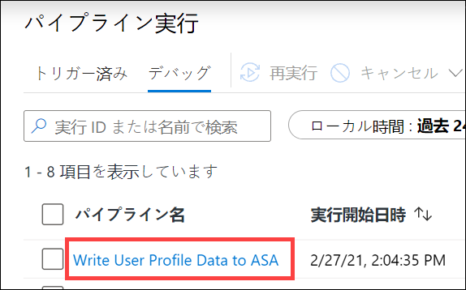

6. 「**アクティビティ実行**」リストでデータ フロー アクティビティの上にマウスを動かし、「**データ フローの詳細**」アイコンを選択します。

    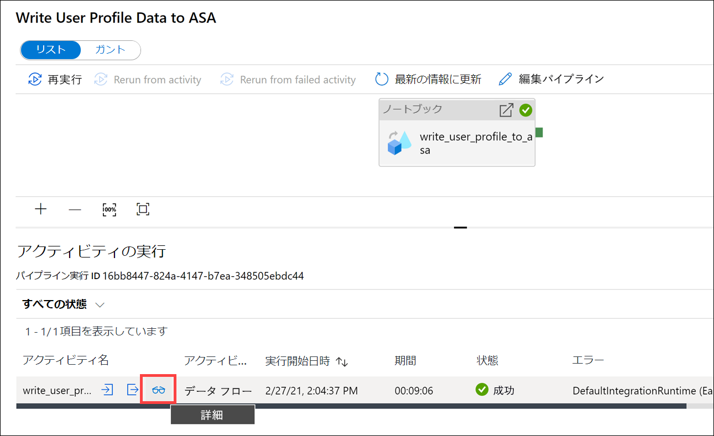

7. データ フローの詳細に、データ フローの手順と処理の詳細が表示されます。以下の例 (結果とは異なる場合があります) では、処理時間は SQL プールシンクの処理に約 44 秒、データ レイク シンクの処理に約 12 秒かかりました。**Filter1** 出力は、どちらでも 100 万行程度でした。どのアクティビティで完了までの時間が最も長かったのか確認できます。クラスター起動時間は合計パイプライン実行のうち 2.5 分以上を占めていました。

    

8. **UserTopProductPurchasesASA** シンクを選択して詳細を表示します。以下の例 (結果とは異なる場合があります) では、合計 30 のパーティションで 1,622,203 行が計算されたことがわかります。SQL テーブルにデータを書き込む前、ADLS Gen2 でのデータのステージングには約 8 秒 かかりました。この場合の合計シンク処理時間は約 44 秒でした。また、他のパーティションよりもはるかに大きい*ホット パーティション*があります。このパイプラインのパフォーマンスをもう少し向上させる必要がある場合は、データ パーティションを再評価し、パーティションをもっと均等に広げ、並列データ読み込み・フィルタリングを向上させることができます。また、ステージングを無効にして処理時間が変化するか試してみることも可能です。最後に、専用 SQL プールの大きさは、シンクへのデータの取り込み時間に影響を与えます。

    

## 重要: SQL プールを一時停止する

これらの手順を実行して、不要になったリソースを解放します。

1. Synapse Studio で「**管理**」ハブを選択します。
2. 左側のメニューで「**SQL プール**」を選択します。**SQLPool01** 専用 SQL プールにカーソルを合わせ、選択します **||**。

    

3. プロンプトが表示されたら、「**一時停止**」を選択します。
