---
lab:
    title: 'Azure Synapse Link を使用してハイブリッド トランザクション分析処理 (HTAP) に対応する'
    module: 'モジュール 9'
---

# ラボ 9 - Azure Synapse Link を使用してハイブリッド トランザクション分析処理 (HTAP) に対応する

このラボでは、受講者はAzure Synapse Link によって Azure Cosmos DB アカウントを Synapse ワークスペースにシームレスに接続する方法を学びます。Synapse Link を有効にして構成する方法、および Apache Spark プールと SQL サーバーレス プールを使用して Azure Cosmos DB 分析ストアのクエリを行う方法を学びます。

このラボを完了すると、次のことができるようになります。

- Azure Cosmos DB を使用して Azure Synapse Link を構成する
- Synapse Analytics で Apache Spark を使用して Azure Cosmos DB に対してクエリを実行する
- Azure Synapse Analytics の サーバーレス SQL プールを使用して Azure Cosmos DB に対するクエリを実行する

## ラボの構成と前提条件

このラボを開始する前に、**ラボ 6: *Azure Data Factory または Azure Synapse パイプラインでデータを変換する***を完了してください。

> **注**: ラボ 6 を完了して***いない***が、このコースのラボセットアップを<u>完了</u>している場合は、これらの手順を完了して、必要なリンクされたサービスとデータセットを作成できます。
>
> 1. Synapse Studio の「**管理**」ハブで、次の設定を使用して **Azure Cosmos DB (SQL API)** 用の新しい**リンク サービス**を追加します。
>       - **名前**: asacosmosdb01
>       - **Cosmos DB アカウント名**: asacosmosdb*xxxxxxx*
>       - **データベース名**: CustomerProfile
> 2. 「**データ**」ハブで、次の**統合データセット**を作成します。
>       - **ソース**: Azure Cosmos DB (SQL API)
>       - **名前**: asal400_customerprofile_cosmosdb
>       - **リンク サービス**: asacosmosdb01
>       - **コレクション**: OnlineUserProfile01
>       - **スキーマのインポート**: 接続/ストアから

## 演習 1 - Azure Cosmos DB を使用して Azure Synapse Link を構成する

Tailwind Traders では Azure Cosmos DB を使用して、電子商取引サイトからユーザー プロファイル データを格納しています。Azure Cosmos DB SQL API によって提供される NoSQL ドキュメント ストアでは、使い慣れた SQL 構文を使用してデータを管理する一方で、ファイルの読み取りと書き込みは大規模なグローバル スケールで行うことができます。

Tailwind Traders では Azure Cosmos DB の機能やパフォーマンスに満足していますが、データ ウェアハウスから複数のパーティションにわたる大量の分析クエリ (クロスパーティション クエリ) を実行するコストについて懸念しています。Azure Cosmos DB の要求ユニット (RU) を増やすことなく、すべてのデータに効率的にアクセスする必要があります。Azure Cosmos DB 変更フィード メカニズムを使用して、変更時にコンテナーからデータ レイクにデータを抽出するためのオプションに注目しました。このアプローチの問題は、追加のサービスとコードの依存関係、およびソリューションの長期的なメンテナンスです。Synapse パイプラインから一括エクスポートを実行できますが、任意の時点での最新情報は得られません。

Cosmos DB 用の Azure Synapse Link を有効にし、Azure Cosmos DB コンテナー上で分析ストアを有効にすることに決めます。この構成では、すべてのトランザクション データが完全に分離された列ストアに自動的に格納されます。このストアを使用すると、トランザクション ワークロードに影響を与えたり、リソース ユニット (RU) コストを発生させたりすることなく、Azure Cosmos DB 内のオペレーショナル データに対して大規模な分析を実行できます。Cosmos DB 用の Azure Synapse Link では、Azure Cosmos DB と Azure Synapse Analytics 間に緊密な統合が作成されます。これにより、Tailwind Traders は、ETL なしでのオペレーショナル データに対するほぼリアルタイムの分析と、トランザクション ワークロードからの完全なパフォーマンスの分離を実行できます。

Azure Synapse Link では、Cosmos DB のトランザクション処理の分散スケールと、Azure Synapse Analytics の組み込みの分析ストアおよびコンピューティング能力を組み合わせることにより、Tailwind Trader のビジネス プロセスを最適化するためのハイブリッド トランザクション/分析処理 (HTAP) アーキテクチャが有効になります。この統合により、ETL プロセスが不要になり、ビジネス アナリスト、データ エンジニア、データ サイエンティストがセルフサービスを実現し、ほぼリアルタイムの BI、分析、および Machine Learning パイプラインをオペレーショナル データに対して実行できるようになります。

### タスク 1: Azure Synapse Link を有効にする

1. Azure portal (<https://portal.azure.com>) で、ラボ環境のリソース グループを開きます。

2. 「**Azure Cosmos DB アカウント**」を選択します。

    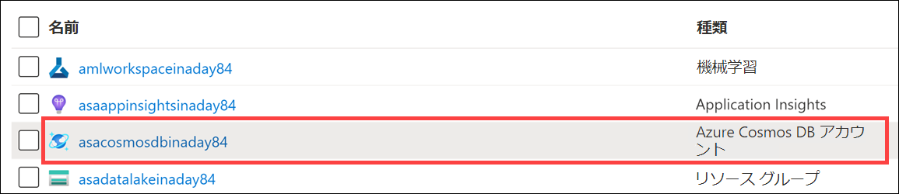

3. 左側のメニューで「**機能**」を選択し、「**Azure Synapse リンク**」を選択します。

    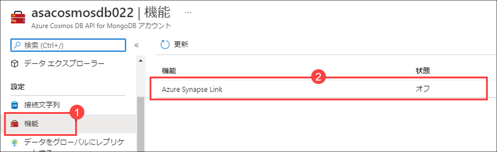

4. 「**有効化**」を選択します。

    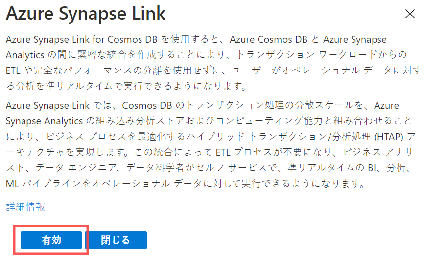

    分析ストアを使用して Azure Cosmos DB コンテナーを作成する前に、まず Azure Synapse Link を有効にする必要があります。

5. 続行する前に、この操作が完了するのを待ってください。1 分ほどかかります。Azure **通知**アイコンを選択して、ステータスをチェックします。

    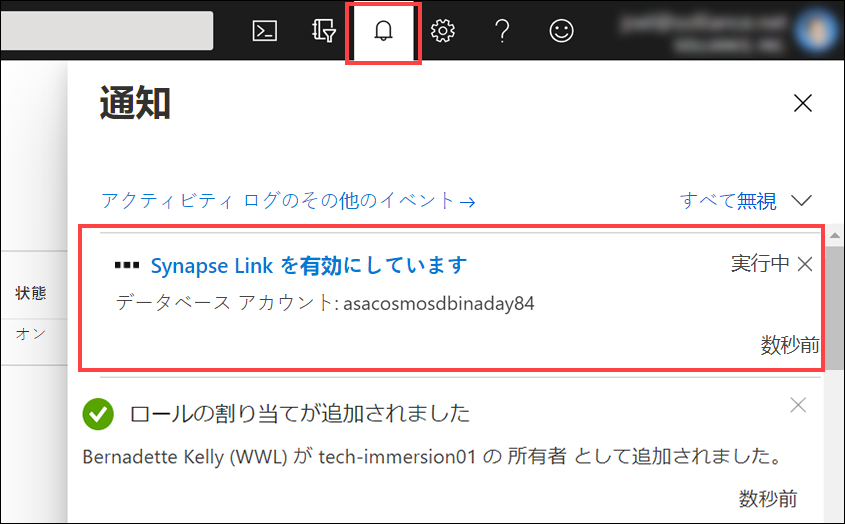

    完了すると、「Synapse リンクの有効化」の隣に緑色のチェックマークが表示されます。

    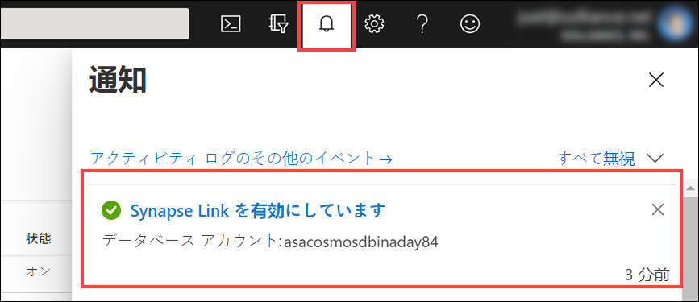

### タスク 2: 新しい Azure Cosmos DB コンテナーを作成します。

Tailwind Traders には、**OnlineUserProfile01** という名前の Azure Cosmos DB コンテナーがあります。コンテナーが既に作成された_後_に Azure Synapse Link 機能が有効になったため、コンテナーで分析ストアを有効にすることはできません。同じパーティション キーを持つ新しいコンテナーを作成し、分析ストアを有効にします。

コンテナーを作成した後、新しい Synapse パイプラインを作成して、**OnlineUserProfile01** コンテナーから新しいコンテナーにデータをコピーします。

1. 左側のメニューで「**データ エクスプローラー**」を選択します。

    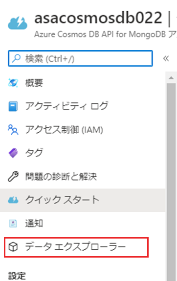

2. **新しいコンテナー**を選択します。

    

3. 次の設定で新しいコンテナーを作成します。
    - **データベース ID**: 既存の **CustomerProfile** データベースを使用します。
    - **コンテナー　ID**: `UserProfileHTAP` を入力します
    - **パーティション キー**: `/userId` を入力します
    - **スループット**: 「**自動スケール**」を選択します。
    - **Container max RU/s**: `4000` を入力します
    - **分析ストア**: オン

    

    ここでは、**パーティション キー**値を **userId** に設定しています。これは、これがクエリで最も頻繁に使用するフィールドであり、パーティション分割のパフォーマンスを向上させるために比較的高いカーディナリティ (一意の値の数) が含まれているためです。スループットを「自動スケール」にし、最大値は 4,000 要求ユニット (RU) に設定します。これは、コンテナーに割り当てられた最小値が 400 RU (最大数の 10%) であり、スケール エンジンがスループットの増加を保証するために十分な量の要求を検出した場合に最大 4,000 までスケールアップすることを意味します。最後に、コンテナーで**分析ストア**を有効にします。これにより、Synapse Analytics 内からハイブリッド トランザクション/分析処理 (HTAP) アーキテクチャを最大限に活用することができます。

    ここでは、新しいコンテナーにコピーするデータを簡単に見てみましょう。

4. 「**CustomerProfile**」データベースの下にある **OnlineUserProfile01** コンテナーを展開し、「**項目**」を選択します。ドキュメントの 1 つを選択し、その内容を表示します。ドキュメントは JSON 形式で格納されます。

    

5. 左側のメニューで「**キー**」を選択します。後で**主キー**と Cosmos DB アカウント名 (左上隅) が必要になるため、このタブを開いたままにします。

    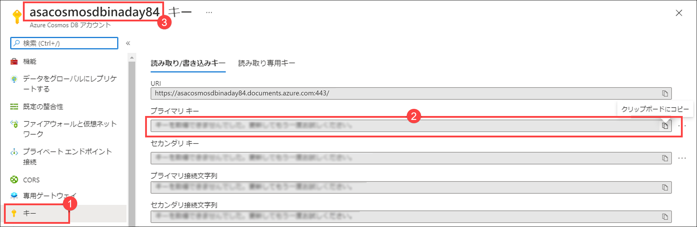

### タスク 3: COPY パイプラインを作成して実行する

新しい Azure Cosmos DB コンテナーで分析ストアが有効になったので、Synapse Pipeline を使用して既存のコンテナーの内容をコピーする必要があります。

1. 異なるタブで、Synapse Studio (<https://web.azuresynapse.net/>) を開き、「**統合**」ハブまでナビゲートします。

    

2. 「**+**」メニューで、「**パイプライン**」を選択します。

    

3. 「**アクティビティ**」で **Move & transform** グループを展開し、「**データのコピー**」アクティビティをキャンバスにドラッグします。「**プロパティ**」ブレードで「**名前**」を **`Copy Cosmos DB Container`** に設定します。

    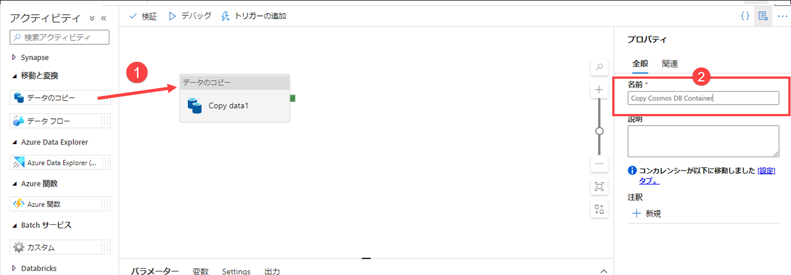

4. キャンバスに追加した新しい「**データのコピー**」アクティビティを選択します。 キャンバスの下の「**ソース**」タブで、**asal400_customerprofile_cosmosdb** ソース データセットを選択します。

    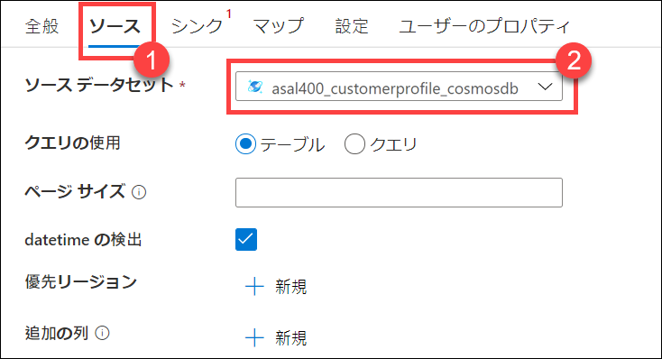

5. 「**シンク**」タブを選択した後、「**+ 新規**」を選択します。

    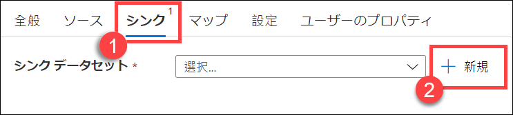

6. 「**Azure Cosmos DB (SQL API)**」データセットの種類を選択し、「**続行**」を選択します。

    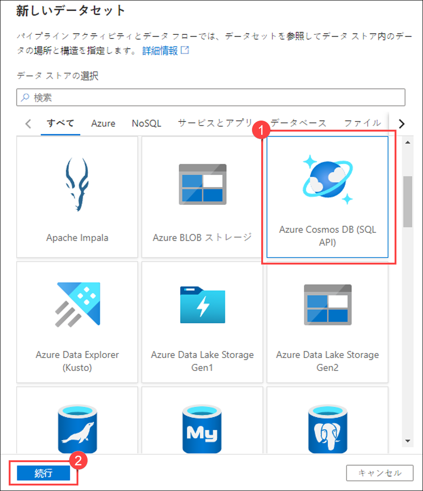

7. 次のプロパティを入力し、「**OK**」をクリックします。
    - **名前**: `cosmos_db_htap` を入力します。
    - **リンク サービス**: 「**asacosmosdb01**」を選択します。
    - **コレクション**: **UserProfileHTAP**/ を選択します。
    - **スキーマのインポート**: 「**スキーマのインポート**」で「**接続/ストアから**」を選択します。

    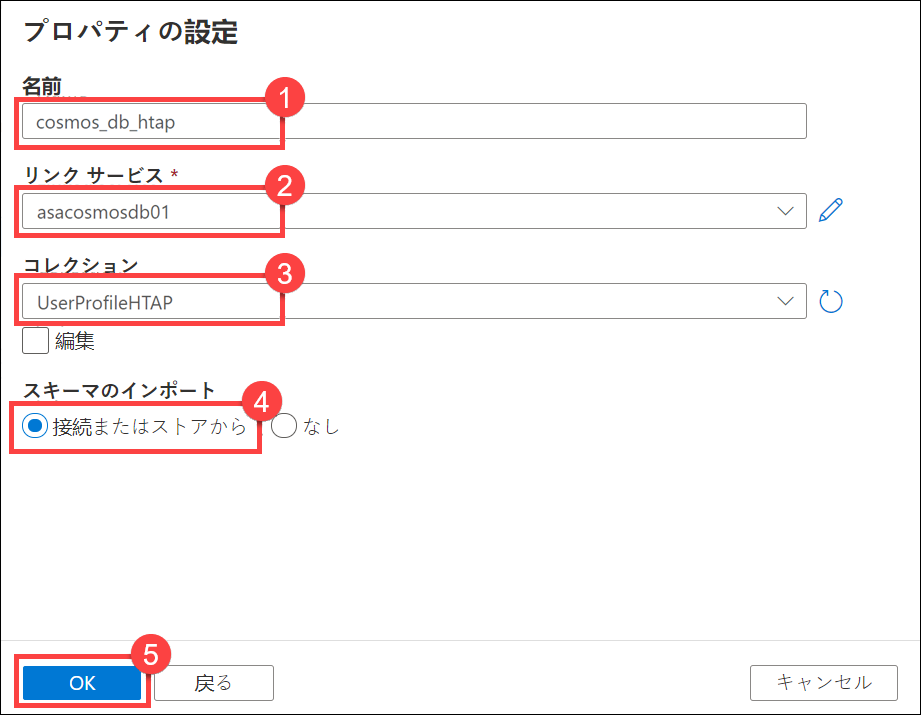

8. 追加したばかりの新しいシンク データセットで「**挿入**」書き込み操作を選択されていることを確認します。

    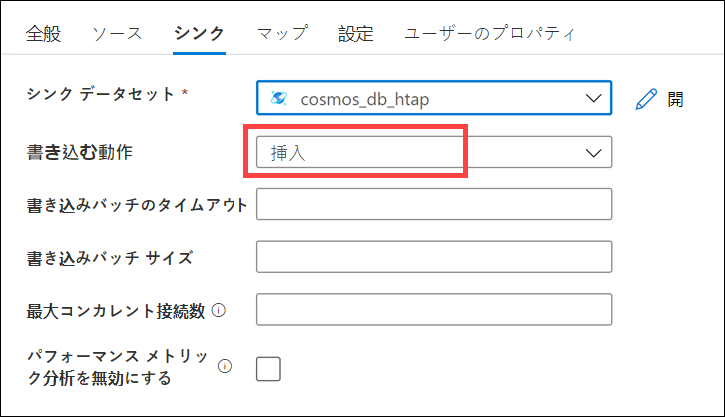

9. 「**すべて公開**」 を選択した後、**公開**して新しいパイプラインを保存します。

    

10. パイプライン キャンバスの上で「**トリガーの追加**」を選択した後、「**今すぐトリガー**」を選択します。「**OK**」を選択して実行をトリガーします。

    

11. 「**監視**」ハブに移動します。

    

12. 「**パイプライン実行**」を選択し、パイプラインの実行が完了するまで待ちます。「**更新**」を数回選択する必要があるかもしれません。

    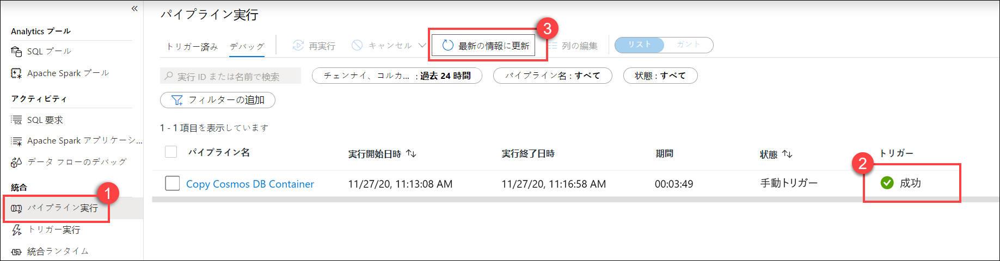

    > この操作が完了するには、**4 分程度**かかる可能性があります。

## 演習 2 - Synapse Analytics で Apache Spark を使用して Azure Cosmos DB に対してクエリを実行する

Tailwind Traders は Apache Spark を使用し、新しい Azure Cosmos DB コンテナーに対して分析クエリを実行したいと考えています。このセグメントでは、Synapse Studio の組み込みジェスチャを使用して、トランザクション ストアに影響を与えることなく、Synapse ノートブックをすばやく作成し、HTAP が有効になったコンテナーの分析ストアからデータを読み込みます。

Tailwind Traders は各ユーザーで特定されたお気に入りの製品リストを、レビュー履歴で一致する製品 ID に組み合わせて利用し、すべてのお気に入り製品レビューのリストを表示しようとしています。

### タスク 1: ノートブックを作成する

1. 「**データ**」ハブに移動します。

    

2. 「**リンク**」タブを選択し、「**Azure Cosmos DB**」セクションを展開し (表示されない場合は、右上の「**&#8635;」;** ボタンを使用して Synapse Studio を更新します)、**asacosmosdb01 (CustomerProfile)** リンク サービスを展開します。**UserProfileHTAP** コンテナーを右クリックし、「**新しいノートブック**」を選択して、「**DataFrame に読み込む**」を選択します。

    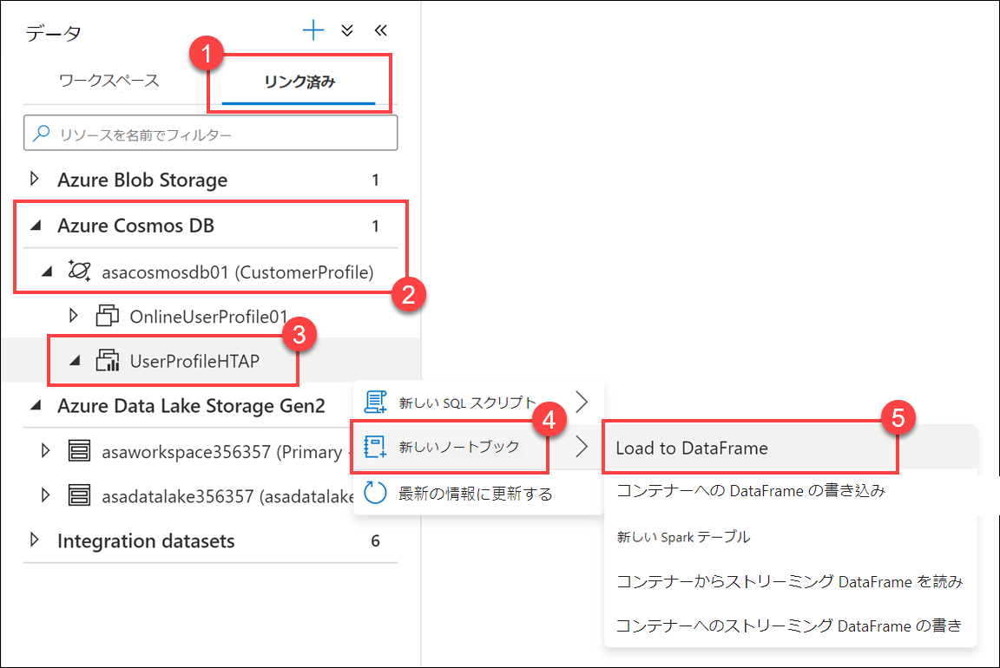

    作成した **UserProfileHTAP** コンテナーはのアイコンは、他のコンテナーのアイコンとわずかに異なっていることがわかります。これは、分析ストアが有効になっていることを示します。

3. 新しいノートブックで「**アタッチ先**」ドロップダウン リストから **SparkPool01** Spark プールを選択します。

    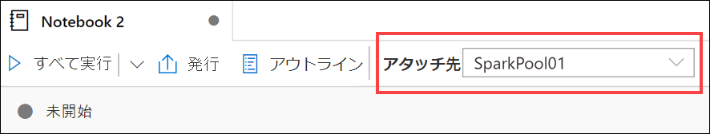

4. 「**すべて実行**」を選択します。

    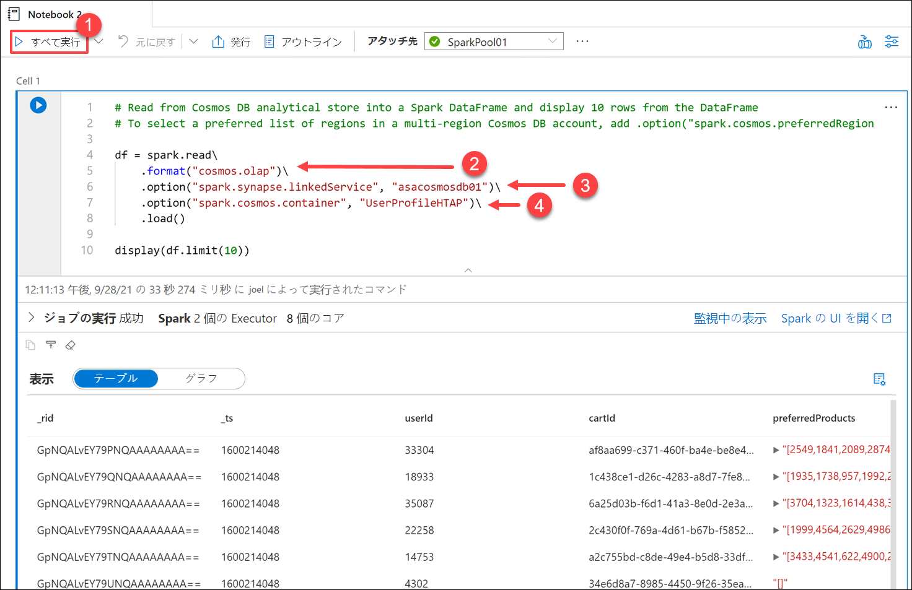

    初めて Spark セッションを開始する際は数分かかります。

    セル 1 内で生成されたコードでは、**spark.read** 形式が **cosmos.olap** に設定されていることがわかります。これにより、Synapse リンクはコンテナー分析ストアを使用するよう指示されます。トランザクション ストアに接続したい場合は (変更フィードから読み取ったり、コンテナーに書き込んだりするなど)、**cosmos.oltp** を使用します。

    > **注:** 分析ストアに書き込むことはできず、読み取りのみが可能です。コンテナーにデータを読み込みたい場合は、トランザクション ストアに接続する必要があります。

    最初のオプションは Azure Cosmos DB リンク サービスの名前を構成します。2 番目の `オプション` は、読み取りたい Azure Cosmos DB コンテナーを定義します。

5. 実行したセルの下にある「**+ コード**」ボタンを選択します。これにより、最初のコード セルの下に新しいコード セルが追加されます。

6. DataFrame には不要な追加の列が含まれています。不要な列を削除し、DataFrame のクリーンなバージョンを作成してみましょう。そのためには、新しいコード セルに次のように入力して実行します。

    ```python
    unwanted_cols = {'_attachments','_etag','_rid','_self','_ts','collectionType','id'}

    # Remove unwanted columns from the columns collection
    cols = list(set(df.columns) - unwanted_cols)

    profiles = df.select(cols)

    display(profiles.limit(10))
    ```

    これで出力には、希望する列のみが含まれるようになります。**preferredProducts** と **productReviews** 列に子要素が含まれていることがわかります。値を表示したい行で値を展開します。Azure Cosmos DB Data Explorer 内の **UserProfiles01** コンテナーで生の JSON 形式が表示されていたことを覚えているかもしれません。

    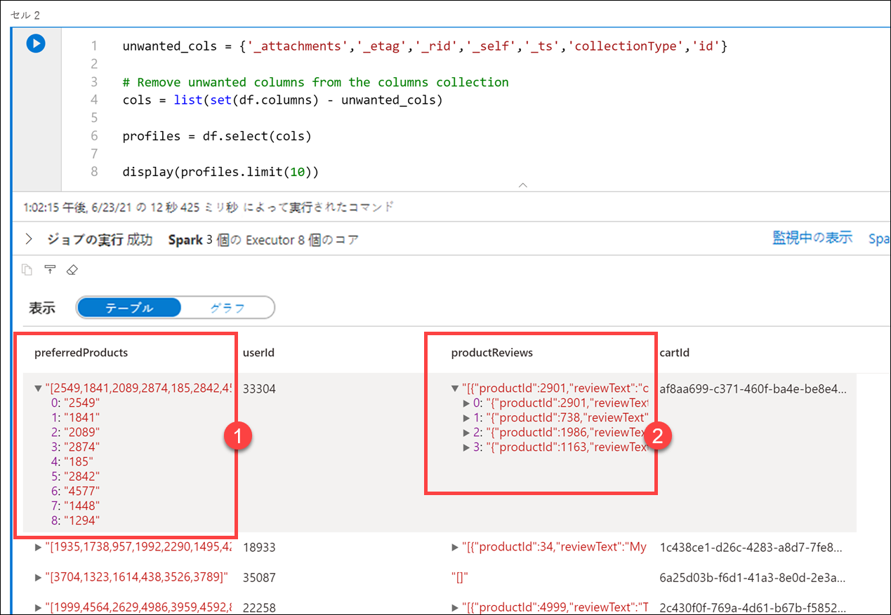

7. 取り扱っている記録の数を把握する必要があります。そのためには、新しいコード セルに次のように入力して実行します。

    ```python
    profiles.count()
    ```

    99,999 というカウント結果が表示されるはずです。

8. 各ユーザーで **preferredProducts** 列の配列と **productReviews** 列の配列を使用して、レビューした製品を一致するお気に入りリストから製品のグラフを作成したいと考えています。これを行うには、この 2 列のフラット化された値が含まれている新しい DataFrame を 2 つ作成し、後ほど結合できるようにしなくてはなりません。新しいコード セルに以下を入力して実行します。

    ```python
    from pyspark.sql.functions import udf, explode

    preferredProductsFlat=profiles.select('userId',explode('preferredProducts').alias('productId'))
    productReviewsFlat=profiles.select('userId',explode('productReviews').alias('productReviews'))
    display(productReviewsFlat.limit(10))
    ```

    このセルでは、特別な PySpark [explode 関数](https://spark.apache.org/docs/latest/api/python/pyspark.sql.html?highlight=explode#pyspark.sql.functions.explode) をインポートしました。これは配列の各要素の新しい行を返します。この関数は、**preferredProducts** と **productReviews** 列をフラット化して、読みやすくしたりクエリを実行しやすくしたりする上で役立ちます。

    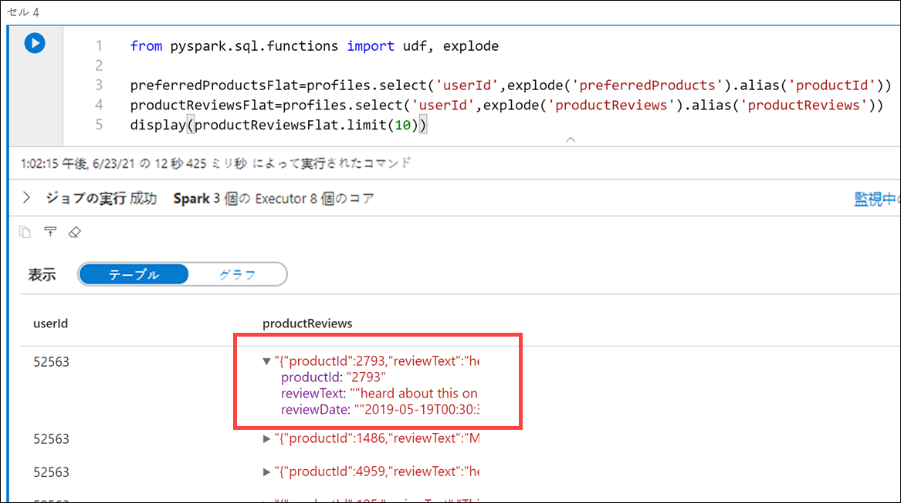

    **productReviewFlat** DataFrame の内容を表示するセルの出力を確認します。ユーザーのお気に入り製品リストに一致させたい **productId** と、表示または保存したい **reviewText** が含まれている新しい **productReviews** 列が表示されています。

9. **preferredProductsFlat** DataFrame の内容を見てみましょう。このためには、新しいセルで以下を入力して**実行**します。

    ```python
    display(preferredProductsFlat.limit(20))
    ```

    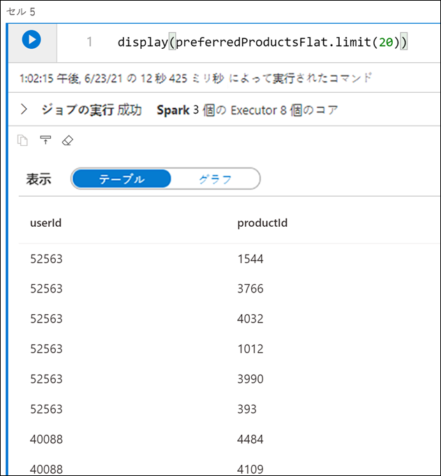

    お気に入り製品配列で **explode** 関数を使用したため、列の値がユーザーの順序で **userId** と **productId** 行にフラット化されました。

10. **productReviewFlat** DataFrame の内容をさらにフラット化して、**productReviews.productId** と **productReviews.reviewText** フィールドを抽出し、データの組み合わせごとに新しい行を作成する必要があります。そのためには、新しいコード セルに次のように入力して実行します。

    ```python
    productReviews = (productReviewsFlat.select('userId','productReviews.productId','productReviews.reviewText')
        .orderBy('userId'))

    display(productReviews.limit(10))
    ```

    出力では、それぞれの `userId` に対して複数の行があることがわかります。

    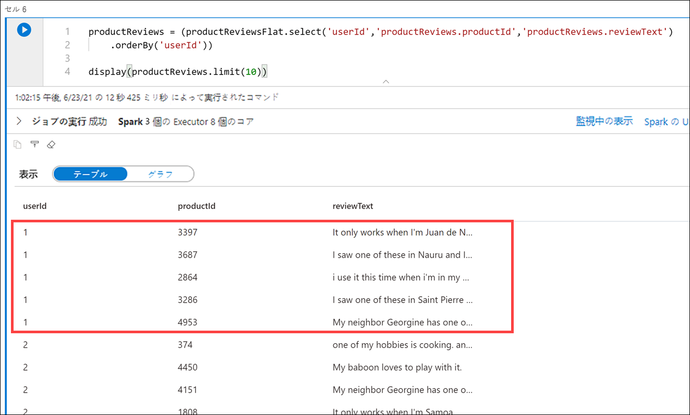

11. 最後のステップは、**userId** と **productId** の値で **preferredProductsFlat** と **productReviews** DataFrames を結合し、お気に入り製品レビューのグラフを構築することです。そのためには、新しいコード セルに次のように入力して実行します。

    ```python
    preferredProductReviews = (preferredProductsFlat.join(productReviews,
        (preferredProductsFlat.userId == productReviews.userId) &
        (preferredProductsFlat.productId == productReviews.productId))
    )

    display(preferredProductReviews.limit(100))
    ```

    > **注**: 「テーブル」ビューの列ヘッダーをクリックして、結果セットを並べ替えることができます。

    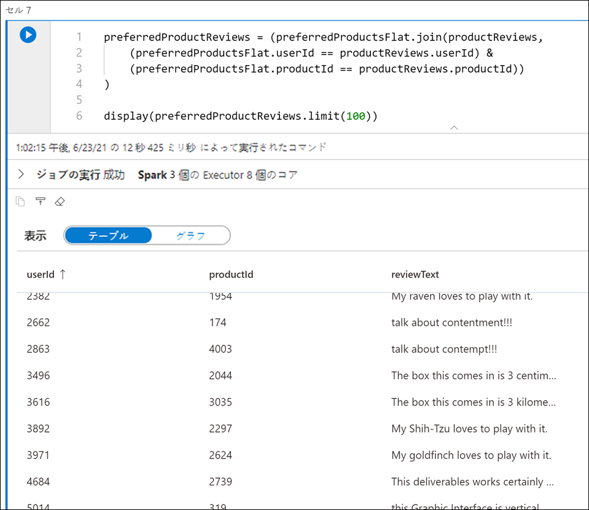

12. ノートブックの右上にある「**セッションの停止**」ボタンを使用して、ノートブックセッションを停止します。次に、ノートブックを閉じて、変更を破棄します。

## 演習 3 - Azure Synapse Analytics の サーバーレス SQL プールを使用して Azure Cosmos DB に対するクエリを実行する

Tailwind Traders は、T-SQL を使用して Azure Cosmos DB 分析ストアを探索したいと考えています。ビューを作成し、それを他の分析ストア コンテナーやデータ レイクからのファイルとの結合に使用し、Power BI のような外部ツールでアクセスできるようになれば理想的です。

### タスク 1: 新しい SQL スクリプトを作成する

1. 「**開発**」ハブに移動します。

    

2. 「**+**」メニューで、「**SQL スクリプト**」を選択します。

    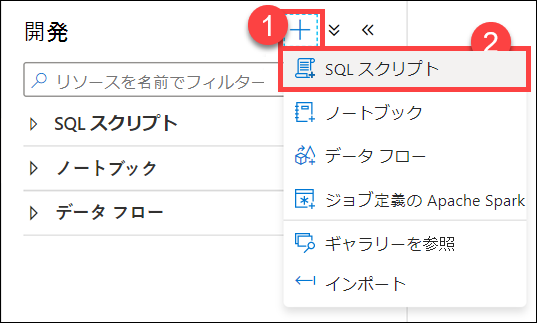

3. スクリプトが開いたら、右側の「**プロパティ**」ペインで、「**名前**」を `User Profile HTAP` に変更します。次に、「**プロパティ**」ボタンを使用してペインを閉じます。

    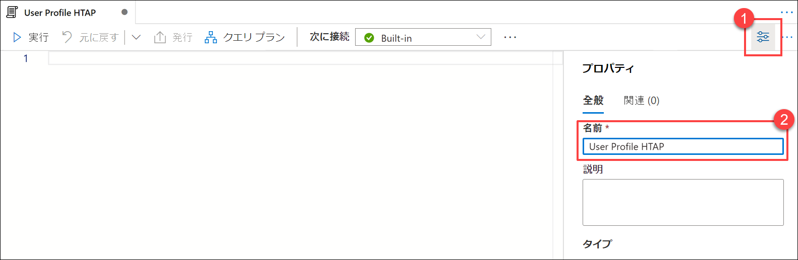

4. サーバーレス SQL プール (**組み込み**) が選択されていることを確認します。

    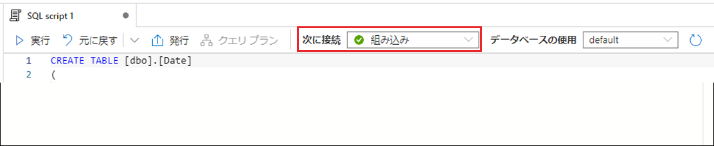

5. 次の SQL クエリを貼り付けます。OPENROWSET ステートメントで **YOUR_ACCOUNT_NAME** を Azure Cosmos DB アカウント名に置き換え、**YOUR_ACCOUNT_KEY** は Azure portal の「**キー**」ページにある Azure Cosmos DB 主キー に置き換えます (別のタブで開いたままにする必要があります)。

    ```sql
    USE master
    GO

    IF DB_ID (N'Profiles') IS NULL
    BEGIN
        CREATE DATABASE Profiles;
    END
    GO

    USE Profiles
    GO

    DROP VIEW IF EXISTS UserProfileHTAP;
    GO

    CREATE VIEW UserProfileHTAP
    AS
    SELECT
        *
    FROM OPENROWSET(
        'CosmosDB',
        N'account=YOUR_ACCOUNT_NAME;database=CustomerProfile;key=YOUR_ACCOUNT_KEY',
        UserProfileHTAP
    )
    WITH (
        userId bigint,
        cartId varchar(50),
        preferredProducts varchar(max),
        productReviews varchar(max)
    ) AS profiles
    CROSS APPLY OPENJSON (productReviews)
    WITH (
        productId bigint,
        reviewText varchar(1000)
    ) AS reviews
    GO
    ```

6. 「**実行**」 ボタンを使用して、クエリを実行します。これにより、以下が行われます。
    - 存在しない場合は、**Profiles** という名前の新しいサーバーレス SQL プール データベースを作成します
    - データベース コンテキストを **Profiles** データベースに変更します。
    - **UserProfileHTAP** ビューがある場合はこれをドロップします。
    - **UserProfileHTAP** という名前の SQL ビューを作成します。
    - OPENROWSET ステートメントを使用してデータ ソースのタイプを **CosmosDB** に設定し、アカウントの詳細を設定して、**UserProfileHTAP** という名前の Azure Cosmos DB 分析ストア コンテナーに対するビューを作成します。
    - JSON ドキュメントのプロパティ名に一致し、適切な SQL データ型を適用します。**preferredProducts** と **productReviews** フィールドが **varchar(max)** に設定されていることがわかります。これは、両方のプロパティに JSON 形式のデータが含まれているためです。
    - JSON ドキュメントの **productReviews** プロパティには入れ子になった部分配列が含まれているため、スクリプトは、ドキュメントのプロパティと配列のあらゆる要素を「結合」する必要があります。Synapse SQL を使用すると、入れ子になった配列で OPENJSON 関数を適用して、入れ子になった構造をフラット化できます。Synapse ノートブックで先ほど Python **explode** 関数を使用した場合と同様に、**productReviews** 内で値をフラット化します。

7. 「**データ**」ハブに移動します。

    

8. 「**ワークスペース**」タブを選択して、**SQL database** グループを展開します。**Profiles** SQL オンデマンド データベースを展開します (リストにこれが表示されない場合は、**データベース** リストを更新します)。「**ビュー**」を展開し、**UserProfileHTA** ビューを右クリックし、「**新しい SQL スクリプト**」を選択してから、「**上位 100 行を選択**」を選びます。

    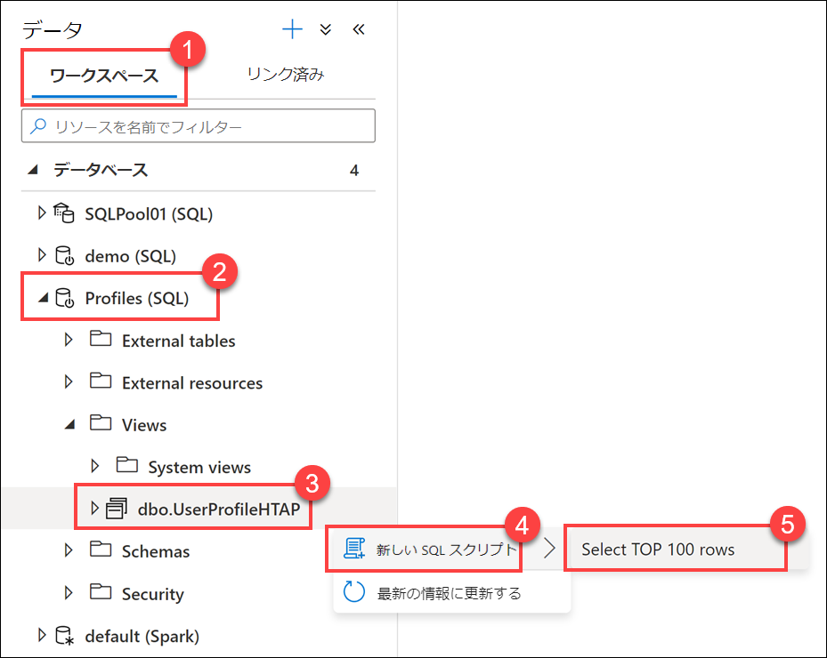

9. スクリプトが**組み込み** SQL プールに接続されていることを確認してから、クエリを実行して結果を表示します。

    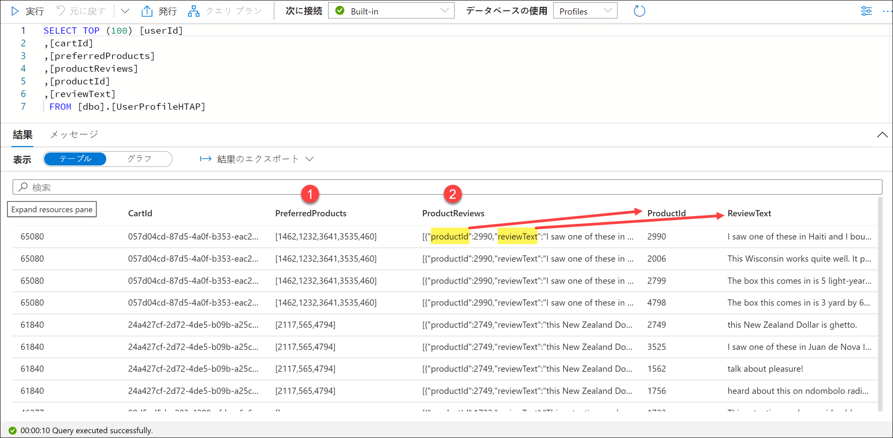

    **preferredProducts** と **productReviews** フィールドがビューに含まれており、両方に JSON 形式の値が含まれています。ビューの CROSS APPLY OPENJSON ステートメントが、**productId** と **reviewText** の値を新しいフィールドに抽出することで、入れ子になった部分配列を **productReviews** フィールドでフラット化していることがわかります。
