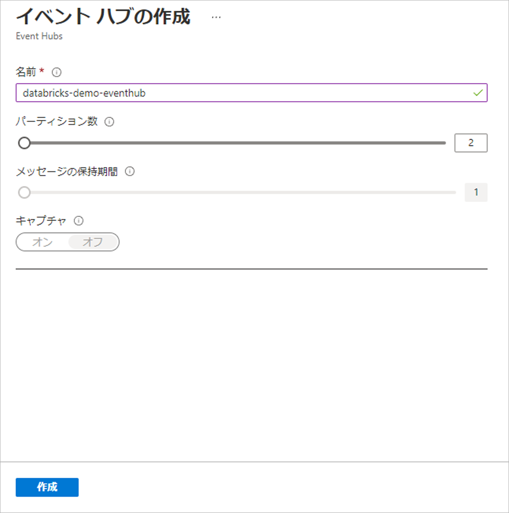
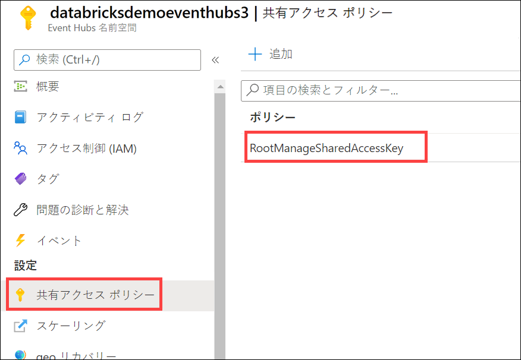
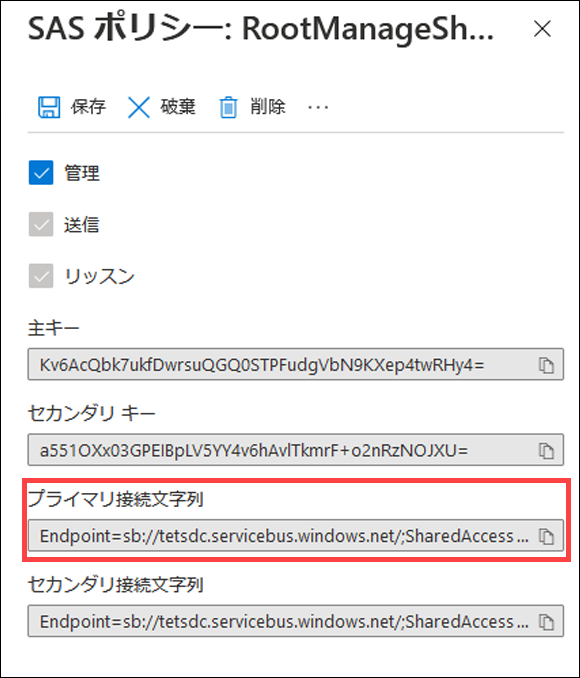

---
lab:
    title: 'Event Hubs と Azure Databricks を使用してストリーム処理ソリューションを作成する'
    module: 'モジュール 11'
---

# ラボ 11 - Event Hubs と Azure Databricks を使用してストリーム処理ソリューションを作成する

このラボでは、Azure Databricks で Event Hubs と Spark Structured Streaming を使用して大規模なストリーミング データの取り込みと処理を行う方法を学習します。構造化ストリーミングの主な機能と使用方法について学びます。スライディング ウィンドウを実装して、データのチャンクで集計を行い、基準値を適用して古いデータを削除します。最後に、Event Hubs に接続して、ストリームの読み取りと書き込みを行います。

このラボを完了すると、次のことができるようになります。

- 構造化ストリーミングの主な機能と使用方法について把握する
- ファイルからデータをストリーミングし、分散ファイル システムに書き込みます
- スライディング ウィンドウを使用して、すべてのデータではなく、データのチャンクを集計する
- 基準値を適用して古いデータを削除する
- Event Hubs の読み取りおよび書き込みストリームに接続する

## 概念

Apache Spark Structured Streaming は、高速でスケーラブルなフォールト トレラント ストリーム処理 API です。ストリーミング データに対して、分析をほぼリアルタイムで実行するのに使用できます。

Strucrured Streaming では、SQL クエリを使用して、静的データの処理の場合と同じ方法でストリーミング データを処理できます。API では、最終データを継続的に増分および更新します。

### Event Hubs および Spark Structured Streaming

Azure Event Hubs は、瞬時に数百万ものデータを処理する、スケーラブルなリアルタイム データ インジェスト サービスです。複数のソースから大量のデータを受信し、準備されたデータを Azure Data Lake または Azure Blob storage にストリーミングすることができます。

Azure Event Hubs を Spark Structured Streaming と統合することで、メッセージをほぼリアルタイムで処理できます。Structured Streaming クエリと Spark SQL を使用して、処理されたデータのクエリと分析を行うことができます。

### ストリーミングの概念

ストリーム処理では、新しいデータを継続的に Data Lake Storage およびコンピューティング結果に組み込みます。従来のバッチ関連の処理手法を使用する場合、ストリーミング データはそれが処理される速度よりも速く取り込まれます。データ ストリームは、データが継続的に追加されるテーブルとして扱われます。そのようなデータの例として、銀行のカード決済、モノのインターネット (IoT) デバイス データ、およびビデオ ゲーム プレイ イベントなどがあります。

ストリーミング システムの構成要素は以下のとおりです。

- Kafka、Azure Event Hubs、IoT Hub、分散システム上のファイル、TCP-IP ソケットなどの入力ソース
- 構造化ストリーミング、forEach シンク、メモリ シンクなどを使用したストリーミング処理

## ラボの構成と前提条件

このラボを開始する前に、ラボ環境を作成するためのセットアップ手順が正常に完了していることを確認してください。

## 演習 1 - 構造化ストリーミングの概念を探る

### タスク 1: Databricks アーカイブを複製する

1. 現在 Azure Databricks ワークスペースを開いていない場合は、Azure portal で、デプロイ済みの Azure Databricks ワークスペースに移動し、「**ワークスペースの起動**」を選択します。
1. 左側のウインドウで、「**コンピューティング**」を選択します。既存のクラスターがある場合は、それが実行されていることを確認します (必要に応じて開始します)。既存のクラスターがない場合は、最新のランタイムと **Scala 2.12** 以降を使用する単一ノード クラスターを作成します。
1. クラスターの実行中に、左側のペインで「**ワークスペース**」 > 「**ユーザー**」を選択し、ユーザー名 (家のアイコンが付いたエントリ) を選択します。
1. 表示されたウィンドウで、ご自分の名前の横にある矢印を選択し、「**インポート**」を選択します。

    

1. 「**ノートブックのインポート**」ダイアログ ボックスで URL を選択し、次の URL 内に貼り付けます。

 ```
   https://github.com/MicrosoftLearning/DP-203-Data-Engineer/raw/master/Allfiles/microsoft-learning-paths-databricks-notebooks/data-engineering/DBC/10-Structured-Streaming.dbc
 ```

1. 「**インポート**」を選択します。
1. 表示される **10-Structured-Streaming** フォルダーを選択します。

### タスク 2: ノートブックを完了する

1. **1.Structured-Streaming-Concepts** ノートブックを開きます。指示に従ってセルで操作を実行する前に、クラスターをノートブックに接続していることを確認してください。

   ノートブック内で以下を行います。

   - ファイルからデータをストリーミングし、分散ファイル システムに書き込みます
   - アクティブなストリームを一覧表示します
   - アクティブなストリームを停止します

## 演習 2 - 時間ウィンドウを使用する

### タスク 1: ノートブックを完了する

1. Azure Databricks ワークスペースで、ユーザー フォルダー内にインポートした **10-Structured-Streaming** フォルダーを開きます。

2. **2.Time-Windows** ノートブックを開きます。指示に従ってセルで操作を実行する前に、クラスターをノートブックに接続していることを確認してください。

   ノートブック内で以下を行います。

   - スライディング ウィンドウを使用して、すべてのデータではなく、データのチャンクを集計します
   - 基準値を適用して、保持する領域がない失効した古いデータを破棄します
   - `display` を使用してライブ グラフをプロットします

## 演習 3 - AzureEvent Hubs で構造化ストリーミングを使用する

### タスク 1: イベント ハブを作成する

1. Azure portal (<https://portal.azure.com>) で、このコースの Azure リソースを含む **data-engineering-synapse-*xxxxxxx*** リソース グループで、**eventhub*xxxxxxx*** Event Hub の名前空間を開きます。
2. ツールバーの「**+ イベント ハブ**」ボタンを選択して、新しいイベント ハブを追加します。
3. 「**イベント ハブの作成**」ペインで、次の詳細を使用して新しいイベント ハブを作成します。

   - **名前**: `databricks-demo-eventhub`
   - **パーティション数**: `2`
   - **メッセージの保持期間**: `1`
   - **キャプチャ**: *オフ*

   「**作成**」を選択します。

   

### タスク 2: 共有アクセス ポリシー用の接続文字列の主キーをコピーする

1. Event Hubs 名前空間の左側のメニューで、「**設定**」の「**共有アクセス ポリシー**」を選択し、「**RootManageSharedAccessKey**」ポリシーを選択します。

   

2. 「コピー」ボタンを選択して、主キーの接続文字列をコピーします。

   

3. 後で参照できるように、メモ帳または別のテキスト エディターに、コピーした主キーを保存します。

### タスク 3: ノートブックを実行する

1. Azure Databricks ワークスペースを含むブラウザー タブに戻りで、ユーザー フォルダー内にインポートした **10-Structured-Streaming** フォルダーを開きます。

2. **3.Streaming-With-Event-Hubs-Demo** ノートブックを開きます。指示に従ってセルで操作を実行する前に、クラスターをノートブックに接続していることを確認してください。

   ノートブック内で以下を行います。

   - Event Hubs に接続し、ご使用のイベント ハブにストリームを書き込みます
   - イベント ハブからストリームを読み取ります
   - JSON ペイロードのスキーマを定義し、データを解析してテーブル内に表示します

## クラスターをシャットダウンする

1. ラボが完了したら、左側のウィンドウ、「**コンピューティング**」を選択し、クラスターを選択します。次に、「**終了**」を選択してクラスターを停止します。
